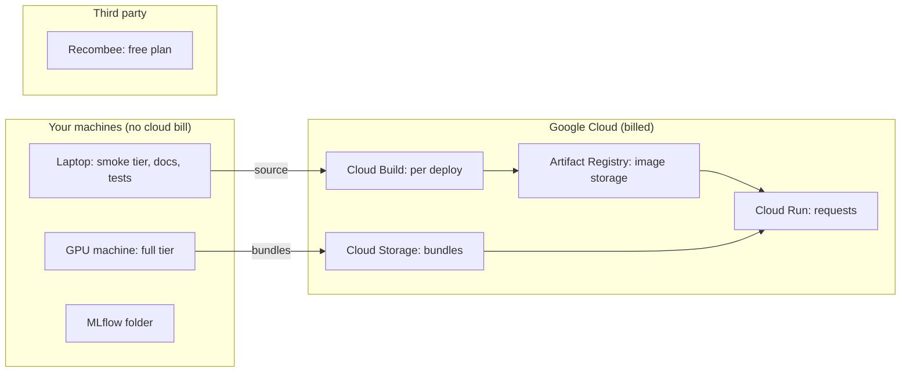

# Cost control

Your limit is **under $50 a month**. recbench is designed so that the expensive part, training, happens on
machines you already own, and the cloud part, serving precomputed lists, is small and scales to zero.

## Where the money goes

## The guardrails

| Guardrail | Where | What it prevents |
|---|---|---|
| `--min-instances 0` | `deploy/cloud_run.sh` | paying for idle time |
| `--max-instances 1` | `deploy/cloud_run.sh` | runaway scaling under heavy traffic |
| 1 vCPU, 1 GiB | `deploy/cloud_run.sh` | oversized instances |
| private by default | `deploy/cloud_run.sh` | strangers generating traffic |
| budget alert | `deploy/budget_alert.sh` | not noticing spending (it notifies; it does not stop) |
| teardown script | `deploy/teardown.sh` | forgotten resources |
| no GPUs in the cloud | design decision | the most expensive resource type |
| Recombee request budget | `recombee_max_requests` (90,000) | exceeding the free plan |
| Recombee non-empty check | `src/recbench/methods/recombee.py` | overwriting a database with real data |

## Rough monthly estimate

Exact prices change and differ by region; check the pricing pages before relying on any figure.

| Item | Usage in a typical month | Expected cost |
|---|---|---|
| Cloud Run | a few thousand demo and load-test requests | within or near the monthly free allowance |
| Cloud Storage | a few GB of bundles at most | cents |
| Artifact Registry | a few hundred MB of images | cents (deleted by teardown) |
| Cloud Build | a few builds | usually within the free allowance |
| Recombee | the free plan | $0 while within its limits |

A forgotten **public** service under constant traffic is the realistic worst case. With one instance at most, it
is bounded, but it could still use a meaningful part of the budget. The budget alert is your early warning.

## Cost as a benchmark metric

The benchmark itself reports cost proxies rather than dollars:

- `train_seconds`, `score_seconds_per_1k_users`, `peak_rss_mb`, `peak_gpu_mb` per run;
- `served_p50_ms` and `served_rps` from the load tester;
- a **cost band** (low / medium / high) per method in the facts boxes.

Converting runtimes to dollars with a price table is a [roadmap](../results/roadmap.md) item. See
[cost](../dictionary/metrics/cost.md) for how to do it by hand.

## Habits

1. Create the budget alert before the first deploy.
2. Deploy, measure, and tear down in the same session.
3. Keep the service private unless you need a public demo.
4. Check the billing report a day after teardown.
5. Use a dedicated project, and delete it when you finish the project.

The step-by-step cleanup checklist is in [costs and cleanup](../how-to/costs-and-cleanup.md).
