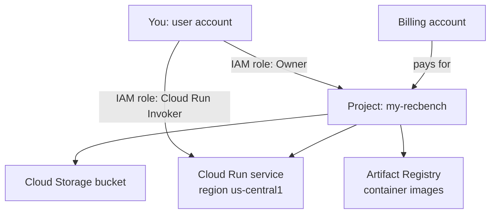

# GCP basics

You need only a small part of Google Cloud Platform (GCP) to deploy recbench. This page explains the five ideas
the deploy scripts rely on. If you have never used a cloud provider, read it before the
[deploy tutorial](../start/deploy-cloud-run.md).

## The five ideas

| Idea | What it is | In recbench |
|---|---|---|
| **Project** | a container for resources, permissions, and billing; identified by a *project id* | `GCP_PROJECT`, used by every deploy script |
| **Billing account** | the payment method a project charges to; one account can pay for many projects | `GCP_BILLING_ACCOUNT`, used by the budget alert |
| **Region** | the data-centre location where a resource runs | `GCP_REGION`, default `us-central1` |
| **API (service)** | each product must be switched on per project before use | `gcloud services enable ...` in `deploy/cloud_run.sh` |
| **IAM** | Identity and Access Management: *who* (a principal) may do *what* (a role) on *which* resource | the service is private: only principals with the Cloud Run Invoker role can call it |



## Projects

Use a **dedicated project** for recbench, for example `yourname-recbench`. Three reasons:

1. Cost reports show exactly what recbench costs.
2. `deploy/teardown.sh` deletes the Artifact Registry repository that `gcloud run deploy --source` creates in
   the region. In a shared project, that repository can also hold other services' images.
3. Deleting the whole project is the surest way to stop all charges when you are done.

The project id is chosen at creation time and cannot be changed; the display name can.

## Billing and budgets

A project must be linked to a billing account before most APIs can be enabled, even when your usage stays within
free allowances. A **budget** compares spending with an amount and e-mails the billing administrators at
thresholds:

```bash
gcloud billing accounts list                                   # find ACCOUNT_ID
GCP_BILLING_ACCOUNT=XXXXXX-XXXXXX-XXXXXX ./deploy/budget_alert.sh 40
```

`deploy/budget_alert.sh` creates a monthly budget (default $40, under your $50 limit) with alerts at 50%, 90%,
and 100%.

!!! warning "Budgets do not cap spending"
    A budget alert only sends e-mails. Spending continues until you delete resources. In recbench the caps that
    actually limit cost are `--max-instances 1` on Cloud Run and running `deploy/teardown.sh` when you are done.
    See [cost control](cost-control.md).

If `gcloud billing budgets create` fails because an API is disabled, enable it with
`gcloud services enable billingbudgets.googleapis.com` and run the script again. Creating budgets also requires
a billing role on the billing account (Billing Account Administrator or Costs Manager).

## Regions

Pick one region for all resources so the service reads the bucket without cross-region traffic. The scripts
default to `us-central1`; set `GCP_REGION` to change it, for example `asia-southeast1` if you are in South-East
Asia. Latency measured from your laptop includes the network distance to the region.

## APIs

`deploy/cloud_run.sh` enables four APIs:

| API | Why |
|---|---|
| `run.googleapis.com` | Cloud Run itself |
| `cloudbuild.googleapis.com` | builds the Docker image from source |
| `artifactregistry.googleapis.com` | stores the built image |
| `storage.googleapis.com` | the bucket that holds bundles |

Enabling an API is free; using it may not be.

## IAM in one paragraph

A **principal** (your Google account, or a service account used by software) gets **roles** (bundles of
permissions) on a **resource** (a project, a bucket, a service). As the project creator, you are Owner, which
includes permission to deploy and to call private services. The Cloud Run service runs as a **service account**
(by default the Compute Engine default service account), which needs read access to the bucket. In a new project
that account normally has broad permissions; see [security](security.md) for how to narrow them.

## The CLI

```bash
brew install --cask google-cloud-sdk     # macOS; see cloud.google.com/sdk for Ubuntu
gcloud auth login                        # opens a browser
gcloud config set project YOUR_PROJECT_ID
gcloud config list                       # check account, project, region
```

`gcloud auth print-identity-token` prints a short-lived token proving who you are; the deploy tutorial uses it
to call the private service.

## Check your understanding

??? question "Your budget alert e-mailed you at 100%. Has Google stopped charging you?"
    No. Alerts only notify. Run `deploy/teardown.sh`, or delete the project.

??? question "Why does the deploy script enable Cloud Build when recbench never calls it?"
    `gcloud run deploy --source` uploads the source code and asks Cloud Build to build the Docker image from
    the `Dockerfile`. The built image is stored in Artifact Registry.
