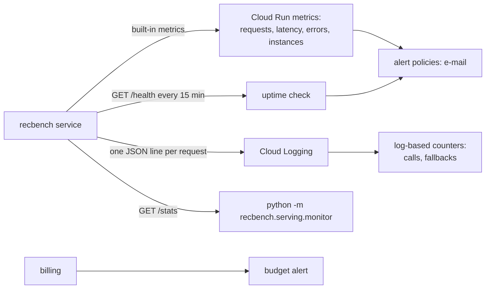

# Monitoring the deployed API

!!! abstract "In plain words"
    Once the service is live, keep asking three questions. **Is it up?** (health) **Is it costing what I
    expect?** (cost) **Is it still recommending well?** (quality). Google Cloud answers the first two almost by
    itself. For the third, recbench adds a `/stats` endpoint, a one-line log per request, and a checking command.
    This page shows where each answer appears, what "normal" looks like, and what to do when it is not normal.



## The signals

| Question | Signal | Where to see it | Normal | Not normal |
|---|---|---|---|---|
| Is it up? | uptime check on `/health` | Monitoring → Uptime checks | passing from every region | failing: the service is down, or has no bundles (503) |
| | 5xx responses | Cloud Run → the service → Metrics → Request count, by response code class | 0 | any steady stream |
| | request latency (p50, p95, p99) | Cloud Run → Metrics → Request latencies | tens of milliseconds; a few seconds right after idle (cold start) | p95 high all the time |
| | instance count | Cloud Run → Metrics → Container instance count | 0 when idle, 1 when used | always 1 with no traffic you know of: someone else calls it |
| Cost | spend this month | Billing → Reports; budget alert e-mails | cents to a few dollars | a budget e-mail you did not expect |
| | billable instance time | Cloud Run → Metrics | short bursts | continuous: constant traffic |
| Quality | bundle freshness | `/stats` → `export_age_days`; monitor check "freshness" | younger than your refresh plan (30 days by default) | older: the lists no longer reflect recent behaviour |
| | coverage of what is served | `/stats` → `served.coverage_at_10` vs `offline.coverage_at_10` | similar to the offline value | far below: a broken export (everyone gets the same few items) |
| | popularity bias | `/stats` → `served.popularity_percentile_at_10` | close to the offline value | near 1.00: only bestsellers are served |
| | unknown users | `/stats` → `traffic.fallback_share`; the log counter `recbench_fallbacks` | low, for your real traffic | high: callers' user ids are not in the bundle (new users, or an id mismatch) |
| | error share | `/stats` → `traffic.error_share` | 0 | rising: unknown datasets or methods in requests |

The traffic numbers in `/stats` count since the instance started, and Cloud Run stops idle instances, so they reset.
The request log keeps the full history.

## Step 1: check it by hand

```bash
URL=$(gcloud run services describe recbench --region us-central1 --format 'value(status.url)')
python -m recbench.serving.monitor --base-url "$URL" --token "$(gcloud auth print-identity-token)"
```

!!! success "You should see (the numbers are examples)"
    ```text
    PASS  health                           HTTP 200; 3 bundles for tier full
    PASS  errors                           0.0% of 320 calls failed (limit 5%)
    PASS  unknown users                    9.4% of calls got the popularity fallback (limit 50%)
    PASS  latency p95                      0.4 ms inside the service, last 320 calls (limit 500 ms)
    PASS  movielens-25m/ease: freshness    exported 2.1 days ago (limit 30); data up to 2018-01-04 02:45:08
    PASS  movielens-25m/ease: coverage     served coverage@10 0.061 vs 0.044 offline (139%)
    PASS  movielens-25m/ease: popularity bias  popularity percentile 0.97 (0.96 offline); 1.00 would mean only the most popular items

    7 checks: 0 FAIL, 0 WARN
    ```

    The exit code is 1 when a check FAILs, so the command works in scripts.

Latency here is measured **inside** the service (lookup time). The load tester measures from your laptop,
including the network round trip, so its numbers are larger.

## Step 2: read the console

1. Open <https://console.cloud.google.com/run>, click **recbench**, and open the **Metrics** tab. The charts:
   request count by response code class, request latencies (p50/p95/p99), container instance count, CPU and memory
   use, and billable instance time.
2. Logs: the **Logs** tab, or the command line:

    ```bash
    # the latest requests, with their structured fields
    gcloud logging read 'resource.type="cloud_run_revision" AND resource.labels.service_name="recbench" AND jsonPayload.message="recommend"' --limit 20
    # only failed or fallback requests
    gcloud logging read 'resource.type="cloud_run_revision" AND jsonPayload.message="recommend" AND (jsonPayload.status>=400 OR jsonPayload.fallback=true)' --limit 20
    ```

    Each request line holds `dataset`, `method`, `k`, `status`, `latency_ms` and `fallback`.

## Step 3: e-mail alerts

`deploy/monitoring.sh` ([step 7 of the tutorial](../start/deploy-cloud-run.md#step-7-set-up-monitoring)) created
the uptime check and the counters. Alerts are created in the console:

1. **Uptime alert.** Monitoring → **Uptime checks** → `recbench-health` → create an alert policy. Choose
   **E-mail** as the notification channel (add your address the first time). You are told when the check fails
   from several regions.
2. **5xx alert.** Monitoring → **Alerting** → **Create policy** → metric **Cloud Run Revision → Request count**,
   filter `response_code_class = 5xx`, condition "above 5 in 5 minutes", same e-mail channel.
3. **Budget.** Already done in step 3 of the tutorial.

The console's labels change from time to time; look for the closest match. If the uptime check fails with `403`,
the monitoring service agent may not call the private service. `deploy/monitoring.sh` grants it the Cloud Run
Invoker role, and the uptime check's page names the account it uses.

## Step 4: follow quality over time

The log counters `recbench_recommend_calls` and `recbench_fallbacks` count every call and every fallback, also
across instances. In **Monitoring → Metrics explorer**, chart `logging/user/recbench_fallbacks` next to
`logging/user/recbench_recommend_calls`. Their ratio is the share of callers the service does not know. A rising
ratio means the bundles are getting stale or new users arrive faster than you refresh.

## Step 5: a weekly five-minute checklist

| Check | How | Act when |
|---|---|---|
| Up and fast | Cloud Run Metrics tab: 5xx, p95 | errors, or p95 climbing |
| Quality | `python -m recbench.serving.monitor …` | any WARN or FAIL |
| Freshness | the same command's freshness lines | older than your plan: re-export and redeploy |
| Cost | Billing → Reports | anything you cannot explain |
| Leftovers | `gcloud run services list`, `gcloud storage ls` | resources you no longer need: `deploy/teardown.sh` |

## When something is wrong

| Symptom | Likely cause | What to do |
|---|---|---|
| uptime check fails, `/health` returns 503 | no bundles for the served tier (empty bucket, wrong `RECBENCH_TIER`) | list them with `gcloud storage ls gs://BUCKET/bundles/*/TIER/`; redeploy with the right tier |
| `403` for your own calls | identity token expired (about 1 hour) | `TOKEN=$(gcloud auth print-identity-token)` |
| many 404 "No bundle for …" | callers ask for a dataset or method that is not served | check `/methods`; adjust `RECBENCH_SERVE_METHODS` |
| high fallback share | real user ids are not in the bundle (new users, or ids in another format) | compare a few logged user ids with the bundle; export fresher bundles |
| freshness WARN | the lists were exported long ago | re-run or `python -m recbench.export`, upload, redeploy |
| coverage far below offline | a broken or truncated bundle | re-export; compare `manifest.json` with the run in MLflow |
| "Memory limit exceeded" in the logs | too many large bundles cached in 1 GiB | serve fewer methods, or `--memory 2Gi` |
| budget e-mail | unexpected traffic or forgotten resources | look at Billing → Reports by service; tear down what you do not need |

## Automating the quality check

The uptime check covers "is it up". To run the quality check every morning from your laptop, add a cron line
(`crontab -e`). It writes a log, and you look at the WARN and FAIL lines:

```text
0 8 * * * cd ~/recbench && .venv/bin/python -m recbench.serving.monitor --base-url https://YOUR-URL --token "$(gcloud auth print-identity-token)" >> runs/logs/monitor.log 2>&1
```

## What is not monitored yet

Be honest about the gaps. recbench serves precomputed lists and has no user feedback loop, so it cannot see:

- whether people **click or buy** what is recommended (online quality, A/B tests:
  [offline vs online](../dictionary/concepts/offline-vs-online.md));
- **behaviour drift** beyond the proxies above: freshness, fallback share, coverage and popularity bias;
- per-user problems, such as a user who always gets poor lists.

These are on the [roadmap](../results/roadmap.md).
