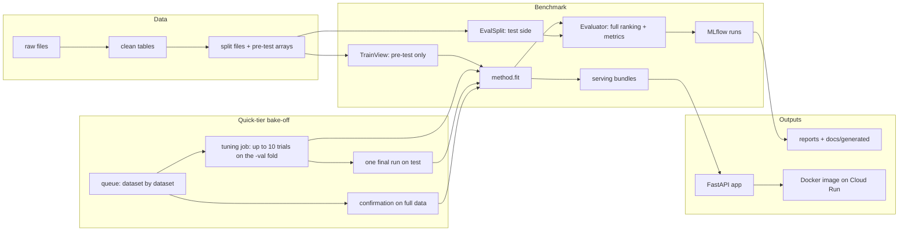

# Architecture

## The big picture

1. **Data:** each dataset adapter downloads raw files and converts them to a standard "clean" format;
   `materialize` builds a split (time cutoffs, user sampling, relevance sets, eval users).
2. **Benchmark:** for every (dataset, method) pair, a child process fits the method on a `TrainView` (which
   exposes only pre-test events), evaluates it, logs to MLflow, and exports a bundle.
   - In the **quick-tier bake-off**, the queue (`queue.py`) runs one tuning job per (dataset, method). Each job
     (`tuning/job.py`) runs up to 10 trials on the validation fold, then one final run on test.
   - When a dataset is done, its top 3 are confirmed on full data, which also exports their bundles.
3. **Outputs:** reports and documentation pages are generated from MLflow; the API serves bundles locally or on
   Cloud Run.

## Module map

| Module | Purpose |
|---|---|
| `src/recbench/protocol.py` | shared types: `Task`, `MethodSpec`, `Recommender`, `MetricSpec`, `Metric`, `DatasetSpec`, `Explanation`, `top_k`, `PROTOCOL_VERSION` |
| `src/recbench/registry.py` | plugin registries and `register_method` / `register_metric` / `register_dataset` decorators |
| `src/recbench/schema.py` | the clean-table column contract |
| `src/recbench/datasets/` | five adapters (download + clean) |
| `src/recbench/pipeline/materialize.py` | builds splits (contract v2) |
| `src/recbench/pipeline/prepare.py` | CLI: download → clean → split |
| `src/recbench/pipeline/download.py` | `curl` and Kaggle download helpers |
| `src/recbench/pipeline/toy.py` | synthetic logs for tests and tutorials (including the copy task) |
| `src/recbench/data.py` | `TrainView` (what models may see) and `HistoryBatch` |
| `src/recbench/methods/` | 34 methods plus shared helpers (`_torch.py`: epoch training and early stopping, `seq_trainer.py`, `_explain.py`, `_memory.py`: GPU item caps) |
| `src/recbench/evaluation.py` | `EvalSplit`, `Evaluator`, `MetricContext`, bootstrap CIs |
| `src/recbench/metrics/catalog.py` | every metric |
| `src/recbench/config.py` | presets, config resolution, `config_hash` |
| `src/recbench/paths.py` | where results go: the active workspace (the bake-off's `runs/`, `reports/`, or the lab's `runs/lab/`, `reports/lab/`) and its MLflow store |
| `src/recbench/runner.py` | CLI: runs pairs in child processes, logs to MLflow, resumes |
| `src/recbench/tuning/` | quick-tier tuning: `spaces.py` (search spaces), `job.py` (one job: trials on the fold, one test run, confirmations), `__main__.py` (one job from the command line) |
| `src/recbench/queue.py` | the bake-off's job queue: dataset by dataset, CPU and GPU workers, backfill, resume |
| `src/recbench/queue_status.py` | what the queue is doing: text status and the self-refreshing status page |
| `src/recbench/export.py` | exports a serving bundle with the bake-off's chosen settings |
| `src/recbench/results.py` | reads protocol-v2 runs back from MLflow |
| `src/recbench/lab/` | the improvement lab: `__main__.py` (`baseline`, `status`, `once`, `sweep`, `run`, `scoreboard`), `experiments.py` (experiment files), `runs.py`, `api.py` (notebook helpers), `scoreboard.py`, `checks.py` (variant tests) |
| `src/recbench/compare.py` | paired comparison of two lab results, verdicts, the promotion rule, error analysis (`--segments`) |
| `src/recbench/import_runs.py` | imports another machine's MLflow runs (GPU → laptop) |
| `src/recbench/report/build.py` | Markdown/HTML leaderboards (and docs leaderboards) |
| `src/recbench/report/overall.py` | the overall comparison across datasets |
| `src/recbench/dictionary/build.py` | generated docs fragments from `dictionary/catalog.yaml` |
| `src/recbench/serving/bundle.py` | export and read serving bundles |
| `src/recbench/serving/app.py` | FastAPI app: `/`, `/health`, `/methods`, `/recommend`, `/stats`, `/dashboard` |
| `src/recbench/serving/latency.py` | load tester |
| `src/recbench/serving/monitor.py` | checks a running API: health, freshness, quality, traffic |
| `src/recbench/ttm.py` | time-to-endpoint measurement |

## Design principles

1. **Leak-free by construction.** Models never get file paths: they get a `TrainView`, which has no route to test
   data. See [data leakage](../dictionary/concepts/data-leakage-and-splits.md).
2. **Plugins over edits.** New methods, metrics, and datasets register themselves with a decorator. The runner,
   evaluator, reports, and docs pick them up without changes ([registry and catalog](registry-and-catalog.md)).
   The bake-off is the deliberate exception: a method enters it through two config entries, a search space and a
   queue entry, so every method's tuning budget is visible in one place.
3. **The protocol is versioned.** Every run stores `protocol_version` and a `config_hash`. Results from different
   protocols or settings are never mixed or silently reused.
4. **Isolation.** Each (dataset, method) pair runs in its own process: per-method memory, a crash-proof
   benchmark, a wall-clock timeout.
5. **Serving without models.** The API reads precomputed bundles, so the container needs no PyTorch and starts fast.
6. **Docs from code.** Facts, capability tables, and leaderboards in the docs are generated; tests check that code
   pointers in the docs resolve.

## What lives where on disk

| Path | Contents | In git? |
|---|---|---|
| `data/raw/`, `data/clean/`, `data/splits/` | downloaded, cleaned, and split data | no |
| `data/bundles/` | serving bundles | no |
| `data/unavailable/` | reasons a dataset failed to prepare | no |
| `runs/mlflow/` | MLflow file store (protocol v2 runs) | no |
| `runs/mlflow_v1_archive/` | archived v0.1 runs (leaky protocol) | no |
| `runs/tuning/<tier>/<dataset>/<method>[.confirm].json` | job summaries: every trial, the best settings, timings, the test result | no |
| `runs/tuning/journal.log` | the Optuna journal, which lets an interrupted job resume its trials | no |
| `runs/queue/<tier>.json` | the queue's state (rewritten every minute while it runs) | no |
| `runs/mlflow-box/`, `runs/queue-box/`, `runs/logs-box/` | copies fetched from a rented box | no |
| `runs/lab/` (`mlflow/`, `tuning/`, `queue/`, `logs/`) and `reports/lab/` | the lab workspace: the same layout, apart from the bake-off; `runs/lab-box/` holds a box's lab runs before import | no |
| `labs/<nn>-<method>/` | each lab's notebook and `experiments.yaml`; `labs/templates/` holds the variant test template | yes |
| `tests/golden/lab_defaults.json` | the lab methods' pinned default behaviour on the toy data | yes |
| `runs/logs/` | run logs | no |
| `reports/` | generated reports, including `quick-tuned/`, `full-tuned/`, `overall/` and `queue/<tier>.html` | no |
| `configs/tuning/` | the bake-off's search spaces | yes |
| `docs/` | documentation sources, including `docs/generated/` | yes |
| `third_party/` | SELFRec, Meta generative-recommenders and the official GRU4Rec code at pinned commits | no (fetched by a script) |
| `site/` | built documentation | no |
