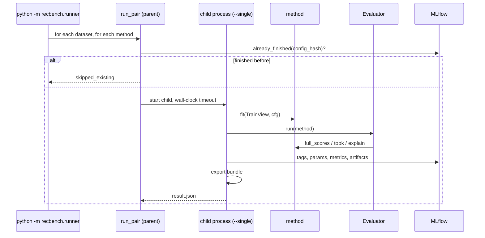

# Training and evaluation flow

## From the command line to MLflow

Code: `src/recbench/runner.py::run_matrix` → `src/recbench/runner.py::run_pair` →
`src/recbench/runner.py::run_single`.

## The runner

1. **Resolve the config** (benchmark YAML + hardware YAML + preset): see [configuration](configuration.md).
2. For each dataset with a valid split and each registered method:
    - compute `config_hash` (protocol version, evaluator version, the method's `impl_version`, split hash, and every setting);
    - if a finished run with that hash exists in MLflow, skip it (`skipped_existing`);
    - otherwise start `python -m recbench.runner --single ...` as a **child process** and watch it with a wall-clock
      timeout (`timeout_minutes`). If the child dies or times out, the parent records `failed` or `timeout`, with
      the reason, on the run.
3. **In the child** (`run_single`):
    - **skip checks:** managed services off, no images, or no text/categories → `unsupported`, with the reason;
    - seed NumPy and PyTorch;
    - `fit` on a `TrainView` (timed: `train_seconds`);
    - evaluate (below);
    - add `peak_rss_mb` and `peak_gpu_mb`, and managed-service statistics from `finish()`, if the method has one;
    - log everything to MLflow; export a bundle for ranked, non-managed methods.

## The evaluator, step by step

`src/recbench/evaluation.py::Evaluator.run`:

1. **Users:** warm evaluation users from `eval_users.parquet`, optionally subsampled with the run's seed to
   `max_eval_users` (the smoke config uses 2,000), so every method sees the same users.
2. **Batches:** users are scored in batches sized so that at most ~250 million scores are in memory.
3. **Scores:** `method.full_scores(users, history)`. Pointwise methods are scored over item chunks; list-only
   methods return lists.
4. **Masks** (`Evaluator._masks`): padding item 0; items the user saw before the cutoff (under `exclude_seen`);
   cold items for methods that cannot score them.
5. **Top 50** per user and per repeat policy (`src/recbench/protocol.py::top_k`).
6. **Sampled check:** the method's scores at the 101 candidates → sampled ranks, per-user AUC, log loss.
7. **Explanations:** for 50 users × 3 items → `personal_explanation_rate`, and up to 30 examples saved.
8. **Metrics:** each registered metric whose tasks overlap the method's tasks is computed on a `MetricContext`.
   Secondary repeat policies get prefixed names (`allow_repeats/ndcg_at_10`) and accuracy metrics only.
9. **Confidence intervals:** a bootstrap with 1,000 resamples for the headline metrics.
10. **Cold users:** for methods with `handles_cold_users`, the same procedure on cold users → `cold_users/*`.

## What is logged per run

| MLflow field | Contents |
|---|---|
| tags | dataset, method, tier, preset, hardware, `protocol_version`, `config_hash`, `split_hash`, managed, ranked, fidelity, tasks, status, reason, bundle, `stage` (benchmark, search, final, confirm), `tuning` (defaults or tuned), `impl_version`, `eval_version`, `recbench_version`, `git_sha`, `git_dirty` |
| params | every numeric or text setting the method received, plus `fit.*` values the method reports |
| metrics | every computed metric, `*_ci_low` and `*_ci_high`, `n_eval_users`, efficiency, and later `served_*` from the load tester |
| artifacts | `per_user_metrics.npz`, `explanations.json`, `metric_errors.json` (if any), `error.txt` (failed runs) |

## Seeds and reproducibility

- Split sampling, eval-user sampling, and candidate negatives use fixed seeds, recorded in `meta.json`.
- Training uses `seed` (default 42). PyTorch on CPU is reproducible run-to-run for most models; GPU kernels can
  differ slightly.
- Bootstrap intervals use their own fixed seed.
