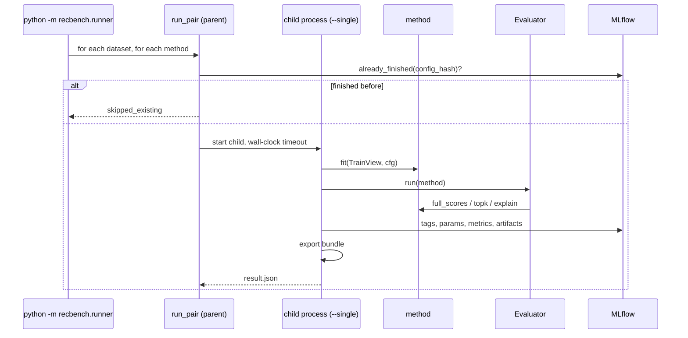
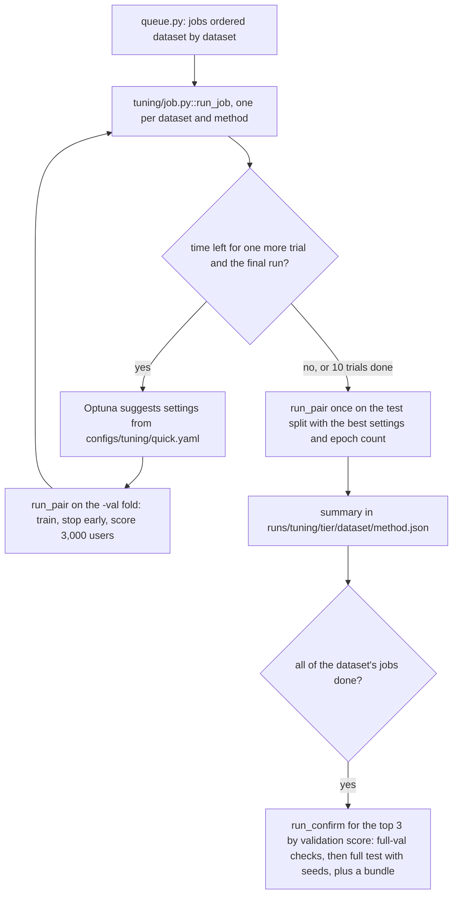

# Training and evaluation flow

## From the command line to MLflow

Code: `src/recbench/runner.py::run_matrix` → `src/recbench/runner.py::run_pair` →
`src/recbench/runner.py::run_single`.

## The runner

1. **Resolve the config** (benchmark YAML + hardware YAML + preset): see [configuration](configuration.md).
2. For each dataset with a valid split and each method listed in the config's `methods:`:
    - compute `config_hash` (protocol version, evaluator version, the method's `impl_version`, split hash, and every setting);
    - if a finished run with that hash exists in MLflow, skip it (`skipped_existing`);
    - otherwise start `python -m recbench.runner --single ...` as a **child process** and watch it with a wall-clock
      timeout (`timeout_minutes`). If the child dies or times out, the parent records `failed` or `timeout`, with
      the reason, on the run.
3. **In the child** (`run_single`):
    - **skip checks:** managed services off, no images, or no text/categories → `unsupported`, with the reason;
    - seed NumPy and PyTorch;
    - on a validation fold (`meta.json` has `fold: valid`), attach a `ValidationMonitor` so epoch-trained methods can
      stop early, unless the config fixes `epochs`. The monitor refuses real test splits;
    - restrict the training data to the last `train_window_days` (each user keeps their last 10 events); the
      evaluator still sees the full history;
    - `fit` on the `TrainView` (timed: `train_seconds`), and log the learning curve (`curve/*` metrics, one point
      per epoch);
    - evaluate (below);
    - add `peak_rss_mb` and `peak_gpu_mb`, and managed-service statistics from `finish()`, if the method has one;
    - log everything to MLflow; export a bundle for ranked, non-managed methods.

## Tuning jobs and the queue

The quick-tier bake-off adds two layers on top of `run_pair`:

- **A job** (`src/recbench/tuning/job.py::run_job`) runs Optuna's seeded TPE sampler over the method's search space
  (`src/recbench/tuning/spaces.py::MethodSpace`), at most `trials` times. Each trial is one `run_pair` on the fold,
  with its own time limit: a fair share of the job's remaining time for training (`fit_deadline`), and everything
  left as the hard timeout. Finished trials live in an Optuna journal, so an interrupted job resumes. With
  `retry=True`, a failed job starts a fresh attempt.
- **The final run** uses the best trial's settings and its best epoch count (`epochs`), so the test split is used
  exactly once per job. Nothing watches a validation score during it, so the epoch loop guards against a blow-up
  itself. If an epoch's loss is not finite, or is more than 50% worse than the best epoch's, it restores the
  lowest-loss weights and stops: `stopped` is `diverged` in `fit_info`. SASRec's final run on RetailRocket in the
  first bake-off collapsed this way. With `tuning.final_seeds` (the lab), a method whose training is random runs that one
  setting once per seed, and the summary averages them; `final_runs` records each run's identity, which is how
  `python -m recbench.compare` finds the per-user results.
- **Labels and re-runs.** A lab experiment is a job with a `label` (summary `<method>@<label>.json`, its own study)
  and a `fingerprint` of its definition and code. `src/recbench/tuning/job.py::prepare_rerun` archives a finished
  summary and leaves a stub with the next attempt number, so the job runs again with a fresh study:
  `python -m recbench.queue run ... --rerun` and `python -m recbench.lab run ... --rerun` use it. The queue's
  `--rerun` also archives the method's confirmations. No stub is left for them: the queue confirms the method
  again only if it is still among the dataset's top methods.
- **A confirmation** (`src/recbench/tuning/job.py::run_confirm`) re-checks the setting that depends on data size on
  `full-val`, then runs the final test on `full` once per seed. Its first final run exports the serving bundle.
- **A re-ranker's generators.** `src/recbench/tuning/job.py::pin_generators` writes EASE's and ItemKNN's chosen
  settings into a re-ranker's config when its job starts (`rerank_ease`, `rerank_itemknn`).
    - **Which settings:** those confirmed on the job's tier, else those tuned on it, else the quick tier's.
      Quick-tier settings used on full data get their size-sensitive setting (EASE's λ) multiplied by the ratio of
      users, as a confirmation would (`src/recbench/tuning/job.py::scaled_for_size`).
    - **Why pin them:** they stay fixed for the whole job, are recorded in its summary (`generators`), and are part
      of every run's identity. When EASE or ItemKNN is tuned again, the re-ranker runs again instead of reusing
      results built on the old candidates.
    - **Exports:** `python -m recbench.export` uses the recorded settings.
- **The queue** (`src/recbench/queue.py::Queue`) orders jobs dataset by dataset, gives CPU jobs to CPU workers with
  a thread cap and GPU jobs to GPU slots (`CUDA_VISIBLE_DEVICES`), starts the next dataset early only when a worker
  would otherwise idle, waits for `after:` dependencies (the re-rankers wait for EASE's and ItemKNN's tuning, and
  their confirmations wait for those methods' confirmations on the same dataset), queues the confirmations, and
  writes its state and status page. Everything resumes from the summaries on disk.

## The evaluator, step by step

`src/recbench/evaluation.py::Evaluator.run`:

1. **Users:** warm evaluation users from `eval_users.parquet`, optionally subsampled with the run's seed to
   `max_eval_users` (the smoke config uses 2,000), so every method sees the same users.
2. **Batches:** users are scored in batches sized so that at most ~250 million scores are in memory.
3. **Scores:** `method.full_scores(users, history)`. Pointwise methods are scored over item chunks; list-only
   methods return lists.
4. **Masks** (`Evaluator._masks`): padding item 0; items the user saw before the cutoff (under `exclude_seen`);
   cold items for methods that cannot score them.
5. **Top 50** per user and per repeat policy (`src/recbench/protocol.py::top_k`).
6. **Sampled check:** the method's scores at the 101 candidates → sampled ranks, per-user AUC, log loss.
7. **Explanations:** for 50 users × 3 items → `personal_explanation_rate`, and up to 30 examples saved.
8. **Metrics:** each registered metric whose tasks overlap the method's tasks is computed on a `MetricContext`.
   Secondary repeat policies get prefixed names (`allow_repeats/ndcg_at_10`) and accuracy metrics only.
9. **Confidence intervals:** a bootstrap with 1,000 resamples for the headline metrics.
10. **Cold users:** for methods with `handles_cold_users`, the same procedure on cold users → `cold_users/*`.

## What is logged per run

| MLflow field | Contents |
|---|---|
| tags | dataset, method, tier, preset, hardware, `protocol_version`, `config_hash`, `config_group` (the hash without the seed: runs that differ only in seed share it and are averaged), `split_hash`, managed, ranked, fidelity, tasks, status, reason, bundle, `stage` (benchmark, search, final, confirm), `tuning` (defaults or tuned), `impl_version`, `eval_version`, `recbench_version`, `git_sha`, `git_dirty` |
| params | every numeric or text setting the method received, plus `fit.*` values the method reports |
| metrics | every computed metric, `*_ci_low` and `*_ci_high`, `n_eval_users`, efficiency, and later `served_*` from the load tester |
| artifacts | `per_user_metrics.npz`, `explanations.json`, `metric_errors.json` (if any), `error.txt` (failed runs) |

## Seeds and reproducibility

- Split sampling, eval-user sampling, and candidate negatives use fixed seeds, recorded in `meta.json`.
- Training uses `seed` (default 42). PyTorch on CPU is reproducible run-to-run for most models; GPU kernels can
  differ slightly.
- The full-data confirmations run seeds 42, 43 and 44 for methods whose training is random (`MethodSpec.deterministic`
  is False). The reports average such runs by `config_group` and show the spread (`ndcg_at_10_seed_sd`).
- Bootstrap intervals use their own fixed seed.
