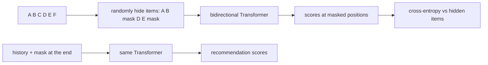

# BERT4Rec

> Trains a Transformer to fill in randomly hidden items of a user's sequence, using items on *both* sides
> (like BERT for text); to recommend, it fills in a blank placed after the last item.

--8<-- "generated/methods/bert4rec.md"

!!! note "Held back from the quick-tier bake-off"
    This method is not in the [quick-tier bake-off](../../results/quick-tier.md) yet, because it is heavier or did
    not finish on the full data. Its results below use default settings, without tuning. It joins the
    comparison later, through the same gate as every other method.

!!! tip "When to use it"
    - To compare bidirectional ("fill in the blank") with causal ("predict the next") training on your data.
    - When sequences have strong context on both sides, for example items bought together in a basket.

!!! warning "When not to"
    - As a default choice: careful replications found SASRec with a cross-entropy loss usually matches or
      beats it, and trains faster.
    - With a small training budget: BERT4Rec is known to need long training.

## 1. Intuition

Take a user's sequence A, B, C, D, E, F and hide some items: A, B, [mask], D, E, [mask]. The model must
guess the hidden ones. For the first blank it can use items *before and after* it (A, B and D, E). This
"cloze" task (as in school fill-in-the-blank exercises) gives many training signals per sequence.

At recommendation time, there is nothing after the last item. So BERT4Rec appends one [mask] at the end,
A B C D E F [mask], and its guess for that blank is the recommendation.

## 2. A tiny worked example

Sequence: A, B, C, D, E, F. Mask ratio 0.2: each position is hidden with probability 0.2, so on average
1.2 of the 6 items are masked. Suppose C and F are drawn:

| Position | 1 | 2 | 3 | 4 | 5 | 6 |
|---|---|---|---|---|---|---|
| Input | A | B | [mask] | D | E | [mask] |
| Target | – | – | C | – | – | F |

The loss is cross-entropy at the two masked positions only. To guess C, the model can attend to A, B, D,
and E. A causal model like SASRec could use only A and B.

At inference, for a history (A, B, C) and a maximum length of 4: RecBole writes [mask] after C, giving
(A, B, C, [mask]), reads the output at the [mask] position, and scores all items.

## 3. How it works

1. RecBole builds training sequences from the pre-test history (items first, padding at the end) and its
   data loader masks random positions.
2. Item and position embeddings feed a **bidirectional** Transformer: no causal mask, only a padding mask.
3. At each masked position, score all items and apply cross-entropy against the hidden item.
4. Inference: append [mask] after the last item; the output there scores all items.

## 4. The math, symbol by symbol

$$
\mathcal{L} = -\frac{1}{|\mathcal{M}|}\sum_{t\in\mathcal{M}}\ln
\frac{\exp(\mathbf{h}_t^\top\mathbf{e}_{s_t} + b_{s_t})}{\sum_{j}\exp(\mathbf{h}_t^\top\mathbf{e}_j + b_j)}
$$

| Symbol | Meaning | Shape / range |
|---|---|---|
| $\mathcal{M}$ | the set of masked positions in a sequence | — |
| $\mathbf{h}_t$ | Transformer output at masked position $t$ (sees both sides) | $d$ numbers |
| $s_t$ | the hidden item at position $t$ | item index |
| $\mathbf{e}_j, b_j$ | item embedding and output bias of item $j$ | $d$ numbers, scalar |
| mask ratio | probability that a position is hidden | `mask_ratio`, default 0.2 |

## 5. Training and inference

- **Training:** bidirectional attention costs $O(L\cdot n^2 d)$ per sequence; only masked positions give a
  loss, so it learns less per step than SASRec, which predicts at every position.
- **Inference:** one forward pass per user plus scoring of all items (RecBole's `full_sort_predict`).
- **Hardware:** laptop CPU at smoke scale; a GPU for full datasets.

## 6. Hyperparameters

| Name in recbench config | What it does | Default | Typical range | Tip |
|---|---|---|---|---|
| `mask_ratio` | share of positions hidden in training | 0.2 | 0.1–0.6 | higher = harder task, more signal per sequence |
| `dim`, `layers`, `heads`, `seq_len`, `dropout` | Transformer size (as for [SASRec](sasrec.md)) | preset; dropout 0.2 | | |
| `batch_size`, `lr`, `max_steps` | training loop | preset | | BERT4Rec usually needs many more steps than SASRec |

## 7. In recbench

- Code: `src/recbench/methods/recbole_models.py::BERT4Rec`, a thin subclass of
  `src/recbench/methods/recbole_models.py::RecBoleMethod`, which:
    1. exports the pre-test events as RecBole atomic files, with a strictly increasing "time" so ties
       never reorder;
    2. builds RecBole's dataset with split ratios [1.0, 0, 0], so RecBole trains on 100% of what it gets
       (recbench already separated train and test);
    3. trains with RecBole's own data loader (which creates the masks) for `max_steps` steps;
    4. scores with RecBole's layout: items first, padding at the end (`HistoryBatch.left_aligned`).
- Loss: cross-entropy (`loss_type: CE`), not BPR with one negative.
- **RecBole quirk:** at inference RecBole appends a column, writes [mask] right after the last item, and
  then drops the first column (`reconstruct_test_data`). With items stored first, that column is always the
  *oldest* item, so the oldest item of every history is not used when recommending. recbench keeps
  RecBole's behaviour rather than patching the library.
- A test checks that recbench's input sequence for a user equals RecBole's own training row
  (`tests/test_methods.py`).

!!! info "Fidelity"
    Faithful (RecBole 1.2's implementation), with the cross-entropy loss recommended by replication studies.

## 8. Results in this benchmark

--8<-- "generated/methods/bert4rec-results.md"

## 9. Strengths and weaknesses

- **Strengths:** uses context on both sides during training; a well-known reference model.
- **Weaknesses:** slow to converge; often no better than SASRec; inference uses an artificial [mask]
  that never appears in the middle of real sequences; same cold-start limits as other ID models.

## 10. Common pitfalls

- **Short training.** Many weak BERT4Rec results in papers came from under-training.
- **Wrong padding side.** RecBole's masking stops at the first padding item, so right-aligned (left-padded)
  sequences get no masks at all. recbench always gives RecBole left-aligned data.
- **Sampled evaluation.** BERT4Rec's original paper used sampled metrics, which inflated its advantage.

## 11. Check your understanding

??? question "Why can BERT4Rec use future items during training but not when recommending?"
    During training the whole sequence is known and some items are hidden. When recommending, the future
    is unknown, so the only blank is at the end.

??? question "With mask ratio 0.2 and length 50, how many positions are masked on average?"
    50 × 0.2 = 10.

??? question "What goes wrong if RecBole receives left-padded sequences?"
    Its masking transform stops at the first padding item, which comes first, so nothing is masked and the
    loss has no targets.

## 12. Further reading

- Sun et al. (2019), [BERT4Rec: Sequential Recommendation with Bidirectional Encoder Representations from
  Transformer](https://arxiv.org/abs/1904.06690) (CIKM 2019).
- Petrov & Macdonald (2022), [A Systematic Review and Replicability Study of BERT4Rec for Sequential
  Recommendation](https://arxiv.org/abs/2207.07483) (RecSys 2022).
- Klenitskiy & Vasilev (2023), [Turning Dross Into Gold Loss](https://arxiv.org/abs/2309.07602).
