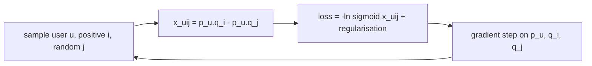

# BPR-MF

> Learns a vector for every user and every item so that, for each user, items they interacted with score
> higher than items picked at random.

--8<-- "generated/methods/bpr_mf.md"

!!! tip "When to use it"
    - As the classic learned baseline for implicit feedback (clicks, plays, purchases).
    - When you want compact vectors (embeddings) for users and items, for example to find similar items.

!!! warning "When not to"
    - When order matters (no notion of sequence).
    - For new users or items (no vector until they have interactions).
    - When you need exact explanations: latent factors are hard to interpret.

## 1. Intuition

Give every user and every item a short list of numbers, say 64. Think of each position as a hidden
"taste dimension" (for movies, perhaps "action vs drama" or "mainstream vs indie"; the model discovers the
dimensions itself). The score of item $i$ for user $u$ is how well their lists agree: multiply position by
position and add up (a dot product).

How to learn these numbers when we only see what users *did* interact with? BPR (Bayesian Personalized
Ranking) uses a pairwise rule. For a user, an item they interacted with should score higher than a random
item they did not. Training repeatedly picks such a pair and nudges the vectors so the pair is ordered correctly.

## 2. A tiny worked example

User $u$ has vector $\mathbf{p}_u = (0.5, 1.0)$. Item $i$ (interacted) has $\mathbf{q}_i = (1.0, 0.2)$; item
$j$ (random, not interacted) has $\mathbf{q}_j = (0.1, 0.8)$.

- $\hat{x}_{ui} = 0.5\cdot1.0 + 1.0\cdot0.2 = 0.70$
- $\hat{x}_{uj} = 0.5\cdot0.1 + 1.0\cdot0.8 = 0.85$
- Difference $\hat{x}_{uij} = 0.70 - 0.85 = -0.15$: the *wrong* order.
- Probability of the right order $\sigma(-0.15) = 0.4626$; loss $-\ln 0.4626 = 0.7710$.

One gradient step on the user vector, with learning rate 0.1, moves $\mathbf{p}_u$ to $(0.548, 0.968)$:
towards $\mathbf{q}_i$ and away from $\mathbf{q}_j$. The difference becomes $-0.087$. Still wrong, but
better. (The item vectors move too.) Millions of such small steps over random triples shape all the vectors.

## 3. How it works

1. Initialise user and item vectors with small random numbers.
2. Repeat: sample a user $u$, an item $i$ they interacted with, and an item $j$ they did not.
3. Compute $\hat{x}_{uij} = \mathbf{p}_u^\top \mathbf{q}_i - \mathbf{p}_u^\top \mathbf{q}_j$.
4. Take a gradient step on $-\ln\sigma(\hat{x}_{uij})$ plus regularisation, updating $\mathbf{p}_u$,
   $\mathbf{q}_i$, and $\mathbf{q}_j$.
5. To recommend: score all items with $\mathbf{p}_u^\top \mathbf{q}_i$; remove seen items; take the top K.

## 4. The math, symbol by symbol

$$
\mathcal{L}_{\text{BPR}} = -\sum_{(u,i,j)} \ln \sigma\!\left(\mathbf{p}_u^\top\mathbf{q}_i - \mathbf{p}_u^\top\mathbf{q}_j\right)
+ \lambda\left(\lVert\mathbf{p}_u\rVert^2 + \lVert\mathbf{q}_i\rVert^2 + \lVert\mathbf{q}_j\rVert^2\right)
$$

| Symbol | Meaning | Shape / range |
|---|---|---|
| $(u, i, j)$ | a training triple: user, interacted item, random non-interacted item | — |
| $\mathbf{p}_u$ | user vector (latent factors) | $d$ numbers |
| $\mathbf{q}_i$ | item vector | $d$ numbers |
| $\mathbf{p}_u^\top\mathbf{q}_i$ | dot product: the score of item $i$ for user $u$ | a real number |
| $\sigma(x) = 1/(1+e^{-x})$ | sigmoid: turns the score difference into a probability | (0, 1) |
| $\lambda$ | L2 regularisation strength | `bpr_reg`, default 0.01 |
| $d$ | number of factors | `dim` from the preset |

Reading it: maximise the probability that every observed item beats every unobserved one, while keeping
vectors small. Rendle et al. (2009) show this is a smooth stand-in for the AUC.

## 5. Training and inference

- **Training:** stochastic gradient descent over sampled triples. The `implicit` library runs it in
  multi-threaded C++/Cython; each iteration samples about one triple per interaction.
- **Inference:** a matrix product user vectors × item vectors: $O(\text{users} \cdot \text{items} \cdot d)$.
- **Hardware:** CPU is fine (`implicit` also has an optional CUDA version, not used here).

## 6. Hyperparameters

| Name in recbench config | What it does | Default | Typical range | Tip |
|---|---|---|---|---|
| `dim` | number of factors $d$ | from the preset (32 laptop, 64/128 GPU) | 16–256 | more factors need more data |
| `bpr_lr` | learning rate | 0.01 | 0.001–0.1 | too high diverges, too low barely moves |
| `bpr_reg` | L2 regularisation $\lambda$ | 0.01 | 0.0001–0.1 | raise if it overfits |
| `bpr_iterations` | passes over the data | 100 | 50–500 | watch validation metrics |

## 7. In recbench

- Code: `src/recbench/methods/implicit_mf.py::BPRMF`, using `implicit.bpr.BayesianPersonalizedRanking`
  (implicit 0.7.3) fitted on the binary pre-test matrix `TrainView.seen`.
- `implicit` appends one extra column to both user and item factors: a constant 1 on the user side and a
  learned bias on the item side. The dot product therefore already includes an item bias (a per-item
  popularity term).
- Scores: `user_factors[users] @ item_factors.T` (`src/recbench/methods/implicit_mf.py::BPRMF`).
- Explanations: history items closest to the recommended item in the factor space
  (`src/recbench/methods/_explain.py::embedding_explanations`). They are post-hoc, not the model's real "reason".

!!! info "Fidelity"
    Faithful to Rendle et al. (2009) through a widely used implementation. Negative sampling is uniform.

## 8. Results in this benchmark

--8<-- "generated/methods/bpr_mf-results.md"

## 9. Strengths and weaknesses

- **Strengths:** compact vectors, fast inference, a solid ranking-oriented objective.
- **Weaknesses:** needs tuning (learning rate, regularisation, iterations); sensitive to how negatives
  are sampled; latent factors are hard to explain or steer; no order and no content.

## 10. Common pitfalls

- **Uniform negatives are often too easy.** Most random items are obscure, so the model mostly learns
  "popular beats unpopular".
- **Comparing untuned BPR to tuned baselines.** Rendle et al. (2020) showed that the tuning budget often
  decides the winner.
- **Expecting explanations from factors.** Factor dimensions rarely map to human concepts.

## 11. Check your understanding

??? question "In the example, which way does the gradient move the user vector, and why?"
    Towards $\mathbf{q}_i - \mathbf{q}_j = (0.9, -0.6)$. Increasing the dot product with that direction raises
    $\hat{x}_{ui}$ relative to $\hat{x}_{uj}$, which is what the loss rewards.

??? question "What is the loss when the positive already scores much higher, say $\hat{x}_{uij} = 5$?"
    $-\ln\sigma(5) \approx 0.0067$. Almost zero, so well-ordered pairs barely change the model.

??? question "Why does implicit's BPR have d + 1 factors?"
    The extra column carries an item bias (with a constant 1 on the user side), so popularity can be learned
    separately from taste.

## 12. Further reading

- Rendle, Freudenthaler, Gantner and Schmidt-Thieme (2009),
  [BPR: Bayesian Personalized Ranking from Implicit Feedback](https://arxiv.org/abs/1205.2618) (UAI 2009).
- [Loss functions](../concepts/loss-functions.md#bpr) and [negative sampling](../concepts/negative-sampling.md).
- The `implicit` library: <https://github.com/benfred/implicit>.
