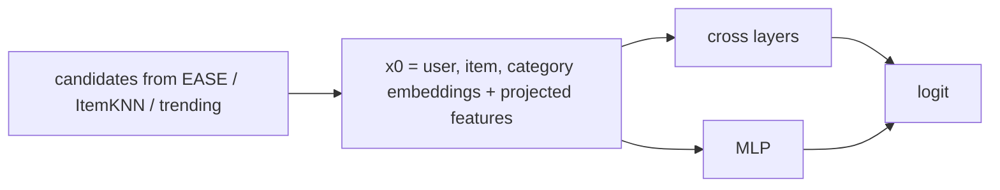

# DCN-V2 re-ranker

> DCN-V2 used for the job it was built for: re-ranking a short candidate list. It uses the same candidates and
> features as the LightGBM re-ranker, plus user, item and category embeddings, and learns feature crosses
> instead of trees.

!!! abstract "In plain words"
    The same two-stage idea as the LightGBM re-ranker, with a neural network as the second stage. Besides the numeric
    signals, it learns a vector for every user, item and category, and it multiplies features with each other
    ("crosses"), so it can find combinations such as "fresh item and a strong ItemKNN rank" by itself. Trees find such
    combinations with splits; this network finds them with products.

--8<-- "generated/methods/dcnv2_rerank.md"

!!! tip "When to use it"
    - When you want a neural re-ranker that can use learned ID embeddings as well as hand-made features.
    - To compare a neural and a tree-based ranker on exactly the same candidates.

!!! warning "When not to"
    - When candidate recall is low: like any re-ranker, it can only reorder what stage 1 proposes.
    - Full-catalog ranking: that is the [DCN-V2](dcnv2.md) page's setting, and it is slow and weak.

## 1. Intuition

In the untuned full-tier run, DCN-V2 scored every (user, item) pair in the catalog and did poorly. It had
learned to tell real items from random ones, which is easy and says little about which of 200 *plausible*
items comes first.

Here it gets a better job and better training data:

- it only scores the ~200 candidates from EASE, ItemKNN and trending items;
- it learns from those same candidates, labelled by what users actually chose next. These are **hard
  negatives**: plausible items the user did not take.

## 2. A tiny worked example

For one candidate, the network's input concatenates four vectors: the user's embedding, the item's embedding,
the item's category embedding, and a projection of the numeric features (generator ranks, trend, item age,
co-visits, and so on). A **cross layer** then multiplies this input by a learned transformation of itself:

$$
x_{l+1} = x_0 \odot (W_l x_l + b_l) + x_l
$$

If $x_0$ contains "high ItemKNN rank" and "fresh item", one cross layer can learn a weight for their
*combination*. Hand-made features would need that product written explicitly. A small MLP runs in parallel,
and both feed the final logit.

## 3. How it works

1. Stage 1 and the training table are exactly as for the [LightGBM re-ranker](lgbm-rerank.md).
2. The numeric features are standardised (mean 0, standard deviation 1).
3. Train DCN-V2 with binary cross-entropy on (user, candidate, label) rows, with the shared epoch loop and early
   stopping on the validation fold.
4. Score the new candidates at the test cutoff.

## 4. The math, symbol by symbol

| Symbol | Meaning |
|---|---|
| $x_0$ | the input: [user emb, item emb, category emb, projected features], 4 × `dim` numbers |
| $x_l$ | the output of cross layer $l$ |
| $W_l, b_l$ | the learned matrix and bias of layer $l$ |
| $\odot$ | element-wise product (this creates the feature crosses) |

After $l$ cross layers, $x_l$ contains products of up to $l + 1$ input features, while the residual "$+ x_l$" keeps
the lower-order terms. The final logit is a linear layer over the concatenated cross output and MLP output, and the
loss is binary cross-entropy against the label (1 = the user took this candidate).

## 5. Training and inference

- **Training rows:** up to `rerank_train_users` (20,000) recent users × about 200 candidates each: up to 4 million
  rows, of which only the users with at least one taken candidate are kept.
- **Training:** mini-batches of rows (`batch_size`), Adam with bf16 on a GPU. One epoch is one pass over the rows.
  On a validation fold, early stopping scores the fold through the whole two-stage pipeline after each epoch, and
  keeps the best epoch. Minutes on a GPU.
- **Inference:** stage 1 proposes the candidates, the features are computed, and one forward pass scores all of a
  batch of users' candidates at once.
- **Hardware:** GPU recommended; the two stage-1 generators (EASE and ItemKNN) are fitted twice, for the label
  window and for the test cutoff.

## 6. Hyperparameters

| Name in recbench config | What it does | Searched over |
|---|---|---|
| `layers` | cross layers | 1–3 |
| `dim` | embedding size | 16–64 |
| `dropout`, `lr`, `batch_size` | training | 0–0.3, 1e-4–1e-2, 512–4096 |
| `rerank_candidates`, `rerank_text` | as for the LightGBM re-ranker | 100/200, true/false |
| `max_epochs`, `patience` | early stopping on the validation fold; an epoch is one pass over the training rows | 30, 3 (not searched) |

## 7. In recbench

- Code: `src/recbench/methods/rerank.py::DCNV2Rerank`, sharing `src/recbench/methods/rerank.py::TwoStage`
  with the LightGBM re-ranker. The cross layers are FuxiCTR's `CrossNetV2`.
- `candidate_recall` is reported, as for every two-stage method.

!!! info "Fidelity: faithful network, re-ranking setting"
    The cross network follows Wang et al. (2021) (via FuxiCTR). Its inputs and training rows come from recbench's
    two-stage pipeline.

## 8. Results in this benchmark

--8<-- "generated/methods/dcnv2_rerank-results.md"

## 9. Strengths and weaknesses

- **Strengths:** learns crosses automatically; uses ID embeddings that trees cannot; same fair setup as the
  LightGBM re-ranker.
- **Weaknesses:** more settings than trees; needs enough training rows; capped by candidate recall.

## 10. Common pitfalls

- **Training on random negatives** and then re-ranking plausible candidates: the model learns the wrong task.
  Train on the candidates themselves.
- **Forgetting to standardise features:** large counts (popularity) would dominate the input.
- **Reading its probability as a click rate.** It is trained on candidate rows with the labels of one window, so
  its scores are only useful for ordering candidates.

## 11. Check your understanding

??? question "Why did DCN-V2 do poorly as a full-catalog ranker but can do well here?"
    It learned to separate real items from random ones, which mostly means popularity. Re-ranking plausible
    candidates with hard negatives teaches it the distinctions that matter for the top of the list.

??? question "What does a cross layer add over an MLP?"
    Explicit multiplicative interactions between input features in every layer, which an MLP can only
    approximate with many units.

??? question "Why does the DCN-V2 re-ranker standardise its numeric features?"
    Counts such as popularity can be thousands of times larger than ranks or shares. Without standardisation they
    would dominate the input and the products the cross layers form.

## 12. Further reading

- Wang et al. (2021). *DCN V2: Improved Deep & Cross Network and Practical Lessons for Web-scale Learning to Rank
  Systems.* WWW. [arXiv](https://arxiv.org/abs/2008.13535)
- [DCN-V2](dcnv2.md), [LightGBM re-ranker](lgbm-rerank.md), [retrieval and ranking](../concepts/retrieval-and-ranking.md).
