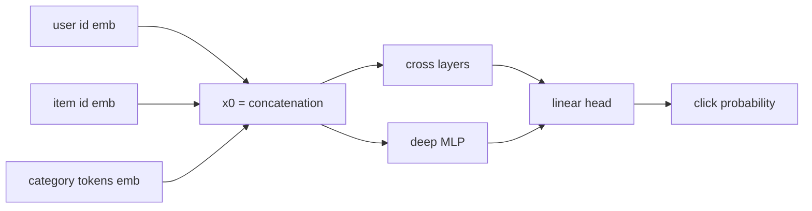

# DCN-V2

> Deep & Cross Network V2: predicts the probability that a user interacts with an item from features, and
> learns explicit *feature crosses* (products of features) with a cross network, next to a regular MLP.

--8<-- "generated/methods/dcnv2.md"

!!! tip "When to use it"
    - As a ranking model over **many features** (user attributes, item attributes, context such as time or device).
    - When interactions between features matter: "young users AND sports category AND weekend".

!!! warning "When not to"
    - With only IDs and one categorical feature (as in recbench's datasets): its strength, rich features, is barely used.
    - For full-catalog retrieval at scale: it scores one pair at a time.

!!! note "Two DCN-V2s in recbench"
    This page is the **full-catalog** version: it scores every (user, item) pair. The
    [DCN-V2 re-ranker](dcnv2-rerank.md) uses the same cross network for the job it was designed for, re-ordering
    about 200 candidates from cheap models. The quick-tier bake-off runs only the re-ranker; this version waits
    for the heavy-methods phase.

## 1. Intuition

Many signals are **combinations**: "likes running" and "item is a shoe" each mean a little; together they
mean a lot. A plain MLP can learn such combinations, but only implicitly and inefficiently. The cross network
builds them explicitly: each cross layer multiplies the original features by a learned transformation of
the current features, so after $l$ layers it contains products of up to $l+1$ features. An MLP runs in
parallel for everything else, and both feed one prediction.

## 2. A tiny worked example

Input features $\mathbf{x}_0 = (1, 2)$ (for example a user feature and an item feature). One cross layer
with

$$
W = \begin{pmatrix}0.5 & 0\\0.1 & 0.2\end{pmatrix},\quad \mathbf{b} = (0, 0.1)
$$

- $W\mathbf{x}_0 + \mathbf{b} = (0.5,\ 0.6)$
- $\mathbf{x}_0 \odot (W\mathbf{x}_0 + \mathbf{b}) = (0.5,\ 1.2)$
- $\mathbf{x}_1 = \mathbf{x}_0 \odot (W\mathbf{x}_0 + \mathbf{b}) + \mathbf{x}_0 = (1.5,\ 3.2)$

Expanding the second coordinate: $x_{1,2} = 0.1\,x_{0,1}x_{0,2} + 0.2\,x_{0,2}^2 + 0.1\,x_{0,2} + x_{0,2}$.
The term $0.1\,x_{0,1}x_{0,2}$ is an explicit **cross** of feature 1 and feature 2, with a learned weight.

## 3. How it works

1. Build $\mathbf{x}_0$ by concatenating embeddings: user id, item id, and the mean of the item's category-token embeddings.
2. Cross network: $L$ cross layers. Deep network: a 2-layer MLP. Both read $\mathbf{x}_0$.
3. Concatenate both outputs and apply a linear head to get a logit; the sigmoid gives a probability.
4. Train with binary cross-entropy on pre-test interactions (label 1) and `dcn_negatives` random unseen
   items per interaction (label 0).

## 4. The math, symbol by symbol

$$
\mathbf{x}_{l+1} = \mathbf{x}_0 \odot \left(W_l\,\mathbf{x}_l + \mathbf{b}_l\right) + \mathbf{x}_l,
\qquad
\hat{y} = \sigma\!\left(\mathbf{w}^\top\big[\mathbf{x}_L;\ \text{MLP}(\mathbf{x}_0)\big] + b\right)
$$

| Symbol | Meaning | Shape / range |
|---|---|---|
| $\mathbf{x}_0$ | input: concatenated feature embeddings | 3·dim numbers |
| $\mathbf{x}_l$ | output of cross layer $l$ | 3·dim |
| $W_l, \mathbf{b}_l$ | learned matrix and bias of layer $l$ | (3·dim)², 3·dim |
| $\odot$ | element-wise product: creates the feature crosses | — |
| $+\,\mathbf{x}_l$ | residual connection: keeps lower-order terms | — |
| $\hat{y}$ | predicted interaction probability | (0, 1) |

## 5. Training and inference

- **Training:** cheap per pair (a few small matrix products).
- **Full-ranking inference:** every (user, item) pair, users × items small networks; much cheaper than DIN
  (no attention over history), but still far more than a dot product.
- **Hardware:** laptop CPU at smoke scale; a GPU for full datasets.

## 6. Hyperparameters

| Name in recbench config | What it does | Default | Tip |
|---|---|---|---|
| `layers` | number of cross layers | preset (2 / 2 / 3) | 2–3 is typical |
| `dim` | embedding size per feature | preset | |
| `dcn_negatives` | negatives per positive | 4 | |
| `batch_size`, `lr`, `max_steps` | training loop (a batch is 4 × `batch_size` positives) | preset | |

## 7. In recbench

- Code: `src/recbench/methods/dcnv2.py::DCNV2` with the network `src/recbench/methods/dcnv2.py::DCNNet`,
  which uses FuxiCTR's `CrossNetV2` layer; category tokens are hashed by
  `src/recbench/methods/dcnv2.py::category_index`.
- Training batches: `src/recbench/methods/_torch.py::edge_batches` (pre-test positives, rejected-if-seen negatives).
- `output="pairs"` and `outputs_probability=True`, so the sampled log loss is reported as a diagnostic.
- recbench v0.1 trained DCN-V2 *on the evaluation file*; v0.2 trains only on pre-test data.

!!! info "Fidelity"
    Faithful cross network (FuxiCTR's implementation) in the parallel DCN-V2 structure. The low-rank
    mixture-of-experts variant from the paper is not used. With only ID and category features, this is a
    minimal setting for a feature-crossing model.

## 8. Results in this benchmark

--8<-- "generated/methods/dcnv2-results.md"

## 9. Strengths and weaknesses

- **Strengths:** explicit, efficient feature interactions; the standard industrial ranker family; easy to
  add business features.
- **Weaknesses:** needs rich features to justify itself; pairwise scoring cost; post-hoc explanations only.

## 10. Common pitfalls

- **Training on evaluation labels.** recbench v0.1 did this; the [review log](../../review/2026-10-02-review.md) explains why it inflates metrics.
- **Calibrated probabilities from sampled negatives:** outputs reflect the sampling ratio.
- **Too many cross layers:** high-order crosses overfit quickly.

## 11. Check your understanding

??? question "After 2 cross layers, what is the highest-order product of input features?"
    Third order: each layer multiplies by $\mathbf{x}_0$ once more, so two layers give products of up to 3 features.

??? question "Why add $\mathbf{x}_l$ at the end of each cross layer?"
    It is a residual connection: lower-order terms (including the raw features) are kept, so the network
    only has to learn the *extra* crosses.

??? question "What is the logit of a pair whose predicted probability is 0.5?"
    0, because σ(0) = 0.5.

## 12. Further reading

- Wang et al. (2021), [DCN V2: Improved Deep & Cross Network and Practical Lessons for Web-scale Learning to
  Rank Systems](https://arxiv.org/abs/2008.13535) (WWW 2021).
- FuxiCTR: <https://github.com/reczoo/FuxiCTR>.
- [DCN-V2 re-ranker](dcnv2-rerank.md), [retrieval and ranking](../concepts/retrieval-and-ranking.md).
