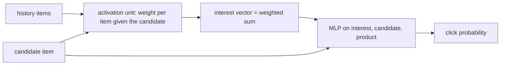

# DIN

> Deep Interest Network: to score one candidate item, it looks back at the user's history and pays
> attention to the past items that are relevant *to that candidate*, then predicts a click probability.

--8<-- "generated/methods/din.md"

!!! tip "When to use it"
    - As a **second-stage ranker**: re-scoring a few hundred candidates per user with rich features.
    - When users have diverse interests (shoes *and* cookbooks): one fixed user vector blurs them, DIN does not.

!!! warning "When not to"
    - For full-catalog retrieval: it must run a neural network for every (user, item) pair. On a laptop CPU,
      full ranking of one smoke dataset took over 90 minutes, so recbench runs DIN in the GPU tier only
      (or explicitly with `--methods din`).
    - Without many labelled examples.

## 1. Intuition

A user's history contains several interests. Most models compress it into **one** vector, the same no
matter which item is being considered. DIN instead builds the user's interest vector *per candidate*. To
score a tent, it weights the hiking-related part of the history heavily. To score a cookbook, it weights the
cooking part. That candidate-dependent weighting is "target attention" (an "activation unit" in the paper).

## 2. A tiny worked example

History embeddings: $h_1 = (1, 0)$, $h_2 = (0, 1)$, $h_3 = (1, 1)$. For illustration, use the dot product
with the candidate as the attention weight (the real model learns a small MLP for this).

| Candidate | Weights $w_j = \mathbf{c}\cdot h_j$ | Interest $\sum_j w_j h_j$ | Score $\langle\text{interest}, \mathbf{c}\rangle$ |
|---|---|---|---|
| $c_1 = (1, 0.2)$ | (1.0, 0.2, 1.2) | (2.2, 1.4) | 2.48 |
| $c_2 = (0, 1)$ | (0, 1, 1) | (1, 2) | 2.00 |

The same history yields two different "users", one per candidate. For $c_1$ the first dimension dominates;
for $c_2$, the second. DIN's weights are not normalised to sum to 1 (no softmax by default), so a long
relevant history can produce a stronger signal.

The model's output is a logit $z$, and $p = \sigma(z)$ is the click probability. With binary cross-entropy:
a positive with $z = 1.2$ has $p = 0.7685$ and loss 0.263; a negative with $z = 0.3$ has $p = 0.5744$
and loss 0.854, the larger correction.

## 3. How it works

1. Embed the user, every history item, and the candidate item (with their category features).
2. For each history item, an MLP reads (history item, candidate, their difference, their product) and outputs
   an attention weight.
3. The interest vector is the weighted sum of history items.
4. An MLP on (interest, candidate, interest ⊙ candidate) outputs a logit.
5. Train with binary cross-entropy: observed pairs labelled 1, sampled unseen items labelled 0.

## 4. The math, symbol by symbol

$$
\mathbf{v}_u(c) = \sum_{j=1}^{n} a(\mathbf{e}_j, \mathbf{e}_c)\,\mathbf{e}_j,
\qquad
\hat{y}_{uc} = \sigma\!\left(\text{MLP}\big[\mathbf{v}_u(c),\ \mathbf{e}_c,\ \mathbf{v}_u(c)\odot\mathbf{e}_c\big]\right)
$$

$$
\mathcal{L} = -\sum_{(u,c,y)} \Big[y\ln\hat{y}_{uc} + (1-y)\ln(1-\hat{y}_{uc})\Big]
$$

| Symbol | Meaning | Shape / range |
|---|---|---|
| $\mathbf{e}_j$ | embedding of the $j$-th history item (item id + category tokens) | $d$ numbers |
| $\mathbf{e}_c$ | embedding of the candidate item | $d$ numbers |
| $a(\cdot,\cdot)$ | activation unit: an MLP on $[\mathbf{e}_j, \mathbf{e}_c, \mathbf{e}_j-\mathbf{e}_c, \mathbf{e}_j\odot\mathbf{e}_c]$ | a real weight |
| $\mathbf{v}_u(c)$ | the user's interest *with respect to candidate c* | $d$ numbers |
| $\hat{y}_{uc}$ | predicted probability that user $u$ interacts with $c$ | (0, 1) |
| $y$ | label: 1 for an observed pair, 0 for a sampled negative | {0, 1} |

## 5. Training and inference

- **Training:** RecBole's data loader adds `din_negatives` sampled negatives per positive; the cost per
  pair is $O(n\cdot\text{MLP})$ for history length $n$.
- **Inference for full ranking:** every (user, item) pair, so cost is users × items × $n$ × MLP. This is the
  most expensive method in recbench. recbench scores pairs in chunks of at most 32,768 (`pair_budget`) to bound memory.
- **Hardware:** a GPU is strongly recommended.

## 6. Hyperparameters

| Name in recbench config | What it does | Default | Tip |
|---|---|---|---|
| `din_negatives` | sampled negatives per positive in training | 4 | more negatives = better ranking, slower training |
| `dim` | embedding size (MLP sizes are 2·dim, dim) | preset | |
| `seq_len` | history length attended over | preset | longer = slower, linearly |
| `batch_size`, `lr`, `max_steps` | training loop | preset | |

## 7. In recbench

- Code: `src/recbench/methods/recbole_models.py::DIN` (RecBole 1.2's DIN through `RecBoleMethod`).
- `output="pairs"`: the evaluator calls `score_pairs` over the whole catalog in chunks; the method feeds
  RecBole's `forward` (logits) with left-aligned histories.
- Item categories are loaded as features, so the activation unit sees item id + category.
- Removed from the laptop smoke default after one dataset took over 90 minutes; included in the GPU tier.

!!! info "Fidelity"
    Faithful to DIN through RecBole: un-normalised attention weights (no softmax), a sigmoid-activated
    attention MLP, and the paper's Dice activation with batch norm in the prediction MLP. The paper's
    mini-batch-aware regularisation is not part of RecBole's implementation.

## 8. Results in this benchmark

--8<-- "generated/methods/din-results.md"

## 9. Strengths and weaknesses

- **Strengths:** candidate-aware user modelling; natural home for rich features; attention weights are a
  natural explanation (not yet exposed by recbench).
- **Weaknesses:** very expensive for full-catalog ranking; needs many labels; no new-item support.

## 10. Common pitfalls

- **Using a pointwise ranker for retrieval.** In production, DIN re-ranks a few hundred candidates
  produced by a cheap retriever (see [retrieval and ranking](../concepts/retrieval-and-ranking.md)).
- **Reading probabilities as calibrated** when the negatives were sampled: the probabilities reflect the
  1:4 sampling ratio, not real click rates.

## 11. Check your understanding

??? question "Why does DIN need the candidate item before it can build the user's interest vector?"
    The attention weights depend on the candidate. A different candidate weights the history differently,
    so there is no single user vector to precompute.

??? question "Why is DIN slow for full ranking but fine as a re-ranker?"
    Full ranking needs users × items network evaluations, each attending over the history. Re-ranking 200
    candidates per user is a tiny fraction of that.

??? question "With 4 negatives per positive, why are predicted probabilities biased?"
    The model sees 20% positives in training, far more than real click rates, so its outputs are inflated
    unless corrected.

## 12. Further reading

- Zhou et al. (2018), [Deep Interest Network for Click-Through Rate Prediction](https://arxiv.org/abs/1706.06978) (KDD 2018).
- [CTR and rating metrics](../metrics/ctr-and-rating-metrics.md) and [loss functions](../concepts/loss-functions.md).
