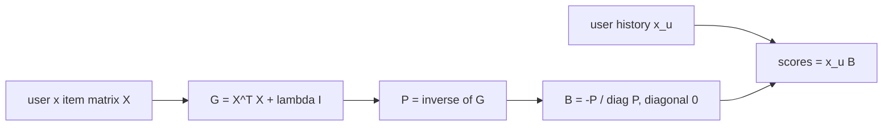

# EASE

> Learns one item-to-item weight matrix that best "reconstructs" every user's history from the rest of it,
> with a closed-form solution (one matrix inverse, no training loop).

--8<-- "generated/methods/ease.md"

!!! tip "When to use it"
    - As the strongest simple baseline. It often matches or beats deep models on top-N benchmarks.
    - When you need exact, item-level explanations.
    - When the catalog has up to tens of thousands of items, so the item × item matrix fits in memory.

!!! warning "When not to"
    - Very large catalogs (hundreds of thousands of items): the dense matrix does not fit. recbench caps the
      catalog for this reason.
    - When the order of actions matters, or for brand-new items.

## 1. Intuition

ItemKNN *counts* which items go together. EASE *learns* how much each item should vote for each other
item, so that, from the rest of your history, it can predict each item you actually have. Two rules make
it work:

1. **An item may not vote for itself** (the diagonal is forced to zero). Otherwise the trivial answer "every
   item predicts itself" would be perfect and useless.
2. **Weights are kept small** (a penalty $\lambda$), so the model does not memorise noise.

The result behaves like a *partial* correlation. Item A gets credit for predicting item C only if A tells
you something about C that the other items do not already explain.

## 2. A tiny worked example

Four users and three items:

| | A | B | C |
|---|---|---|---|
| u1 | 1 | 1 | 0 |
| u2 | 1 | 1 | 1 |
| u3 | 0 | 1 | 1 |
| u4 | 1 | 0 | 0 |

**Step 1: Gram matrix** $G = X^\top X$ (co-occurrence counts):

$$
G = \begin{pmatrix} 3 & 2 & 1 \\ 2 & 3 & 2 \\ 1 & 2 & 2 \end{pmatrix}
$$

**Step 2: invert** $G + \lambda I$ with $\lambda = 1$:

$$
P = (G + I)^{-1} = \begin{pmatrix} 0.3333 & -0.1667 & 0 \\ -0.1667 & 0.4583 & -0.25 \\ 0 & -0.25 & 0.5 \end{pmatrix}
$$

**Step 3: weights** $B_{ij} = -P_{ij} / P_{jj}$, with the diagonal set to 0:

$$
B = \begin{pmatrix} 0 & 0.3636 & 0 \\ 0.5 & 0 & 0.5 \\ 0 & 0.5455 & 0 \end{pmatrix}
$$

Row $i$ holds the votes of item $i$. Notice $B_{AC} = 0$: A and C co-occur once (user u2), but u2 also has
B, which already explains C. EASE gives A no direct credit for C. ItemKNN would.

**Step 4: score users.** u1 has A and B, so their scores are row A + row B = (0.5, 0.3636, 0.5). After
removing seen items A and B, u1 gets **C (0.5)**, explained by B's vote of 0.5. User u4 has only A and
gets B = 0.3636 and C = 0.

## 3. How it works

1. Build the binary user × item matrix $X$, restricted to at most `ease_max_items` items (the most
   recently popular ones).
2. $G = X^\top X$; add $\lambda$ to its diagonal.
3. Invert it: $P = (G + \lambda I)^{-1}$.
4. $B = -P / \text{diag}(P)$ column by column; set $\text{diag}(B) = 0$.
5. Score: $s_u = x_u B$; remove seen items; take the top K.

## 4. The math, symbol by symbol

EASE solves

$$
\min_{B}\; \lVert X - XB \rVert_F^2 + \lambda \lVert B \rVert_F^2
\quad\text{subject to}\quad \text{diag}(B) = 0,
$$

whose solution is

$$
\hat{B} = I - P\,\text{diagMat}\!\left(\frac{1}{\text{diag}(P)}\right),
\qquad P = (X^\top X + \lambda I)^{-1}.
$$

| Symbol | Meaning | Shape / range |
|---|---|---|
| $X$ | binary user × item matrix of pre-test interactions | users × items |
| $B$ | item-to-item weights; $B_{ij}$ = how much item $i$ votes for item $j$ | items × items |
| $\lVert \cdot \rVert_F^2$ | squared Frobenius norm: the sum of all squared entries | ≥ 0 |
| $\lambda$ | L2 penalty that keeps weights small | `ease_lambda`, default 500 |
| $\text{diag}(B) = 0$ | an item may not predict itself | constraint |
| $P$ | inverse of the regularised Gram matrix | items × items |
| $\text{diagMat}(1/\text{diag}(P))$ | diagonal matrix with $1/P_{jj}$ on its diagonal | items × items |

Reading it: find weights $B$ such that each user's row, multiplied by $B$, reproduces that same row as
well as possible, without self-votes and without huge weights. The zero-diagonal constraint is solved
exactly with a Lagrange multiplier, which is where the division by $P_{jj}$ comes from.

## 5. Training and inference

- **Training:** one dense matrix inverse, $O(I^3)$ time and $O(I^2)$ memory for $I$ items. With 20,000
  items in float32, each item × item matrix takes 1.6 GB, and several exist briefly. On a laptop this is
  seconds to about a minute.
- **Inference:** $x_u B$ for each user, a sparse row times a dense matrix.
- **Hardware:** CPU. The memory is the limit, not the compute.

## 6. Hyperparameters

| Name in recbench config | What it does | Default | Typical range | Tip |
|---|---|---|---|---|
| `ease_lambda` | L2 penalty $\lambda$ | 500.0 | 50–5,000 | larger for denser data and bigger catalogs |
| `ease_max_items` | catalog cap (most recently popular items) | 30,000; 20,000 on the laptop profile | 10K–40K | limited by RAM: about 3 × items² × 4 bytes |

## 7. In recbench

- Code: `src/recbench/methods/baselines.py::EASE`. The computation runs in float32 to halve memory, and the
  inverse is turned into $B$ in place.
- **Catalog cap:** if a dataset has more items than `ease_max_items`, EASE keeps the most recently popular
  ones and logs `fit.item_cap_coverage`, the share of pre-test interactions those items cover. Items
  outside the cap are never recommended.
- Explanations are exact: the score is a sum of $B_{ij}$ over history items $i$, and the explanation cites
  the largest terms (`src/recbench/methods/_explain.py::contribution_explanations`).
- A test checks the weights against a direct float64 computation of the closed form (`tests/test_methods.py`).

!!! info "Fidelity"
    Faithful to Steck (2019). The catalog cap is a practical addition; the paper assumes the matrix fits.

## 8. Results in this benchmark

--8<-- "generated/methods/ease-results.md"

## 9. Strengths and weaknesses

- **Strong accuracy** for its simplicity; one hyperparameter; deterministic.
- **Exact explanations** and inspectable weights (you can read $B$ like a table).
- **Weaknesses:** memory grows with the square of the catalog; ignores order; cannot score new items.

## 10. Common pitfalls

- **Too small a $\lambda$** on big data overfits; too large makes everything look like popularity.
- **Inverting in float64 on a laptop** can exhaust memory; float32 is accurate enough here.
- **Forgetting the zero diagonal** makes the model predict that you will interact with what you already have.

## 11. Check your understanding

??? question "Why is $B_{AC} = 0$ in the example although A and C co-occur?"
    The only user with both A and C (u2) also has B, and B explains C (weight 0.5). After accounting for B,
    A adds no extra information about C, so EASE gives it no direct weight.

??? question "What happens without the diag(B) = 0 constraint?"
    $B = I$ (each item predicts itself) reconstructs $X$ perfectly. That gives zero loss and no useful
    recommendations.

??? question "Roughly how much memory does EASE need for 30,000 items in float32?"
    One 30,000 × 30,000 float32 matrix is 3.6 GB. With two or three such matrices alive at once, about 11 GB.

## 12. Further reading

- Steck (2019), [Embarrassingly Shallow Autoencoders for Sparse Data](https://arxiv.org/abs/1905.03375)
  (WWW 2019), code: <https://github.com/hasteck/EASE_WWW19>.
- [ItemKNN](itemknn.md) for the counting version of the same idea.
- [Fair baselines](../concepts/fair-baselines-and-tuning.md): why such simple models are hard to beat.
