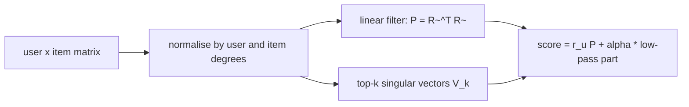

# GF-CF

> A graph method with no training: it smooths a user's history over the normalised item-item graph and adds a
> little of the graph's strongest global patterns, all with fixed matrix formulas.

!!! abstract "In plain words"
    Imagine every item as a dot, with lines between items that the same people use. GF-CF "blurs" your history along
    those lines, so items close to yours light up. It also adds a little of the few broad patterns that explain most of
    the data (a low-pass filter, like keeping the bass of a song and dropping the hiss). Everything is a fixed formula:
    there is nothing to train, so it runs in seconds.

--8<-- "generated/methods/gfcf.md"

!!! example "Improve it yourself"
    [Lab 7](../../labs/07-gfcf.md) takes you through GF-CF in four levels: reproduce its baseline, understand
    every setting, prune its filter for speed, and make its low-pass filter smooth. The [lab scoreboard](../../labs/scoreboard.md) tracks your results.

!!! tip "When to use it"
    - As a cheap stand-in for LightGCN. The paper showed that LightGCN's benefit comes mostly from this kind of
      smoothing, which GF-CF computes directly, in seconds instead of hours.
    - When you want a graph method with almost nothing to tune (two settings).

!!! warning "When not to"
    - When order or time matter more than co-occurrence.
    - For items without interactions (cold start).

## 1. Intuition

In [LightGCN](lightgcn.md), each layer replaces a node's embedding by a weighted average of its neighbours'
embeddings. Stacking layers keeps the "smooth" patterns shared across the graph and washes out noise, like a
**low-pass filter** keeping the bass and dropping the hiss.

Shen et al. (2021) showed that you can apply such a filter directly, without learning any embeddings. GF-CF
combines two filters:

- a **linear filter**: one step of smoothing over the normalised item-item graph $\tilde R^\top \tilde R$
  ("items co-occurring with your items, discounted by how popular everyone involved is"), and
- an **ideal low-pass filter**: the projection onto the top-$k$ singular vectors (the strongest global
  patterns), weighted by $\alpha$.

## 2. A tiny worked example

Users A {1, 2}, B {1, 3}, C {1, 2, 4}. User degrees: A 2, B 2, C 3. Item degrees: item 1 has 3, item 2 has 2,
items 3 and 4 have 1.

The normalised entry for user $u$ and item $i$ is $1 / (\sqrt{d_u}\sqrt{d_i})$. A new user D has item 2.
The linear filter scores each item $j$ by summing over the users who have both 2 and $j$:

$$
\text{score}(j) = \sum_{u \ni 2, j} \frac{1}{d_u \sqrt{d_2 d_j}}
$$

- item 1: users A and C: (1/2 + 1/3) / √(2·3) = 0.833 / 2.449 ≈ **0.340**
- item 4: user C only: (1/3) / √(2·1) ≈ **0.236**
- item 3: nobody has both 2 and 3: **0**

Compare with [RP3beta](rp3beta.md) on the same data: the degree normalisation again pulls the bestseller
(item 1) towards the niche item 4, built into the formula instead of tuned through beta. The ideal low-pass
term then adds $\alpha$ times the part of D's history that lies along the graph's strongest patterns.

## 3. How it works

1. Normalise: $\tilde R = D_U^{-1/2} R\, D_I^{-1/2}$.
2. Linear filter: the sparse item-item matrix $P = \tilde R^\top \tilde R$.
3. Ideal low-pass: the top-$k$ right singular vectors $V_k$ of $\tilde R$ (a randomized SVD).
4. Score: $r_u P + \alpha\, r_u D_I^{-1/2} V_k V_k^\top D_I^{1/2}$.

## 4. The math, symbol by symbol

$$
s_u = r_u\, \tilde R^\top \tilde R \;+\; \alpha\, r_u\, D_I^{-1/2} V_k V_k^\top D_I^{1/2}
$$

| Symbol | Meaning | Shape |
|---|---|---|
| $r_u$ | user $u$'s interactions (binary, or time-decayed) | 1 × items |
| $D_U, D_I$ | diagonal matrices of user and item degrees | — |
| $\tilde R$ | symmetrically normalised interaction matrix | users × items |
| $V_k$ | top-$k$ right singular vectors of $\tilde R$ (`gfcf_k`) | items × k |
| $\alpha$ | weight of the ideal low-pass part (`gfcf_alpha`); 0 = linear filter only | ≥ 0 |

## 5. Training and inference

- **"Training":** one sparse product and one truncated SVD: seconds to minutes on a CPU.
- **Inference:** sparse and small dense products per batch of users.
- **Hardware:** CPU.

## 6. Hyperparameters

| Name in recbench config | What it does | Default | Searched over |
|---|---|---|---|
| `gfcf_alpha` | weight of the ideal low-pass part | 0.3 | 0–1 |
| `gfcf_k` | singular vectors in the low-pass part | 256 | 64–1024 |
| (normalisation exponent) | how strongly user and item degrees are divided out | 0.5 | fixed in the code |
| `decay_half_life_days`, `train_window_days` | time-aware settings | none | as for every method |

## 7. In recbench

- Code: `src/recbench/methods/graph_filters.py::GFCF`.
- `tests/test_new_methods.py` checks the scores against the dense formula above.

!!! info "Fidelity: faithful"
    The formula and defaults (alpha = 0.3, k = 256) follow Shen et al. (2021). The authors' repository has
    no licence, so recbench implements the equations independently, with a randomized SVD instead of
    `sparsesvd`.

## 8. Results in this benchmark

--8<-- "generated/methods/gfcf-results.md"

## 9. Strengths and weaknesses

- **Strengths:** no training loop; two settings; graph-quality results at near-ItemKNN cost; deterministic.
- **Weaknesses:** no order or time awareness (except decay); the item-item matrix can get dense for very
  popular items; no explanations beyond the co-occurrence part.

## 10. Common pitfalls

- **Expecting LightGCN to beat it by default.** The paper's point is that it often does not; compare them
  with the same tuning budget.
- **Forgetting the degree normalisation.** Without it, the filter just recommends popular items.
- **Slow scoring.** The linear filter is never pruned: on MovieLens it holds about 70 million weights, and scoring
  takes about 4 seconds per 1,000 users, some 30 times ItemKNN's ([lab 7](../../labs/07-gfcf.md), Level 3.2).
- **Too many singular vectors (`gfcf_k`).** The "ideal" low-pass part then keeps fine, noisy patterns too, and
  stops being a smoothing step.

## 11. Check your understanding

??? question "Why is it called 'training-free'?"
    Nothing is learned by gradient descent: every quantity is computed by a fixed formula from the data.

??? question "What does alpha = 0 reduce GF-CF to?"
    The linear filter alone: one step of normalised item-item smoothing, close in spirit to ItemKNN with a
    particular similarity.

??? question "GF-CF and PureSVD both use the top singular vectors. What does GF-CF add?"
    The degree normalisation, so popular items and very active users do not dominate, and the linear filter, so that
    a user's direct neighbours still count. PureSVD is the low-rank projection alone, without normalisation.

## 12. Further reading

- Shen, Wu, Zhang, Yang, Hu, Lu, Letaief (2021). *How Powerful is Graph Convolution for Recommendation?* CIKM.
  [arXiv](https://arxiv.org/abs/2108.07567)
- [Turbo-CF](turbocf.md), [LightGCN](lightgcn.md), [PureSVD](puresvd.md).
