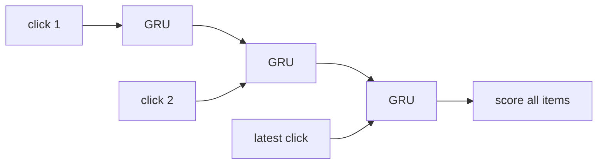

# GRU4Rec

> A recurrent neural network that reads a user's clicks one by one, keeps a running "memory" of what they are
> after, and scores every item as the possible next click.

!!! abstract "In plain words"
    GRU4Rec reads a user's clicks in order, like you read a sentence, and keeps a running summary of "what this person
    is after right now". Each new click updates that summary: a small switch (a gate) decides whether the click is a
    detour or a change of mind. After the latest click, the items closest to the summary are the predicted next
    clicks. recbench uses the authors' own code, because unofficial versions were shown to score much lower.

--8<-- "generated/methods/gru4rec.md"

!!! tip "When to use it"
    - For next-click and session tasks, as the classic neural sequential baseline (the first deep model for
      session-based recommendation).
    - As a cheaper alternative to Transformers such as SASRec: one small recurrent layer.

!!! warning "When not to"
    - When long-term taste matters more than recent order.
    - For commercial use without the author's permission (see the licence below).

## 1. Intuition

Reading a user's history in order, GRU4Rec keeps a **hidden state**: a vector summarising "what this user seems
to want right now". Each new click updates it. A **gate** decides how much of the old state to keep and how
much to replace with information from the new click. After the latest click, the hidden state is compared with
every item's vector, and the closest items are the predicted next clicks.

## 2. A tiny worked example

Use a one-number hidden state. After several camping items, $h_{t-1} = 0.8$ ("into camping"). The user now
clicks a dress, whose candidate update is $\tilde n_t = -0.5$. PyTorch's GRU combines them as
$h_t = (1 - z_t)\,\tilde n_t + z_t\, h_{t-1}$:

| Update gate $z_t$ | New state | Meaning |
|---|---|---|
| 0.9 (keep the old state) | 0.1·(−0.5) + 0.9·0.8 = **0.67** | still mostly camping; the dress was a detour |
| 0.2 (replace it) | 0.8·(−0.5) + 0.2·0.8 = **−0.24** | switched to fashion |

The network learns when to keep and when to switch from the training sequences.

## 3. How it works

1. Training data: each user's pre-test history is one sequence. Mini-batches are "session-parallel": a batch
   holds one position from each of several sequences.
2. Input: the clicked item's embedding (shared with the output layer, "constrained embedding").
3. A GRU cell updates the hidden state.
4. The hidden state is scored against the target item and against negatives: the other targets in the batch,
   plus `gru4rec_n_sample` extra items sampled by popularity^`sample_alpha`.
5. Loss: cross-entropy over those candidates, or BPR-max (Hidasi & Karatzoglou 2018).
6. To recommend, recbench steps through the user's latest `seq_len` items and scores all items against the
   final state.

## 4. The math, symbol by symbol

$$
z_t = \sigma(W_z x_t + U_z h_{t-1}),\quad r_t = \sigma(W_r x_t + U_r h_{t-1}),\quad
\tilde n_t = \tanh\!\big(W x_t + r_t \odot U h_{t-1}\big),\quad h_t = (1-z_t)\odot \tilde n_t + z_t \odot h_{t-1}
$$

| Symbol | Meaning |
|---|---|
| $x_t$ | the embedding of the item clicked at step $t$ |
| $h_t$ | hidden state after step $t$ (size `gru4rec_hidden`) |
| $z_t$, $r_t$ | update and reset gates (between 0 and 1) |
| $\tilde n_t$ | the candidate new state |
| score$(i)$ | $h_t \cdot e_i + b_i$ for every item $i$ |

## 5. Training and inference

- **Training:** one GRU step per event per epoch, with sampled negatives. Fast on a GPU.
- **Inference:** `seq_len` GRU steps per user, then one product with all item vectors.
- **Hardware:** GPU or CPU. The official code's sparse embeddings do not support Apple MPS.

## 6. Hyperparameters

The ranges follow the official code's search space (`paramspaces/` in the repository); the defaults are its
tuned RetailRocket settings.

| Name in recbench config | What it does | Default | Searched over |
|---|---|---|---|
| `gru4rec_loss` | cross-entropy or BPR-max | bpr-max | both |
| `gru4rec_hidden` | hidden state size | 224 | 64–512 |
| `gru4rec_batch_size` | sequences per mini-batch | 80 | 32–256 |
| `gru4rec_lr`, `gru4rec_momentum` | Adagrad-style optimiser settings | 0.05, 0.4 | 0.01–0.25, 0–0.9 |
| `gru4rec_dropout_embed`, `gru4rec_dropout_hidden` | dropout | 0.5, 0.05 | 0–0.5, 0–0.7 |
| `gru4rec_sample_alpha`, `gru4rec_n_sample` | extra negatives sampled by popularity^alpha | 0.4, 2048 | 0–1, fixed |
| `gru4rec_epochs` | passes over the data (no early stopping) | 10 | 5, 10, 20 |

## 7. In recbench

- Code: `src/recbench/methods/gru4rec.py::GRU4Rec`, an adapter around the official code, which
  `scripts/fetch_third_party.sh` fetches at a pinned commit.
- `tests/test_methods.py` runs the copy task (it must predict the next item from the history's end).

!!! info "Fidelity: faithful (official code)"
    The model and its training are the authors' own PyTorch code. Two adaptations: each user's whole history is
    one sequence (the original task is anonymous sessions), and the code's PyTorch weight initialisation is
    used, because its Theano-compatible mode fails under NumPy 2's type promotion.

!!! warning "Licence"
    The official code is free for research and education; commercial use needs the author's permission.
    recbench fetches it and never redistributes it.

## 8. Results in this benchmark

--8<-- "generated/methods/gru4rec-results.md"

## 9. Strengths and weaknesses

- **Strengths:** a strong next-item baseline when tuned; cheap; well-understood.
- **Weaknesses:** sensitive to its settings; long histories must be cut to `seq_len` at scoring time; no
  attention, so it summarises the past in one vector.

## 10. Common pitfalls

- **Using an unofficial re-implementation.** Hidasi & Czapp (2023) showed popular third-party versions miss
  features and score much lower.
- **Comparing it untuned with a tuned Transformer.** The quick tier gives every method the same budget.
- **Comparing BPR-max and cross-entropy at the same learning rate.** The two losses behave differently, so the
  search samples the loss together with the learning rate and batch size, and each loss can find its own good
  setting.

## 11. Check your understanding

??? question "What does the update gate do?"
    It decides, per dimension, how much of the previous state to keep versus replace with information from the
    new click.

??? question "Why are other sequences' targets good negatives?"
    They come for free (they are already in the batch), and they are popular items, which are exactly the hard
    cases a ranker must learn to place below the true next item.

??? question "GRU4Rec and SASRec both read the history in order. What is the main difference?"
    GRU4Rec carries one running state forward, click by click. SASRec's attention can look at any earlier click
    directly when predicting the next one. GRU4Rec is cheaper per step; SASRec handles long-range links more easily.

## 12. Further reading

- Hidasi, Karatzoglou, Baltrunas, Tikk (2016). *Session-based Recommendations with Recurrent Neural Networks.*
  ICLR. [arXiv](https://arxiv.org/abs/1511.06939)
- Hidasi, Karatzoglou (2018). *Recurrent Neural Networks with Top-k Gains for Session-based Recommendations.*
  CIKM. [arXiv](https://arxiv.org/abs/1706.03847)
- Hidasi, Czapp (2023). *The effect of third party implementations on reproducibility.* RecSys.
  [arXiv](https://arxiv.org/abs/2307.14956)
- [SASRec](sasrec.md), [V-SKNN](vsknn.md), [sequential and session recommendation](../concepts/sequential-and-session.md).
