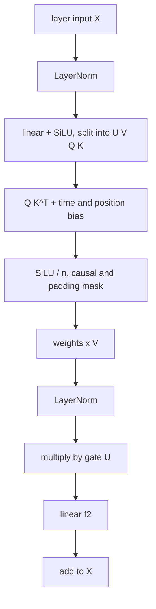

# HSTU

> Meta's Hierarchical Sequential Transduction Unit: a Transformer-like sequence model built for user
> actions, with pointwise (non-softmax) attention, a gating vector, and attention biases for time gaps.

--8<-- "generated/methods/hstu.md"

!!! tip "When to use it"
    - To study the architecture behind "generative recommenders" (Meta, 2024), which scales to very long
      histories and huge data.
    - When timestamps carry information (time gaps between actions matter).

!!! warning "When not to"
    - On small data or a small budget: its advantages appear at scale. Smoke-tier results are not
      representative.
    - When you need a production-scale system: recbench's version is a small, dense, single-GPU model.

## 1. Intuition

HSTU starts from a Transformer and changes three things for recommendation data:

1. **Pointwise attention instead of softmax.** Softmax forces a position's attention weights to sum to 1,
   so ten strong signals each get one tenth of the attention. HSTU applies SiLU to each score independently,
   so the total "amount" of evidence can grow with the number of relevant past actions. Repeated behaviour
   keeps its intensity.
2. **A gate ($U$).** Each position computes an extra vector that multiplies (gates) the attention output,
   letting the model decide how much of the gathered context to let through.
3. **Relative position and time bias.** Two actions one minute apart are more related than two actions a
   year apart. HSTU adds a learned bias that depends on the position distance *and* the time gap.

## 2. A tiny worked example

**Softmax vs SiLU.** One query's raw scores for three earlier actions: (2.0, 0.5, −1.0).

| | Action 1 | Action 2 | Action 3 | Sum |
|---|---|---|---|---|
| softmax | 0.786 | 0.175 | 0.039 | 1.000 |
| SiLU(score) / n, with n = 3 | 0.587 | 0.104 | −0.090 | 0.601 |

Now suppose the user repeated the strong action 4 times (scores 2.0, 2.0, 2.0, 2.0, 0.5, −1.0; n = 6). Softmax
gives each copy only 0.234: the evidence is diluted. SiLU/n gives the four copies a total of 1.174:
**more evidence, more weight**. Note that SiLU weights can also be negative ("this action argues against").

**Time buckets.** recbench buckets the gap between two actions by $\lfloor \log_2(\text{seconds}) \rfloor$:

| Gap | 1 min | 1 hour | 1 day | 1 week | 1 year |
|---|---|---|---|---|---|
| Bucket | 5 | 11 | 16 | 19 | 24 |

Each bucket has a learned bias, so the model can learn, for example, that actions in the same hour
(bucket ≤ 11) belong together.

## 3. How it works

One HSTU layer (repeated $L$ times, with a residual connection):

1. Normalise the input $X$ (LayerNorm), apply one linear layer, then SiLU, and split the result into four
   parts: $U, V, Q, K$.
2. Attention scores $QK^\top$ plus the relative bias $\text{rab}$ (position distance and time gap).
3. Weights $= \text{SiLU}(\text{scores}) / n$, masked to earlier positions and real (non-padding) keys.
4. Mix the values: $A\,V$.
5. Gate and project: $Y = f_2(\text{LayerNorm}(AV) \odot U)$; output $X + \text{Dropout}(Y)$.

Training and scoring are as for [SASRec](sasrec.md): next-item cross-entropy at every position; the user
vector is the last position's output.

## 4. The math, symbol by symbol

$$
U, V, Q, K = \operatorname{split}\big(\phi_1(f_1(\operatorname{Norm}(X)))\big)
$$

$$
A = \frac{\phi_2\!\left(QK^\top + \text{rab}^{p,t}\right)}{n} \odot M_{\text{causal}},
\qquad
Y = f_2\big(\operatorname{Norm}(AV) \odot U\big),
\qquad
X' = X + \operatorname{Dropout}(Y)
$$

| Symbol | Meaning | Shape / range |
|---|---|---|
| $X$ | layer input: one vector per position | positions × $d$ |
| $f_1, f_2$ | linear layers ($f_1$: $d \to 4d$, $f_2$: $d \to d$) | — |
| $\phi_1, \phi_2$ | SiLU activation, $\text{SiLU}(x) = x\cdot\sigma(x)$ | element-wise |
| $U$ | gate vectors | positions × $d$ |
| $\text{rab}^{p,t}$ | learned relative attention bias for (position distance, time-gap bucket) | positions × positions |
| $n$ | sequence length used for normalisation | scalar |
| $M_{\text{causal}}$ | 1 for allowed (earlier, non-padding) keys, else 0 | positions × positions |
| $\odot$ | element-wise multiplication | — |

## 5. Training and inference

- **Training:** like SASRec; the attention matrix plus the bias tensor cost $O(n^2)$ memory per sequence.
- **Inference:** last-position output dotted with all item embeddings.
- **Hardware:** laptop CPU at smoke scale; a GPU for anything serious.

## 6. Hyperparameters

| Name in recbench config | What it does | Default | Tip |
|---|---|---|---|
| `dim`, `layers`, `heads` | model size | preset | `dim` must be divisible by `heads` |
| `seq_len` | history length | preset (50 / 50 / 200) | HSTU is designed for long histories |
| `dropout` | dropout | 0.2 | |
| (fixed) time buckets | number of log2 time-gap buckets | 64 | |
| `batch_size`, `lr`, `max_steps` | training loop | preset | |

## 7. In recbench

- Code: `src/recbench/methods/hstu.py::HSTU`, with `src/recbench/methods/hstu.py::HSTULayer`,
  `src/recbench/methods/hstu.py::RelativeBias`, and the attention core
  `src/recbench/methods/hstu.py::hstu_attention`.
- **Verified against Meta's code:** `tests/test_methods.py` checks that `hstu_attention` matches
  `pytorch_hstu_mha` from Meta's generative-recommenders repository (pinned commit `ea7b85f`).
- Event times come with every history (`HistoryBatch.times`), so the time bias uses real gaps.
- Training windows and loss are shared with SASRec (`sequence_windows`, `next_item_loss`).

!!! info "Fidelity: simplified"
    The layer follows the paper's equations, and its attention core is verified against Meta's reference
    op. Differences from Meta's system: dense (padded) tensors instead of jagged ones and custom kernels; a
    small model; plain dot-product scoring (the paper uses normalised embeddings and a temperature); none of
    the paper's multi-task heads or trillion-parameter scale.

## 8. Results in this benchmark

--8<-- "generated/methods/hstu-results.md"

## 9. Strengths and weaknesses

- **Strengths:** time-aware; keeps the intensity of repeated behaviour; designed to scale.
- **Weaknesses:** needs a lot of data and compute to shine; more knobs; post-hoc explanations only; no
  new-item support.

## 10. Common pitfalls

- **Expecting state-of-the-art results at smoke scale.** The architecture's advantage is at scale.
- **Wrong timestamps:** bulk-entered timestamps (MovieLens) make the time bias meaningless.
- **Leakage:** v0.1 trained HSTU on the evaluation targets, which made it look like the best model. The
  [review log](../../review/2026-10-02-review.md) explains how this was found.

## 11. Check your understanding

??? question "Why can HSTU's attention weights be negative, and why might that help?"
    SiLU is negative for negative inputs. A past action can then *reduce* the evidence for something,
    instead of only contributing a smaller positive share as under softmax.

??? question "Two actions are 3 hours apart. Which time bucket do they use?"
    3 hours = 10,800 seconds; $\log_2(10800) \approx 13.4$, so bucket 13.

??? question "What does the gate U add compared with a plain Transformer layer?"
    A data-dependent multiplier on the attention output, so each position can amplify or suppress the
    context it gathered before it is added back to its own state.

## 12. Further reading

- Zhai et al. (2024), [Actions Speak Louder than Words: Trillion-Parameter Sequential Transducers for
  Generative Recommendations](https://arxiv.org/abs/2402.17152) (ICML 2024).
- Meta's code: <https://github.com/meta-recsys/generative-recommenders>.
- [LLMs and generative recommenders](../concepts/llm-and-generative-recsys.md).
