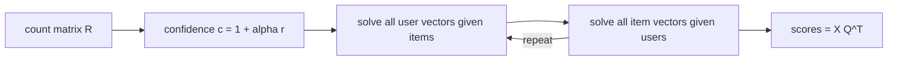

# iALS

> Implicit Alternating Least Squares: learns user and item vectors by treating every (user, item) pair as
> "interacted or not", trusting observed interactions more, and solving for the vectors in closed form,
> alternating between users and items.

!!! abstract "In plain words"
    iALS describes every user and every item with a short list of numbers (a vector), chosen so that a user's vector
    lines up with the vectors of the items they used. Items the user never touched count as weak "no" signals, and
    repeated use counts as a stronger "yes". It alternates between solving for users and solving for items.

--8<-- "generated/methods/ials.md"

!!! example "Improve it yourself"
    [Lab 8](../../labs/08-ials.md) takes you through iALS in four levels: reproduce its baseline, understand
    every setting, try log-scaled confidence, and weight interactions by inverse popularity. The [lab scoreboard](../../labs/scoreboard.md) tracks your results.

!!! tip "When to use it"
    - As a fast, robust learned baseline for implicit feedback. Well-tuned iALS is still competitive
      with much newer methods.
    - On large catalogs, where it scales better than EASE (no item × item matrix).
    - When repeated interactions (play counts, views) carry signal: counts become confidence weights.

!!! warning "When not to"
    - When order matters, or for brand-new users and items.
    - When you need explanations.

## 1. Intuition

Every user-item pair is either a 1 ("interacted") or a 0 ("did not"). But a 0 is weak evidence: maybe the
user never saw the item. A 1 seen 20 times is strong evidence. iALS fits user and item vectors so that
their dot products are close to these 1s and 0s, and it weights each pair by a **confidence**: one for
every 0, much more for frequent 1s.

Fitting everything at once is hard. If all item vectors are frozen, each user's best vector is an ordinary
weighted least-squares problem with an exact answer. So iALS alternates: solve all users given the items,
then all items given the users, and repeat. Each half-step can only lower the loss.

## 2. A tiny worked example

Three items with fixed 2-D vectors: $\mathbf{q}_1 = (1, 0)$, $\mathbf{q}_2 = (0.5, 0.5)$, $\mathbf{q}_3 = (0, 1)$.
A user played item 1 twice and item 3 once ($r = (2, 0, 1)$). With $\alpha = 10$ and $\lambda = 0.1$:

- Confidences $c_{ui} = 1 + \alpha r_{ui}$ = (21, 1, 11)
- Preferences $p_{ui}$ = (1, 0, 1)

The user's vector solves $(Q^\top C_u Q + \lambda I)\,\mathbf{x}_u = Q^\top C_u \mathbf{p}_u$:

$$
\begin{pmatrix} 21.35 & 0.25 \\ 0.25 & 11.35 \end{pmatrix}\mathbf{x}_u =
\begin{pmatrix} 21 \\ 11 \end{pmatrix}
\;\Rightarrow\; \mathbf{x}_u = (0.9725,\ 0.9477)
$$

Scores $Q\mathbf{x}_u$ = (0.9725, **0.9601**, 0.9477). Item 2, which the user never touched, scores almost as
high as the two they did. Its vector sits "between" items 1 and 3, so the model generalises from both.
That is collaborative filtering at work.

## 3. How it works

1. Build the user × item count matrix $R$ from pre-test events.
2. Initialise item vectors randomly.
3. Solve every user vector exactly (weighted least squares, given the items).
4. Solve every item vector exactly (given the users).
5. Repeat steps 3–4 for a fixed number of iterations.
6. Recommend with dot products; remove seen items; take the top K.

The trick that makes this fast: $Q^\top C_u Q = Q^\top Q + Q^\top (C_u - I) Q$. The first term is shared
by all users, and the second involves only the few items the user interacted with.

## 4. The math, symbol by symbol

$$
\min_{X, Q} \sum_{u,i} c_{ui}\left(p_{ui} - \mathbf{x}_u^\top \mathbf{q}_i\right)^2
+ \lambda\left(\sum_u \lVert\mathbf{x}_u\rVert^2 + \sum_i \lVert\mathbf{q}_i\rVert^2\right),
\qquad
\mathbf{x}_u = \left(Q^\top C_u Q + \lambda I\right)^{-1} Q^\top C_u \mathbf{p}_u
$$

| Symbol | Meaning | Shape / range |
|---|---|---|
| $r_{ui}$ | number of pre-test interactions of user $u$ with item $i$ | ≥ 0 |
| $p_{ui}$ | preference: 1 if $r_{ui} > 0$, else 0 | {0, 1} |
| $c_{ui} = 1 + \alpha r_{ui}$ | confidence in that preference | ≥ 1 |
| $\alpha$ | how much more an observed interaction counts | `ials_alpha`, default 10 |
| $\mathbf{x}_u, \mathbf{q}_i$ | user and item vectors | $d$ numbers each |
| $C_u$ | diagonal matrix of user $u$'s confidences | items × items |
| $\lambda$ | L2 regularisation | `ials_reg`, default 0.01 |

## 5. Training and inference

- **Training:** each half-step solves one small $d \times d$ system per user (or item). Cost per
  iteration ≈ $O(\text{nnz}\cdot d^2 + (\text{users}+\text{items})\, d^3)$; there is no learning rate.
- **Inference:** dot products, like BPR.
- **Hardware:** CPU (multi-threaded in `implicit`); a CUDA version exists but is not used here.

## 6. Hyperparameters

| Name in recbench config | What it does | Default | Searched in the [quick tier](../../results/quick-tier.md) | Tip |
|---|---|---|---|---|
| `dim` | number of factors $d$ | preset (32 / 64 / 128) | 64, 128, 256, 512 | iALS benefits from large $d$ with strong regularisation (Rendle et al. 2022) |
| `ials_alpha` | confidence scaling $\alpha$ | 10.0 | 0.3–100 (log scale) | higher trusts repeated interactions more |
| `ials_reg` | regularisation $\lambda$ | 0.01 | 0.001–100 (log scale) | tune together with `dim`; re-checked at ×0.5, ×1, ×2 (scaled by users) on full data |
| `ials_iterations` | alternating rounds | 15 | 10, 20 | usually converges within 15–30 |
| `decay_half_life_days` | recent interactions get more confidence: an interaction $a$ days old is weighted $2^{-a/h}$ | none | none, 30, 90, 365 | |
| `train_window_days` | train on the last $N$ days only | none | none, 30, 90, 365 | |

## 7. In recbench

- Code: `src/recbench/methods/implicit_mf.py::IALS`, using `implicit.als.AlternatingLeastSquares` on
  `TrainView.interaction_counts` (counts, not just 0/1, so repeated plays raise the confidence).
- Scores and explanations work exactly as in [BPR-MF](bpr-mf.md): dot products, and history items near the
  recommended item in factor space.

!!! info "Fidelity"
    Faithful to Hu, Koren and Volinsky (2008) through `implicit`'s conjugate-gradient solver (an efficient
    approximate solve of the same equations).

## 8. Results in this benchmark

--8<-- "generated/methods/ials-results.md"

## 9. Strengths and weaknesses

- **Strengths:** no learning rate, few hyperparameters, fast and stable, scales to large catalogs, uses
  interaction counts.
- **Weaknesses:** latent factors are hard to explain; no order or content; new users and items need a
  "fold-in" step that recbench does not implement.

## 10. Common pitfalls

- **Treating every 0 as "dislike".** The confidence weights exist precisely because a 0 often means "never saw it".
- **A huge $\alpha$ with heavy users.** One user with thousands of plays dominates; consider log-scaling counts
  ([lab 8](../../labs/08-ials.md), Level 3.2).
- **Under-tuned baselines.** Rendle et al. (2022) showed iALS is much stronger with proper tuning than
  many papers reported.

## 11. Check your understanding

??? question "Why does item 2 score 0.96 in the example although the user never touched it?"
    Its vector (0.5, 0.5) lies between items 1 and 3, which the user likes, so the dot product is high. The
    model generalises from similar items.

??? question "Why alternate instead of solving users and items together?"
    With one side fixed, the loss is quadratic in the other side and has an exact solution. Together, the
    problem is not convex and has no closed form.

??? question "What does a confidence of 1 for unobserved pairs mean?"
    Those pairs still pull the score towards 0, but weakly: 21 times less than an item played twice when $\alpha = 10$.

## 12. Further reading

- Hu, Koren and Volinsky (2008),
  [Collaborative Filtering for Implicit Feedback Datasets](http://yifanhu.net/PUB/cf.pdf) (ICDM 2008).
- Rendle, Krichene, Zhang and Koren (2022), [Revisiting the Performance of iALS on Item Recommendation
  Benchmarks](https://arxiv.org/abs/2110.14037) (RecSys 2022).
- The `implicit` library: <https://github.com/benfred/implicit>.
