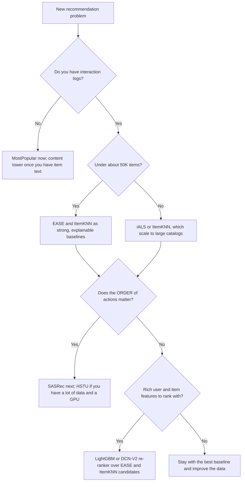

# The method ladder

recbench compares the methods below (the low-budget ones first enter through the
[quick tier](../../results/quick-tier.md)). They are arranged as a **ladder**: each rung adds one idea (and usually
more cost and complexity) on top of the rung below. Reading the pages in order is the fastest way to
understand modern recommender systems.

--8<-- "generated/ladder.md"

## Why start with simple methods?

A benchmark is only useful if it can tell you when complexity does **not** pay off. Two influential
studies showed how often it doesn't:

- Ferrari Dacrema, Cremonesi and Jannach (2019), [Are We Really Making Much Progress? A Worrying Analysis of
  Recent Neural Recommendation Approaches](https://arxiv.org/abs/1907.06902): most of the neural methods
  they could reproduce were beaten by well-tuned nearest-neighbour or linear baselines.
- Rendle, Krichene, Zhang and Anderson (2020), [Neural Collaborative Filtering vs. Matrix Factorization
  Revisited](https://arxiv.org/abs/2005.09683): a plain dot product beat a learned neural similarity once
  both were tuned properly.

So every recbench leaderboard ranks the simple rungs next to the advanced ones. If HSTU does not beat
EASE on a dataset, that is a real and useful finding, not a failure of the benchmark.

!!! info "In recbench"
    The first full-tier run used fixed default settings with no tuning (see
    [fair baselines](../concepts/fair-baselines-and-tuning.md)). Simple methods have few or no
    hyperparameters, so they lost less from that than deep models did. The quick-tier bake-off now tunes every
    low-budget method with the same budget before any comparison.

## What "fidelity" means

Every method page has a **Fidelity** field:

- **faithful**: recbench runs the method as described in its paper or canonical code (possibly smaller).
- **simplified**: same core idea, but some components are missing or reduced; the page lists exactly what.
- **placeholder**: stands in for a family that is not implemented yet.

No method is called by a name it does not deserve. For example, `tiger_lite` is not called "TIGER",
because it does not generate semantic IDs the way the paper does.

## Capability matrix

What each method can do, generated from the code (`src/recbench/methods/`) and `dictionary/catalog.yaml`:

--8<-- "generated/capability.md"

How to read the columns:

- **Tasks**: `topn` means "a ranked list for a user". `sequential` means the method is also scored on
  predicting the very next item. `similar_items` means it can produce "more like this" lists. `ctr` means
  it outputs a click probability for one (user, item) pair.
- **Uses history**: scoring reads the user's past items. Methods that use only global statistics, such as
  MostPopular, do not.
- **Order-aware**: the model reads that history as a *sequence* (what came first, what came last), not as a
  set. Sequential and session models are order-aware; EASE, ItemKNN and matrix factorisation are not.
- **New items**: the model can score items that had no interactions before the cutoff (it understands
  items from their content). Pure ID models cannot; the evaluator removes such items from their lists.
- **Needs content**: the model needs item text or categories.
- **Ranked**: experimental methods are reported but not ranked.

## Which method should I try first?

The [decision guide](../../results/decision-guide.md) turns benchmark results into a recommendation
for a product.

## All methods at a glance

In ladder order, generated from `dictionary/catalog.yaml`:

--8<-- "generated/glance.md"
