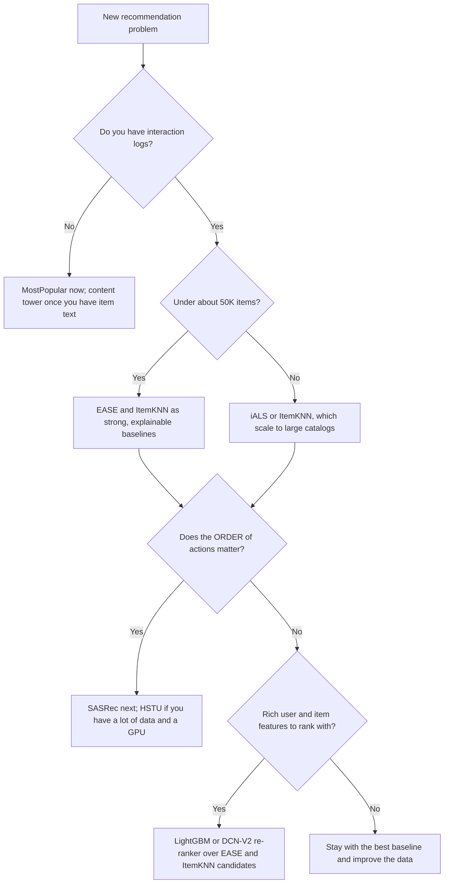

# The method ladder

recbench compares the methods below (the low-budget ones first enter through the
[quick tier](../../results/quick-tier.md)). They are arranged as a **ladder**: each rung adds one idea (and usually
more cost and complexity) on top of the rung below. Reading the pages in order is the fastest way to
understand modern recommender systems.

| Rung | Idea it adds | Methods |
|---|---|---|
| 0 — Baselines | "no learning" reference points | [Random](random.md), [MostPopular](most-popular.md) |
| 1 — Neighbourhood and linear | items that co-occur are related | [ItemKNN](itemknn.md), [EASE](ease.md), [RP3beta](rp3beta.md), [SLIM](slim.md), [SANSA](sansa.md) |
| 2 — Matrix factorisation | users and items as learned vectors | [PureSVD](puresvd.md), [BPR-MF](bpr-mf.md), [iALS](ials.md), [SimpleX](simplex.md), [DirectAU](directau.md), [MultVAE](multvae.md), [RecVAE](recvae.md) |
| 3 — Graph methods | neighbours of neighbours carry signal | [GF-CF](gfcf.md), [Turbo-CF](turbocf.md) (training-free filters), [UltraGCN](ultragcn.md), [LightGCN](lightgcn.md), [XSimGCL](xsimgcl.md) |
| 4 — Sequential models | the *order* of a user's history matters | [V-SKNN](vsknn.md), [GRU4Rec](gru4rec.md), [SASRec](sasrec.md), [BERT4Rec](bert4rec.md), [S3-Rec](s3rec.md), [HSTU](hstu.md), [TIGER-lite](tiger-lite.md) |
| 5 — CTR-style rankers and re-rankers | score one (user, item) pair at a time with rich features | [LightGBM re-ranker](lgbm-rerank.md), [DCN-V2 re-ranker](dcnv2-rerank.md), [DIN](din.md), [DCN-V2](dcnv2.md) |
| 6 — Content towers | understand items from their text and images | [Text-embedding kNN](text-knn.md), [Text hash tower](text-hash-tower.md), [Multimodal tower](multimodal-tower.md) |
| 7 — Managed services | rent a recommender instead of building one | [Recombee](recombee.md), [other services](managed-services.md) |

## Why start with simple methods?

A benchmark is only useful if it can tell you when complexity does **not** pay off. Two influential
studies showed how often it doesn't:

- Ferrari Dacrema, Cremonesi and Jannach (2019), [Are We Really Making Much Progress? A Worrying Analysis of
  Recent Neural Recommendation Approaches](https://arxiv.org/abs/1907.06902): most of the neural methods
  they could reproduce were beaten by well-tuned nearest-neighbour or linear baselines.
- Rendle, Krichene, Zhang and Anderson (2020), [Neural Collaborative Filtering vs. Matrix Factorization
  Revisited](https://arxiv.org/abs/2005.09683): a plain dot product beat a learned neural similarity once
  both were tuned properly.

So every recbench leaderboard ranks the simple rungs next to the advanced ones. If HSTU does not beat
EASE on a dataset, that is a real and useful finding, not a failure of the benchmark.

!!! info "In recbench"
    The first full-tier run used fixed default settings with no tuning (see
    [fair baselines](../concepts/fair-baselines-and-tuning.md)). Simple methods have few or no
    hyperparameters, so they lost less from that than deep models did. The quick-tier bake-off now tunes every
    low-budget method with the same budget before any comparison.

## What "fidelity" means

Every method page has a **Fidelity** field:

- **faithful**: recbench runs the method as described in its paper or canonical code (possibly smaller).
- **simplified**: same core idea, but some components are missing or reduced; the page lists exactly what.
- **placeholder**: stands in for a family that is not implemented yet.

No method is called by a name it does not deserve. For example, `tiger_lite` is not called "TIGER",
because it does not generate semantic IDs the way the paper does.

## Capability matrix

What each method can do, generated from the code (`src/recbench/methods/`) and `dictionary/catalog.yaml`:

--8<-- "generated/capability.md"

How to read the columns:

- **Tasks**: `topn` means "a ranked list for a user". `sequential` means the method is also scored on
  predicting the very next item. `similar_items` means it can produce "more like this" lists. `ctr` means
  it outputs a click probability for one (user, item) pair.
- **Uses order**: the model reads the history as a *sequence*, not as a set.
- **New items**: the model can score items that had no interactions before the cutoff (it understands
  items from their content). Pure ID models cannot; the evaluator removes such items from their lists.
- **Needs content**: the model needs item text or categories.
- **Ranked**: experimental methods are reported but not ranked.

## Which method should I try first?

The [decision guide](../../results/decision-guide.md) turns benchmark results into a recommendation
for a product.

## All methods at a glance

In ladder order:

| Method | One-line idea |
|---|---|
| [Random](random.md) | Random scores: the floor. |
| [MostPopular](most-popular.md) | Recently popular items for everyone. |
| [ItemKNN](itemknn.md) | Items similar (by co-occurrence) to what you used. |
| [EASE](ease.md) | One learned item-to-item weight matrix, solved in closed form. |
| [RP3beta](rp3beta.md) | Two-step random walks between items, with popular items turned down. |
| [SLIM](slim.md) | A sparse, non-negative item-to-item weight matrix learned by regression. |
| [SANSA](sansa.md) | EASE's weights approximated sparsely, so it scales to large catalogs. |
| [PureSVD](puresvd.md) | A truncated SVD of the interaction matrix: the simplest factorisation. |
| [BPR-MF](bpr-mf.md) | User and item vectors trained so that used items outrank random ones. |
| [iALS](ials.md) | User and item vectors fitted by weighted least squares. |
| [SimpleX](simplex.md) | Matrix factorisation with a cosine contrastive loss and many negatives. |
| [DirectAU](directau.md) | Vectors trained to align used pairs and spread everything else out. |
| [MultVAE](multvae.md) | A variational autoencoder that rebuilds a user's whole history. |
| [RecVAE](recvae.md) | MultVAE with a stronger encoder and a composite prior. |
| [GF-CF](gfcf.md) | A training-free graph filter: normalised co-occurrence plus a low-pass part. |
| [Turbo-CF](turbocf.md) | A training-free polynomial graph filter, computed on a GPU. |
| [UltraGCN](ultragcn.md) | The effect of infinite graph convolutions, as a weighted loss without message passing. |
| [LightGCN](lightgcn.md) | Vectors smoothed over the user-item graph. |
| [XSimGCL](xsimgcl.md) | LightGCN plus a contrastive loss that spreads vectors out. |
| [V-SKNN](vsknn.md) | Past sessions similar to your current one, with recent items counting more. |
| [GRU4Rec](gru4rec.md) | A recurrent network reads your clicks in order (the authors' official code). |
| [SASRec](sasrec.md) | A causal Transformer reads your sequence and predicts the next item. |
| [BERT4Rec](bert4rec.md) | Fill-in-the-blank training on sequences, like BERT for text. |
| [S3-Rec](s3rec.md) | Self-supervised pre-training with item attributes, then fine-tuning. |
| [HSTU](hstu.md) | Meta's generative sequence model with pointwise attention and time-aware bias. |
| [TIGER-lite](tiger-lite.md) | A next-item model with semantic-ID codes (experimental). |
| [LightGBM re-ranker](lgbm-rerank.md) | Cheap models propose candidates; boosted trees re-order them with many features. |
| [DCN-V2 re-ranker](dcnv2-rerank.md) | The same candidates, re-ordered by a neural network that learns feature crosses. |
| [DIN](din.md) | Attention over your history, conditioned on the candidate item. |
| [DCN-V2](dcnv2.md) | Learned feature crosses for click prediction, over the whole catalog. |
| [Text-embedding kNN](text-knn.md) | Items whose descriptions (encoded by a pretrained model) match your recent items. |
| [Text hash tower](text-hash-tower.md) | Items understood from their words; can recommend brand-new items. |
| [Multimodal tower](multimodal-tower.md) | Text plus image colour features. |
| [Recombee](recombee.md) | A managed recommendation API, benchmarked like the rest. |
| [Other managed services](managed-services.md) | Amazon Personalize, Google's commerce recommender, Azure Personalizer (retired). |
