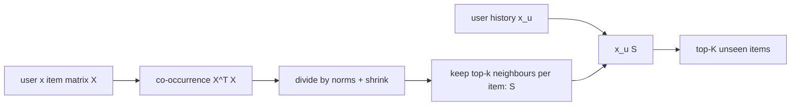

# ItemKNN

> Recommends items that are often used by the same people who used the items you already have.

--8<-- "generated/methods/itemknn.md"

!!! tip "When to use it"
    - As a strong, cheap, and **explainable** baseline ("because you watched X").
    - For "similar items" carousels on product pages.
    - When you must be able to inspect and edit what the system recommends.

!!! warning "When not to"
    - When order matters (it treats the history as a set: next-item prediction suffers).
    - For brand-new items with no interactions (they have no neighbours).
    - On very large catalogs without care: the item-item computation needs memory and time.

## 1. Intuition

"People who bought this also bought..." If many customers who bought a tent also bought a sleeping bag,
the tent and the sleeping bag are *neighbours*. To recommend for you, ItemKNN looks at every item you
already have, collects each one's neighbours, and adds up how strongly each candidate is connected to
your items. Items connected to several of your items rise to the top.

## 2. A tiny worked example

Four users and five items (1 = interacted):

| | A | B | C | D | E |
|---|---|---|---|---|---|
| u1 | 1 | 1 | 0 | 0 | 0 |
| u2 | 1 | 1 | 1 | 0 | 0 |
| u3 | 0 | 1 | 1 | 1 | 0 |
| u4 | 0 | 0 | 1 | 1 | 1 |

**Step 1: co-occurrence.** How many users used both items? A and B: 2 (u1, u2). B and C: 2 (u2, u3). A and C: 1 (u2).

**Step 2: cosine similarity.** Divide by $\sqrt{\text{users of } i}\cdot\sqrt{\text{users of } j}$ so that
popular items do not dominate. For A (2 users) and B (3 users): $2/(\sqrt2\cdot\sqrt3) = 0.8165$.
The full table (diagonal set to 0):

| | A | B | C | D | E |
|---|---|---|---|---|---|
| A | 0 | 0.8165 | 0.4082 | 0 | 0 |
| B | 0.8165 | 0 | 0.6667 | 0.4082 | 0 |
| C | 0.4082 | 0.6667 | 0 | 0.8165 | 0.5774 |

**Step 3: score for u1** (history = A, B). Add the rows of A and B:

- C: 0.4082 + 0.6667 = **1.0749**
- D: 0 + 0.4082 = 0.4082
- E: 0 + 0 = 0

A and B are already seen and get removed, so u1's list is **C, D, E**. The explanation for C is exact:
"because you interacted with B (0.67) and A (0.41)".

With a shrinkage term of 1 in the denominator (see below), the A–B similarity becomes
$2/(\sqrt2\sqrt3 + 1) = 0.5798$. Pairs with little evidence are pulled down the most.

## 3. How it works

1. Build the binary user × item matrix $X$ from pre-test events.
2. Compute item-item co-occurrence $X^\top X$ in blocks of items, divide by the norms plus shrinkage, and
   keep only each item's $k$ strongest neighbours (a sparse matrix $S$).
3. For a user, sum the rows of $S$ for the items in their history: $s_u = x_u S$.
4. Remove seen items and take the top K.

## 4. The math, symbol by symbol

$$
\text{sim}(i, j) = \frac{\sum_u x_{ui}\, x_{uj}}{\sqrt{\sum_u x_{ui}}\;\sqrt{\sum_u x_{uj}} + \lambda},
\qquad
s_{uj} = \sum_{i \in H_u} \text{sim}(i, j)
$$

| Symbol | Meaning | Shape / range |
|---|---|---|
| $x_{ui}$ | 1 if user $u$ interacted with item $i$ before the cutoff, else 0 | {0, 1} |
| $\sum_u x_{ui} x_{uj}$ | number of users who used both $i$ and $j$ (co-occurrence) | ≥ 0 |
| $\sqrt{\sum_u x_{ui}}$ | square root of item $i$'s number of users (its norm) | ≥ 0 |
| $\lambda$ | shrinkage: penalises pairs supported by few users | `knn_shrink`, default 10 |
| $H_u$ | the set of items in user $u$'s pre-test history | — |
| $s_{uj}$ | score of candidate item $j$ for user $u$ | ≥ 0 |

Reading the formula: two items are similar when the same users use both, relative to how popular each one
is. A user's score for $j$ is how strongly $j$ is connected to everything they already have.

## 5. Training and inference

- **Training:** sparse matrix products, item block by item block. The cost grows with the number of
  co-occurring pairs, which is large for heavy users (they connect every pair of their items). It needs no
  gradient descent and has no randomness.
- **Memory:** the pruned similarity matrix holds at most $k$ entries per item.
- **Inference:** a sparse vector-matrix product per user.
- **Hardware:** CPU only.

## 6. Hyperparameters

| Name in recbench config | What it does | Default | Typical range | Tip |
|---|---|---|---|---|
| `knn_neighbors` | neighbours kept per item ($k$) | 100 | 20–1,000 | more neighbours = smoother scores, more memory |
| `knn_shrink` | shrinkage $\lambda$ | 10.0 | 0–100 | raise it for noisy, sparse data |

## 7. In recbench

- Code: `src/recbench/methods/baselines.py::ItemKNN`; the similarity computation is
  `src/recbench/methods/baselines.py::item_cosine_topk`.
- The history used for scoring is the full pre-test history (`TrainView.seen`), not just the last
  `seq_len` items.
- Explanations come from `src/recbench/methods/_explain.py::contribution_explanations`: they cite the
  history items with the largest similarity to the recommendation, which are exactly the terms of the sum.
- A test checks that, with shrinkage 0, recbench ranks items like the `implicit` library's
  `CosineRecommender` (`tests/test_methods.py`).

!!! info "Fidelity"
    Faithful to item-based CF (Sarwar et al., 2001) with cosine similarity and shrinkage. Variants such as
    adjusted cosine, BM25 weighting, or RP3beta's graph-based similarity are not implemented.

## 8. Results in this benchmark

--8<-- "generated/methods/itemknn-results.md"

## 9. Strengths and weaknesses

- **Explainability: excellent.** Every score is an exact sum of named contributions.
- **Controllability: high.** You can inspect, filter, or hand-edit neighbour lists.
- **Cold start:** new items have no neighbours. New users need only one interaction.
- **Order:** ignored. In the copy-task test (users walk item 1 → 2 → 3 ...), ItemKNN cannot predict the
  next step, while sequence models can.

## 10. Common pitfalls

- **Forgetting shrinkage.** Two items used by the same single user get cosine 1.0, the maximum, on very
  thin evidence.
- **Not removing seen items.** The most similar items are often ones the user already has.
- **Very heavy users.** One user with 10,000 items creates 50 million co-occurring pairs. Real systems cap or
  down-weight such users.

## 11. Check your understanding

??? question "In the example, why does C beat D for u1?"
    C is connected to both of u1's items (A: 0.41, B: 0.67, total 1.07). D is connected only to B (0.41).

??? question "Why divide by the square roots of the item counts?"
    Without it, very popular items co-occur with everything and dominate every list. The division turns raw
    counts into a similarity relative to popularity.

??? question "What does a large `knn_shrink` do to a pair seen together by only 1 user?"
    Its similarity becomes small. For example, $1/(1\cdot1 + 10) = 0.09$ instead of 1.0. Rare evidence is
    trusted less.

## 12. Further reading

- Sarwar, Karypis, Konstan and Riedl (2001),
  [Item-based Collaborative Filtering Recommendation Algorithms](https://dl.acm.org/doi/10.1145/371920.372071).
- [Collaborative vs content-based filtering](../concepts/collaborative-content-hybrid.md).
- [EASE](ease.md): a learned version of the same item-to-item idea.
