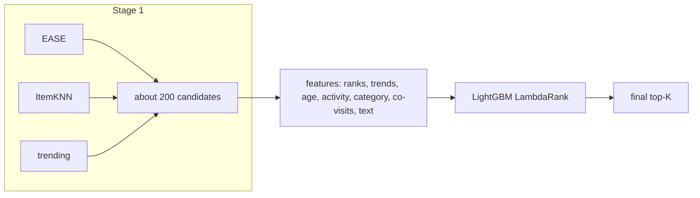

# LightGBM re-ranker

> Two stages: cheap models (EASE, ItemKNN, trending items) propose about 200 candidates per user, then a
> gradient-boosted tree model re-orders them using features no single model sees: popularity trends, item age,
> user activity, category affinity, and what usually follows the user's last item.

--8<-- "generated/methods/lgbm_rerank.md"

!!! tip "When to use it"
    - When you already have decent retrieval and want the "last mile" of ranking quality. This is the recipe
      behind many winning competition solutions, including H&M's Kaggle challenge.
    - When business signals (recency, stock, price, category) should influence the order.

!!! warning "When not to"
    - When the candidate generators rarely contain the right items: a re-ranker can only reorder what it is
      given. Check `candidate_recall` first.
    - With very little recent data: it learns from the last window before the test cutoff.

## 1. Intuition

A shop manager asks three assistants for suggestions (stage 1), then decides the final order herself
(stage 2). She knows things they do not: what is trending this week, what is new, what this customer usually
buys. The assistants are good at finding plausible items fast. She is good at ordering a short list using many
signals at once.

LightGBM learns the manager's rules from history. For each user it looks at the candidate list as of an
earlier date and at which candidates the user actually took afterwards. **LambdaRank** then trains the trees
to put those items at the top of each user's list, directly optimising a ranking measure (NDCG).

## 2. A tiny worked example

Training rows for one user, with candidates proposed as of the validation cutoff:

| Candidate | EASE rank | ItemKNN rank | Trend (7d / 28d) | Co-visits with last item | Bought afterwards? |
|---|---|---|---|---|---|
| A (bestseller) | 1 | 40 | 0.20 | 0 | no |
| B | 6 | 2 | 0.45 | 3 | **yes** |
| C | 3 | — | 0.10 | 0 | no |

Across thousands of users, the trees learn rules such as "a strong ItemKNN rank plus co-visits beats a high
EASE rank alone". At the test cutoff, the same features are recomputed from all pre-test data, and the trees
score the new candidate lists.

## 3. How it works

1. **Training window:** the split's validation window [valid start, test cutoff).
2. **Past generators:** fit EASE, ItemKNN and recent popularity on events before the validation start, with
   the settings the quick tier tuned for EASE and ItemKNN on this dataset.
3. **Training table:** for recent users, propose candidates; the label is 1 if the user took the item in the
   window; compute the features as of the validation start. Users whose items were not in their candidates are
   dropped, because they teach the ranker nothing.
4. **Train** LightGBM LambdaRank, with early stopping on 10% of the users.
5. **Score:** refit the generators on all pre-test data, propose candidates, and rank them with the trees.
   Items outside the candidate list cannot be recommended.

## 4. The math, symbol by symbol

LambdaRank weights each pair of candidates (one the user took, one they did not) by how much swapping them
would change the list's NDCG:

$$
\lambda_{ij} = \frac{-\sigma}{1 + e^{\sigma (s_i - s_j)}}\,\big|\Delta \text{NDCG}_{ij}\big|
$$

| Symbol | Meaning |
|---|---|
| $s_i, s_j$ | current model scores of a relevant and an irrelevant candidate |
| $\lvert\Delta\text{NDCG}_{ij}\rvert$ | change in the list's NDCG if $i$ and $j$ swapped places |
| $\sigma$ | sharpness of the logistic curve |

The trees are fitted to these "lambda" gradients, so mistakes near the top of the list cost the most.

## 5. Training and inference

- **Training:** two generator fits (past and full), feature building for up to `rerank_train_users` users ×
  200 candidates, and a few hundred trees. Minutes on a CPU.
- **Inference:** generators and features per user batch, plus tree scoring.
- **Hardware:** CPU. On macOS it runs single-threaded when PyTorch is loaded, because of an OpenMP conflict.

## 6. Hyperparameters

| Name in recbench config | What it does | Default | Searched over |
|---|---|---|---|
| `rerank_candidates` | candidates per user | 200 | 100, 200 |
| `lgbm_leaves`, `lgbm_lr`, `lgbm_min_child` | tree shape and learning rate | 31, 0.05, 20 | 15–127, 0.01–0.2, 10–100 |
| `lgbm_trees` | maximum trees (early stopping picks fewer) | 500 | fixed |
| `rerank_text` | add text similarity as a feature | false | true, false |
| `rerank_train_users` | recent users in the training table | 20,000 | fixed |

## 7. In recbench

- Code: `src/recbench/methods/rerank.py::LGBMRerank`, with candidate generation in
  `src/recbench/methods/rerank.py::Generators` and features in `src/recbench/methods/rerank.py::FeatureBuilder`.
- The evaluator reports **`candidate_recall`**: the share of each user's test items present in their candidate
  list, which is the ceiling for any re-ranker.
- `tests/test_new_methods.py` checks that every training label comes from the window before the test cutoff
  (no leakage) and that it beats Random on toy data.

!!! info "Fidelity: a standard recipe"
    There is no single paper. This is the common two-stage pattern (retrieve, then rank with gradient-boosted
    trees) used in industry and competitions, built from recbench's own generators and features.

## 8. Results in this benchmark

--8<-- "generated/methods/lgbm_rerank-results.md"

## 9. Strengths and weaknesses

- **Strengths:** combines many signals; easy to add business features; fast; feature importances explain what
  matters.
- **Weaknesses:** capped by candidate recall; more moving parts (generators, features, labels); the training
  window must look like the test window.

## 10. Common pitfalls

- **Computing features with future data.** Here, features for training come strictly from before the validation
  cutoff, and features for scoring from before the test cutoff.
- **Judging the ranker without candidate recall.** A low NDCG may simply mean the right items never reached it.

## 11. Check your understanding

??? question "Why train on the window before the test cutoff instead of on all history?"
    The ranker needs labels for what users did *after* the candidates were proposed. The validation window
    plays that role without touching the test window.

??? question "What limits a re-ranker's best possible recall?"
    The candidate list: items not proposed in stage 1 can never be ranked.

## 12. Further reading

- Burges (2010). *From RankNet to LambdaRank to LambdaMART: An Overview.* Microsoft Research Technical Report.
- Ke et al. (2017). *LightGBM: A Highly Efficient Gradient Boosting Decision Tree.* NeurIPS.
- [Retrieval and ranking](../concepts/retrieval-and-ranking.md), [DCN-V2 re-ranker](dcnv2-rerank.md).
