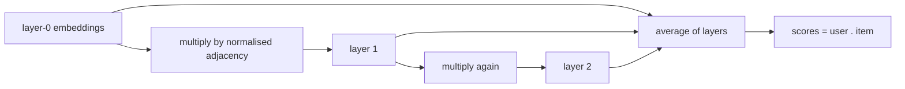

# LightGCN

> Treats users and items as nodes of one graph (an edge = an interaction) and smooths their embeddings
> over that graph, so each vector also reflects neighbours, and neighbours of neighbours.

--8<-- "generated/methods/lightgcn.md"

!!! note "Held back from the quick-tier bake-off"
    This method is not in the [quick-tier bake-off](../../results/quick-tier.md) yet, because it is heavier or did
    not finish on the full data. Its results below use default settings, without tuning. It joins the
    comparison later, through the same gate as every other method.

!!! tip "When to use it"
    - When higher-order connections matter ("users like you liked items liked by users like them").
    - As the standard graph baseline that newer graph methods (including [XSimGCL](xsimgcl.md)) build on.

!!! warning "When not to"
    - Very large graphs without a GPU: every training step propagates over the whole graph.
    - When order matters, or for new users and items (they are not in the graph).

## 1. Intuition

Start with a random vector for every user and item. Then let every node "listen" to its neighbours: a
user's new vector is a weighted average of the vectors of the items they used, and an item's new vector is
an average of its users. After one round, your vector knows your items. After two rounds, it also knows the
other users of your items. LightGCN keeps the vectors from every round and averages them. Training adjusts
the starting vectors so that the smoothed ones rank your items above random ones.

"Light" refers to what the original GCN-for-recommendation (NGCF) had and LightGCN removed: weight
matrices and non-linear activations. He et al. (2020) found these made results *worse*. The propagation
alone does the work.

## 2. A tiny worked example

Users u1, u2 and items A, B, with edges u1–A, u1–B, u2–B. Use 1-number embeddings at layer 0:
u1 = 1.0, u2 = −1.0, A = 0.5, B = 2.0. Degrees (number of edges): u1 = 2, u2 = 1, A = 1, B = 2.

One propagation step: each node sums its neighbours, each divided by $\sqrt{\text{deg}_\text{self}\cdot\text{deg}_\text{neighbour}}$:

- u1: $0.5/\sqrt{2\cdot1} + 2.0/\sqrt{2\cdot2} = 0.3536 + 1.0 = 1.3536$
- u2: $2.0/\sqrt{1\cdot2} = 1.4142$
- A: $1.0/\sqrt{1\cdot2} = 0.7071$
- B: $1.0/\sqrt{2\cdot2} + (-1.0)/\sqrt{2\cdot1} = 0.5 - 0.7071 = -0.2071$

Final embedding = average of layers 0 and 1: u1 = 1.1768, u2 = 0.2071, A = 0.6036, B = 0.8964.

u2 started at −1.0, a vector that disliked everything. After smoothing it is 0.2071, pulled towards its
item B. Its scores are now u2·A = 0.125 and u2·B = 0.1857.

## 3. How it works

1. Build the bipartite adjacency matrix $A$ (users + items as nodes) from pre-test interactions and normalise
   it: $\tilde{A} = D^{-1/2} A D^{-1/2}$.
2. Layer 0: learnable embeddings $E^{(0)}$ for all users and items.
3. Layers 1..L: $E^{(k+1)} = \tilde{A}\,E^{(k)}$ (no weights, no activation).
4. Final: $E = \frac{1}{L+1}\sum_{k=0}^{L} E^{(k)}$.
5. Train with the BPR loss on (user, interacted item, random item) triples, plus L2 on the layer-0 embeddings.
6. Recommend with dot products of final user and item embeddings.

## 4. The math, symbol by symbol

$$
\mathbf{e}_u^{(k+1)} = \sum_{i \in \mathcal{N}_u} \frac{1}{\sqrt{|\mathcal{N}_u|}\sqrt{|\mathcal{N}_i|}}\,\mathbf{e}_i^{(k)},
\qquad
\mathbf{e}_u = \frac{1}{L+1}\sum_{k=0}^{L}\mathbf{e}_u^{(k)},
\qquad
\hat{y}_{ui} = \mathbf{e}_u^\top\mathbf{e}_i
$$

| Symbol | Meaning | Shape / range |
|---|---|---|
| $\mathbf{e}_u^{(k)}$ | user $u$'s embedding after $k$ propagation steps | $d$ numbers |
| $\mathcal{N}_u$ | the items user $u$ interacted with (neighbours in the graph) | a set |
| $\mathcal{N}_i$ | the users who interacted with item $i$ | a set |
| $1/\sqrt{\lvert\mathcal{N}_u\rvert\lvert\mathcal{N}_i\rvert}$ | symmetric normalisation: popular nodes do not dominate | (0, 1] |
| $L$ | number of propagation layers | `graph_layers`, default 2 |
| $\hat{y}_{ui}$ | score of item $i$ for user $u$ | a real number |

Items are updated the same way from their users. The training loss is BPR (see [BPR-MF](bpr-mf.md)).

## 5. Training and inference

- **Training:** each step multiplies the sparse normalised adjacency matrix by the embedding matrix $L$
  times: $O(L\cdot\text{nnz}\cdot d)$ per step, on the whole graph.
- **Inference:** propagate once at the end, then use dot products.
- **Hardware:** a laptop CPU handles smoke-sized graphs. Full datasets want a GPU.

## 6. Hyperparameters

| Name in recbench config | What it does | Default | Typical range | Tip |
|---|---|---|---|---|
| `dim` | embedding size | preset (32 / 64 / 128) | 32–256 | |
| `graph_layers` | propagation layers $L$ | 2 | 1–4 | more layers over-smooth (everyone becomes alike) |
| `graph_reg` | L2 on layer-0 embeddings, divided by batch size | 1e-4 | 1e-5–1e-3 | |
| `graph_batch_size` | (user, positive, negative) triples per step | 2048 | 1,024–8,192 | |
| `lr`, `max_steps` | Adam learning rate and step budget | preset | — | the budget matters more than the rate here |

## 7. In recbench

- Code: `src/recbench/methods/graph.py::LightGCN`, using SELFRec's `LGCN_Encoder` (pinned commit `5b022942`).
- The graph comes from `TrainView.seen`; the normalised adjacency is built in
  `src/recbench/methods/graph.py::_GraphData`.
- SELFRec calls `.cuda()` internally; recbench redirects that to the chosen device
  (`src/recbench/methods/graph.py::on_device`), so the same code runs on a laptop CPU or a GPU.
- Negatives are re-drawn when the user already has the item (`src/recbench/methods/_torch.py::sample_negatives`).
- The loss follows SELFRec's training loop: BPR + `graph_reg` × L2(layer-0 embeddings of the batch) / batch size.

!!! info "Fidelity"
    Faithful (SELFRec's encoder and loss), with a step budget instead of epochs and no early stopping.

## 8. Results in this benchmark

--8<-- "generated/methods/lightgcn-results.md"

## 9. Strengths and weaknesses

- **Strengths:** captures multi-hop collaborative signal; simple architecture; a strong graph baseline.
- **Weaknesses:** full-graph propagation every step (slow on big graphs); embeddings tend to cluster around
  popular items; no explanations beyond embedding similarity.

## 10. Common pitfalls

- **Too many layers:** vectors become too similar (over-smoothing).
- **Forgetting the normalisation:** high-degree nodes would explode.
- **Comparing epochs with steps:** recbench uses a fixed number of steps, which for big graphs is far less
  than the hundreds of epochs in papers.

## 11. Check your understanding

??? question "In the example, why did u2's embedding go from -1.0 to 0.2071?"
    Its layer-1 value is the normalised value of its only item, B ($2.0/\sqrt2 = 1.414$). The final embedding
    averages layer 0 (−1.0) and layer 1 (1.414): $(−1.0 + 1.414)/2 = 0.207$.

??? question "What did LightGCN remove compared with NGCF, and why?"
    Feature transformation matrices and non-linear activations. With only ID embeddings as input they added
    parameters without useful signal and hurt accuracy.

??? question "Why average the layers instead of using only the last one?"
    Each layer captures a different neighbourhood size. Averaging keeps the node's own signal (layer 0) and
    limits over-smoothing.

## 12. Further reading

- He et al. (2020), [LightGCN: Simplifying and Powering Graph Convolution Network for
  Recommendation](https://arxiv.org/abs/2002.02126) (SIGIR 2020).
- SELFRec: <https://github.com/Coder-Yu/SELFRec>.
- [Embeddings](../concepts/embeddings.md) and [XSimGCL](xsimgcl.md).
