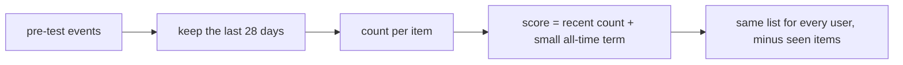

# MostPopular

> Recommends the items that got the most interactions recently, the same list for everyone (minus what
> each user already has).

--8<-- "generated/methods/most_popular.md"

!!! tip "When to use it"
    - On day one of a product, before you have enough data to personalise.
    - For brand-new users (the "cold start"); recbench scores it on cold users too.
    - As the baseline every personalised method must beat. On many datasets it is surprisingly hard to beat.

!!! warning "When not to"
    - When you want diversity or discovery: it pushes the same head items to everyone.
    - When popularity is driven by something you do not want to amplify (for example, a temporary promotion).

## 1. Intuition

A bookshop's "bestsellers this month" table. It knows nothing about you, but bestsellers sell because
many people want them, so a random customer will often like one. "This month" matters: last year's hit
may be old news. That is why recbench counts only the **last 28 days** before the cutoff, by default.

## 2. A tiny worked example

The test window starts on day 30. Interactions per item:

| Item | Interactions in days 2–29 (inside the 28-day window) | Interactions in days 0–1 | All-time total |
|---|---|---|---|
| A | 5 | 9 | 14 |
| B | 7 | 0 | 7 |
| C | 5 | 1 | 6 |
| D | 0 | 20 | 20 |

The score is the recent count, plus the all-time count divided by (largest all-time count + 1), which only
breaks ties:

- B: 7 + 7/21 = 7.33
- A: 5 + 14/21 = 5.67
- C: 5 + 6/21 = 5.29
- D: 0 + 20/21 = 0.95

The ranking is **B, A, C, D**. D was the all-time favourite, but nobody touched it in the last 4 weeks.
A and C tie on recent count, and A wins the tie because it has more interactions overall.

## 3. How it works

1. Find the cutoff time $t_0$ (the start of the test window).
2. Count each item's interactions between $t_0 - 28$ days and $t_0$.
3. Add the tie-breaking term.
4. Give everyone the same sorted list; the evaluator removes items each user already interacted with.

## 4. The math, symbol by symbol

$$
s_i = \underbrace{\big|\{(u, i, t) : t_0 - w \le t < t_0\}\big|}_{\text{recent count}} + \frac{n_i}{\max_j n_j + 1}
$$

| Symbol | Meaning | Shape / range |
|---|---|---|
| $s_i$ | score of item $i$ (the same for every user) | ≥ 0 |
| $(u, i, t)$ | one interaction: user $u$, item $i$, time $t$ | — |
| $t_0$ | the test cutoff (start of the test window) | a timestamp |
| $w$ | the recency window | 28 days by default |
| $n_i$ | all-time pre-test interactions of item $i$ | ≥ 0 |
| $\frac{n_i}{\max_j n_j + 1}$ | a tie-breaker; always below 1, so it never beats a full recent interaction | [0, 1) |

## 5. Training and inference

- **Training:** one pass over the pre-test events, O(number of events).
- **Inference:** the same vector for every user, O(catalog size) per user.
- **Hardware:** any CPU; trains in milliseconds.

## 6. Hyperparameters

| Name in recbench config | What it does | Default | Searched in the [quick tier](../../results/quick-tier.md) | Tip |
|---|---|---|---|---|
| `pop_window_days` | length of the "recent" window | 28 | 3, 7, 14, 28, 56, 112, 365 | shorter for fast-moving catalogs (news, fashion), longer for slow ones (books, movies) |
| `pop_half_life_days` | inside the window, an interaction $a$ days old counts $2^{-a/h}$ instead of 1 | none (all count 1) | none, 3, 7, 14, 30 | a smooth alternative to a short window |

## 7. In recbench

- Code: `src/recbench/methods/baselines.py::MostPopular`.
- It reads the cutoff from `TrainView.meta["test_start_us"]`. Knowing the cutoff time is not leakage: at
  serving time, "now" is the cutoff.
- `handles_cold_users=True`: for users with no history it is evaluated on the `cold_users/*` metrics.
  It is also what the serving API returns for unknown users (`popular.npy` in every bundle).
- Explanations say "Popular now: N interactions in the last 28 days". This is honest, but not personal.

!!! info "Fidelity"
    Faithful. Some systems use popularity within a category or region; that would be a different method
    (see [your first new method](../../start/your-first-method.md) for how to build one).

## 8. Results in this benchmark

--8<-- "generated/methods/most_popular-results.md"

## 9. Strengths and weaknesses

- **Strengths:** free, instant, works for new users, easy to steer (filters and boosts are trivial), and
  often within reach of much more complex models, especially when tastes are similar or the data is sparse.
- **Weaknesses:** no personalisation; it reinforces [popularity bias](../concepts/popularity-bias.md)
  (low coverage, high Gini); it struggles on catalogs where users want niche items.

## 10. Common pitfalls

- **Counting over all time.** Old blockbusters dominate and recent trends are missed.
- **Counting test events.** Popularity must be computed only from events before the cutoff. In recbench,
  `TrainView` makes anything else impossible.
- **Concluding "personalisation does not work"** because MostPopular wins a smoke run. Small samples have
  wide [confidence intervals](../metrics/confidence-intervals.md); check whether the methods are tied.

## 11. Check your understanding

??? question "Why is the all-time count divided by (max + 1)?"
    The term is then always below 1, so it can only break ties between items with the same recent count. It
    can never let an old item overtake one with even one more recent interaction.

??? question "Is it leakage that MostPopular knows the cutoff date?"
    No. In production the cutoff is simply "now". Leakage would be using events *after* the cutoff.

??? question "Why can MostPopular score cold users while EASE cannot?"
    It does not need any history: everyone gets the same list. EASE builds scores from the user's own
    history, which a cold user does not have.

## 12. Further reading

- [Popularity bias](../concepts/popularity-bias.md) and
  [coverage and popularity metrics](../metrics/coverage-and-popularity.md).
- Ji et al. (2023) on how evaluation choices can make popularity look better or worse:
  [A Critical Study on Data Leakage in Recommender System Offline Evaluation](https://arxiv.org/abs/2010.11060).
