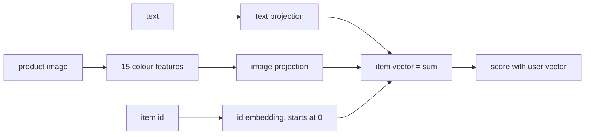

# Multimodal tower

> The text hash tower plus simple **image** features (colours read from real product photos) and a small
> item-ID correction. It runs only when real images are on disk.

--8<-- "generated/methods/multimodal_tower.md"

!!! note "Held back from the quick-tier bake-off"
    This method is not in the [quick-tier bake-off](../../results/quick-tier.md) yet, because it is heavier or did
    not finish on the full data. Its results below use default settings, without tuning. It joins the
    comparison later, through the same gate as every other method.

!!! tip "When to use it"
    - In visual domains (fashion, furniture, art), where how an item *looks* matters.
    - To learn how multimodal features plug into a two-tower model.

!!! warning "When not to"
    - Without images. recbench marks the run "unsupported" rather than inventing images.
    - As a stand-in for modern image encoders: 15 colour numbers are a teaching device, not CLIP.

## 1. Intuition

Shoppers often choose by look: the same colour family, similar patterns. This model adds a tiny visual
summary of each product photo, its average colour overall and in each quarter of the image, to the text
features of the [text hash tower](text-hash-tower.md). It also adds a learned per-item correction that
starts at zero, so a brand-new item is described by content alone, while items with history can drift
towards what their interactions say.

## 2. A tiny worked example: image features

Take a 2 × 2 image whose left column is red and right column is blue. recbench resizes every image to
32 × 32 and averages RGB values (scaled to 0–1):

| Feature | R | G | B |
|---|---|---|---|
| whole image | 0.50 | 0.00 | 0.50 |
| top-left quarter | 0.89 | 0.00 | 0.11 |
| top-right quarter | 0.11 | 0.00 | 0.89 |
| bottom-left quarter | 0.89 | 0.00 | 0.11 |
| bottom-right quarter | 0.11 | 0.00 | 0.89 |

That is 15 numbers. Notice the quarters are 0.89, not 1.0: resizing blends colours near the boundary. The
model learns which colour patterns matter for each user's taste.

## 3. How it works

1. Text features exactly as in the [text hash tower](text-hash-tower.md).
2. Image features: 15 numbers per item from Pillow (cached per split).
3. Item vector = text projection + image projection + item-ID embedding (initialised to zero).
4. User tower and training as in the text hash tower.

## 4. The math, symbol by symbol

$$
\mathbf{q}_i = W_t\,\mathbf{f}^{\text{text}}_i + \mathbf{b} + W_v\,\mathbf{f}^{\text{img}}_i + \mathbf{e}_i
$$

| Symbol | Meaning | Shape |
|---|---|---|
| $\mathbf{f}^{\text{text}}_i$ | hashed text features | 2,048 (sparse) |
| $\mathbf{f}^{\text{img}}_i$ | colour features (mean RGB + 4 quarter means) | 15 |
| $W_t, W_v$ | text and image projections | 2,048 × dim, 15 × dim |
| $\mathbf{e}_i$ | item-ID residual, zero at initialisation | dim |

## 5. Training and inference

- **Training:** as for the text tower, plus a tiny dense projection; image features are computed once.
- **Hardware:** laptop CPU. Reading tens of thousands of images takes a few minutes the first time.

## 6. Hyperparameters

Same as the [text hash tower](text-hash-tower.md) (`hash_features`, `dim`, `seq_len`, `batch_size`, `lr`, `max_steps`).

## 7. In recbench

- Code: `src/recbench/methods/content.py::MultimodalTower` and
  `src/recbench/methods/content.py::image_features` (cached at `<split>/cache/<split_hash>/image_features.npy`).
- Requires real image files: for H&M, unpack the Kaggle image archive under `data/raw/hm/images/`
  (about 30 GB; see the [H&M dataset page](../datasets/hm.md)). Without it, the run is recorded as
  `unsupported` with the reason "no item images on disk".
- recbench v0.1 read real JPEGs as black pixels and generated placeholder images on the laptop; v0.2 reads
  real images with Pillow and never generates any.

!!! info "Fidelity: simplified"
    A teaching-sized multimodal model. Production systems use pretrained vision encoders (for example CLIP or
    SigLIP embeddings); that upgrade is on the [roadmap](../../results/roadmap.md).

## 8. Results in this benchmark

--8<-- "generated/methods/multimodal_tower-results.md"

## 9. Strengths and weaknesses

- **Strengths:** uses visual similarity; supports new items; an inspectable example of multimodal fusion.
- **Weaknesses:** colour averages miss shape, texture, and style; needs a large image download.

## 10. Common pitfalls

- **Fake or placeholder images:** they add noise and give a false impression of "multimodal" results.
- **Different image sizes and crops:** always resize consistently (recbench uses 32 × 32 for features).

## 11. Check your understanding

??? question "Why start the item-ID embedding at zero?"
    So a new item, whose ID embedding never trains, is represented purely by its content, while items with
    history can learn a correction.

??? question "What would a quarter-mean feature capture that the whole-image mean misses?"
    Layout: for example, a dark top and a light bottom, which the overall average blends away.

## 12. Further reading

- Radford et al. (2021), [Learning Transferable Visual Models From Natural Language Supervision (CLIP)](https://arxiv.org/abs/2103.00020).
- [Text hash tower](text-hash-tower.md) and [cold start](../concepts/cold-start.md).
