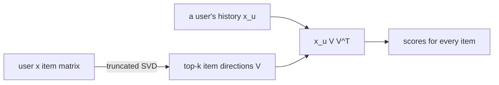

# PureSVD

> Compresses the user × item matrix into a few "taste directions" with a truncated SVD, then recommends the items
> that sit along the same directions as a user's history.

!!! abstract "In plain words"
    Every user's history is a long row of 0s and 1s. PureSVD finds a handful of "taste directions" that explain most
    of those rows; for films, something like "action vs drama" or "old vs new". It describes each user by where their
    history points in those directions, and recommends the items that point the same way. There is no training loop
    and no learning rate: just one matrix decomposition.

--8<-- "generated/methods/puresvd.md"

!!! example "Improve it yourself"
    [Lab 6](../../labs/06-puresvd.md) takes you through PureSVD in four levels: reproduce its baseline, understand
    every setting, normalise users by activity, and implement EigenRec's popularity scaling. The [lab scoreboard](../../labs/scoreboard.md) tracks your results.

!!! tip "When to use it"
    - As the simplest learned-factor baseline: one SVD call, one setting.
    - To build intuition for matrix factorisation before iALS and BPR.

!!! warning "When not to"
    - When you need exact explanations (factors are abstract), or order-aware recommendations.
    - With very skewed data, unless the number of factors is tuned: too few factors recommend mostly
      bestsellers.

## 1. Intuition

Millions of user × item cells hide a few broad patterns: "likes action films", "likes romance". A **singular
value decomposition (SVD)** finds these patterns as directions in item space, ordered from strongest to
weakest. **PureSVD** keeps the strongest $k$ directions and throws the rest away.

To score a user, take their history, keep only the part that lies along those $k$ directions, and read off
how strongly each item lies along them. Items that share the user's dominant directions score high.

## 2. A tiny worked example

Four users and four items. Items 1 and 2 form one taste group, items 3 and 4 another:

| User | Item 1 | Item 2 | Item 3 | Item 4 |
|---|---|---|---|---|
| A | 1 | 1 | 0 | 0 |
| B | 1 | 1 | 0 | 0 |
| C | 0 | 0 | 1 | 1 |
| D | 1 | 0 | 0 | 0 |

The SVD finds singular values 2.14, 1.41, 0.66, 0. The strongest direction is mostly items 1 and 2
(weights 0.79 and 0.62); the second is items 3 and 4 (0.71 each).

User D has only item 1. Projecting D's history onto the top direction gives scores **0.62 for item 1** and
**0.49 for item 2**, and 0 for items 3 and 4. Item 1 is already seen and gets masked, so D's recommendation
is **item 2**, the item that shares item 1's taste group. Adding the second direction (k = 2) leaves D's
scores unchanged, because D has nothing in the "items 3 and 4" direction.

## 3. How it works

1. Build the user × item matrix $X$ (binary, or time-decayed weights).
2. Compute the top-$k$ right singular vectors $V$ (items × $k$) with a randomized SVD.
3. Score: $x_u V V^\top$, a projection of the user's history onto the $k$ directions.

## 4. The math, symbol by symbol

$$
X \approx U_k \Sigma_k V_k^\top, \qquad \text{score}(u) = x_u V_k V_k^\top
$$

| Symbol | Meaning | Shape |
|---|---|---|
| $X$ | user × item interactions | users × items |
| $U_k, \Sigma_k, V_k$ | top-$k$ left singular vectors, singular values, right singular vectors | users × k, k × k, items × k |
| $x_u$ | user $u$'s row of $X$ | 1 × items |
| $V_k V_k^\top$ | projection onto the $k$ strongest item directions | items × items (never built explicitly) |
| $k$ | number of factors (`svd_factors`) | about 16–1024 |

Because scoring uses only $V_k$, any user with a history can be scored, including users the SVD never saw.
This is called **folding in**.

## 5. Training and inference

- **Training:** one randomized SVD of a sparse matrix, $O(\text{nnz}(X) \cdot k)$ per iteration. Seconds to
  minutes on a CPU.
- **Inference:** two small dense products per batch of users.
- **Hardware:** CPU.

## 6. Hyperparameters

| Name in recbench config | What it does | Default | Searched over |
|---|---|---|---|
| `svd_factors` | number of directions kept | 128 | 16–1024 |
| (power iterations) | how exact the randomized SVD's directions are | 5 | fixed in the code (`n_iter`) |
| `decay_half_life_days` | recent interactions weigh more | none | none, 30, 90, 365 |
| `train_window_days` | train on the last N days only | none | none, 30, 90, 365 |

## 7. In recbench

- Code: `src/recbench/methods/linear.py::PureSVD` (scikit-learn's `randomized_svd`, seeded).
- `tests/test_new_methods.py` checks that $V V^\top$ matches NumPy's exact SVD on toy data.

!!! info "Fidelity: faithful"
    Cremonesi et al. (2010) used the same projection with an exact sparse SVD; a randomized SVD gives the
    same top directions up to small numerical differences.

## 8. Results in this benchmark

--8<-- "generated/methods/puresvd-results.md"

## 9. Strengths and weaknesses

- **Strengths:** one setting, no training loop, folds in new users instantly, a natural "first latent model".
- **Weaknesses:** treats missing cells as known zeros (no confidence weighting, unlike iALS); factors are
  abstract, so explanations are only post-hoc.

## 10. Common pitfalls

- **Too few factors:** the top directions are mostly popularity, so lists collapse to bestsellers.
- **Too many factors:** the projection keeps noise and starts to just reproduce the user's own history.
- **Reading scores as probabilities.** SVD treats every missing cell as a 0, as if the user disliked the item.
  That is fine for ordering items, but the scores are only useful as a ranking.

## 11. Check your understanding

??? question "Why can PureSVD score a user who joined after training?"
    Scoring only needs the item directions $V_k$ and the user's history $x_u$; no per-user parameter has
    to be learned.

??? question "How is PureSVD different from iALS?"
    Both learn latent factors. iALS weights observed interactions more than missing ones (confidence) and
    regularises; PureSVD treats every cell equally and simply truncates.

??? question "The dataset gets ten times more users but keeps the same items. Which part of PureSVD's cost grows?"
    The truncated SVD, whose cost grows with the number of interactions, so roughly ten times for a fixed number of
    factors. Scoring one user stays the same: a product of their history with the item directions.

## 12. Further reading

- Cremonesi, Koren, Turrin (2010). *Performance of Recommender Algorithms on Top-N Recommendation Tasks.* RecSys.
- Nikolakopoulos et al. (2019). *EigenRec: generalizing PureSVD for effective and efficient top-N recommendations.*
  Knowledge and Information Systems ([lab 6](../../labs/06-puresvd.md), Level 4).
- [Embeddings](../concepts/embeddings.md), [iALS](ials.md), and [the interaction matrix](../concepts/interaction-matrix.md).
