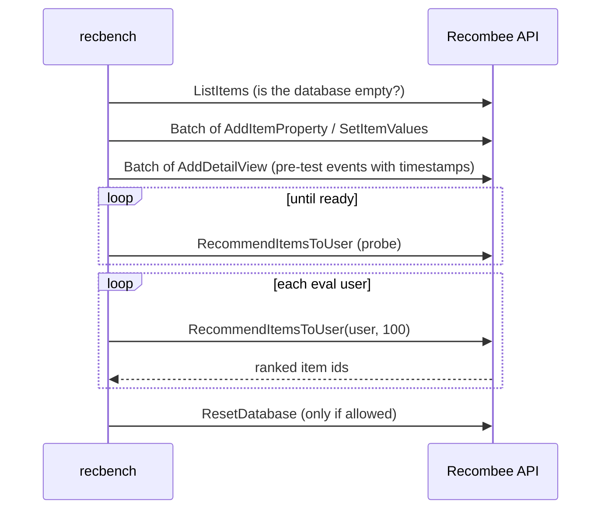

# Recombee

> A managed recommendation service (software as a service): you send it your items and interactions, and it
> returns recommendations through an API. recbench benchmarks it on exactly the same data and metrics as
> the local models.

--8<-- "generated/methods/recombee.md"

!!! tip "When to use it"
    - When time to market matters more than control: no models to train, host, or monitor.
    - When you need business rules (filters, boosts) without writing ranking code.
    - To answer "build or buy?" with numbers instead of a sales pitch.

!!! warning "When not to"
    - When you need to know *why* an item was recommended: the service is a black box.
    - When data cannot leave your infrastructure (privacy, regulation).
    - At large scale on a small budget: pricing grows with users, items, and requests.

## 1. Intuition

Instead of building a recommender, you rent one. Recombee keeps a database of your items and of who
interacted with what. Each time you ask "what should user X see?", its models (which you never see) answer
with a ranked list. To benchmark it fairly, recbench treats it like any other method: upload only the
**pre-test** interactions, ask for each evaluation user's top-K, and compute the same metrics against the
same test items.

## 2. A tiny worked example: the request budget

Every API call costs part of a monthly quota. Recombee's docs say a batch request is "equivalent as if [the
requests] were executed one-by-one", so recbench conservatively counts **every sub-request**. For the
`slice` tier (sized for the free plan):

| Requests | Count (approximately) |
|---|---|
| define 2 item properties (title, category) | 2 |
| upload items (`SetItemValues`) | ≤ 10,000 |
| upload pre-test interactions (`AddDetailView`) | ~36,000 |
| readiness polling (at most) | 20 |
| one recommendation request per eval user | 1,000 |
| check that the database is empty | 1 |
| **Total** | **~47,000 (about 52% of the 90,000 budget)** |

If the total would exceed `recombee_max_requests`, recbench refuses to start, *before* sending anything.

## 3. How it works

1. **Check:** credentials present, the plan fits the budget, and the database is empty (or a reset is
   explicitly allowed).
2. **Upload:** item properties, then items, then every pre-test interaction as a "detail view" with its
   original timestamp (in seconds), in batches of 5,000.
3. **Wait:** poll `RecommendItemsToUser` until the service returns recommendations (its models train
   continuously in the background).
4. **Evaluate:** request the top 100 items for each evaluation user. recbench removes seen items and
   computes the usual metrics.
5. **Report:** live latency percentiles of those calls and the number of requests used.
6. **Clean up:** reset the database if allowed (`RECBENCH_RECOMBEE_ALLOW_RESET=1`).

## 4. The math

There is no model to write down: it is Recombee's. What recbench controls is the arithmetic of a fair
comparison:

$$
\text{requests} = 2 + |\text{items}| + |\text{pre-test events}| + |\text{eval users}| + \text{polls} + 1
\;\le\; \texttt{recombee\_max\_requests}
$$

| Term | Meaning |
|---|---|
| $\lvert\text{items}\rvert$ | catalog size of the split (≤ 10,000 in the slice tier) |
| $\lvert\text{pre-test events}\rvert$ | interactions before the test cutoff (what the service may learn from) |
| $\lvert\text{eval users}\rvert$ | users whose lists are requested (≤ 1,000 in the slice tier) |

## 5. Training and inference

- **Training:** done by the service after upload; recbench only waits.
- **Inference:** one HTTPS request per user. Latency includes the network round trip from your machine.
- **Cost:** the free plan reportedly allows about 100,000 requests per month, 20,000 active users, and 20,000
  items (third-party listings; confirm on recombee.com). Paid plans start at about $99 per month.

## 6. Settings

| Name | What it does | Default |
|---|---|---|
| `RECBENCH_RECOMBEE_DB` | database id (create a dedicated one) | required |
| `RECBENCH_RECOMBEE_TOKEN` | the database's **private** token | required (never commit it) |
| `RECBENCH_RECOMBEE_REGION` | `ap-se`, `ca-east`, `eu-west`, or `us-west` | `eu-west` |
| `RECBENCH_RECOMBEE_ALLOW_RESET` | `1` allows wiping the database before and after a run | off |
| `recombee_max_requests` | hard request budget per run | 90,000 |
| `recombee_max_polls`, `recombee_poll_seconds` | readiness polling | 20, 30 s |
| `recombee_scenario` | optional Recombee scenario name (business rules set up in its admin UI) | none |

## 7. In recbench

- Code: `src/recbench/methods/recombee.py::RecombeeMethod` and `src/recbench/methods/recombee.py::RequestBudget`,
  using the official SDK `recombee-api-client` 6.3.1, which signs every request (HMAC).
- `output="list"`: the evaluator calls `topk` and filters seen items itself.
- Configuration: `configs/benchmarks/recombee-slice.yaml` runs Recombee **and** six local methods on the same
  slice, so the comparison is fair. Step-by-step: [Benchmark Recombee](../../how-to/run-recombee.md).
- Tests use a fake client (`tests/test_recombee.py`). A live test runs only with `RECBENCH_LIVE=1`.

!!! info "Fidelity"
    Faithful: the real service through its official SDK. Uploading interactions as "detail views" is a
    simplification; Recombee also supports purchases, ratings, and cart additions, which could help it.

## 8. Results in this benchmark

Recombee runs only on the slice tier, and only when you provide credentials:

--8<-- "generated/methods/recombee-results.md"

## 9. Strengths and weaknesses

- **Strengths:** fastest path to production; built-in business rules, real-time updates, and fallbacks.
- **Weaknesses:** black box (no explanations); cost grows with scale; data leaves your infrastructure;
  results depend on settings you configure in its admin UI.

## 10. Common pitfalls

- **Uploading test events**, which would leak the answers. recbench uploads only pre-test events.
- **Reusing a database** that already holds other data. recbench refuses unless reset is allowed.
- **Leaving data in the service** after a run. Allow the reset, or delete the database in the admin UI.

## 11. Check your understanding

??? question "Why upload timestamps with every interaction?"
    The service can then weight recent behaviour, as it would in production. Without them, all history
    would look like it happened "now".

??? question "Why does recbench count batch sub-requests individually?"
    The documentation says a batch is equivalent to executing its requests one by one, so they likely count
    against the quota. Counting conservatively avoids an unexpected bill.

??? question "What makes the Recombee comparison fair?"
    The same slice, the same pre-test data, the same eval users, and the same metrics as the local methods it
    is compared with.

## 12. Further reading

- Recombee API documentation: <https://docs.recombee.com/api> and authentication: <https://docs.recombee.com/authentication>.
- [Other managed services](managed-services.md) and the [decision guide](../../results/decision-guide.md).
