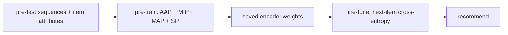

# S3-Rec

> Pre-trains a sequence encoder with four self-supervised puzzles that connect items, their attributes
> (categories), and their context, then fine-tunes it for next-item prediction.

--8<-- "generated/methods/s3rec.md"

!!! note "Held back from the quick-tier bake-off"
    This method is not in the [quick-tier bake-off](../../results/quick-tier.md) yet, because it is heavier or did
    not finish on the full data. Its results below use default settings, without tuning. It joins the
    comparison later, through the same gate as every other method.

!!! tip "When to use it"
    - When items have meaningful attributes (genres, product types) and interaction data is limited.
      Attributes give extra training signal.
    - To learn how self-supervised pre-training works in recommendation.

!!! warning "When not to"
    - Without real item attributes. recbench refuses to run it when a dataset has fewer than 2 category
      values (Last.fm has none).
    - On a tight budget: two training stages and four auxiliary losses cost time.

## 1. Intuition

Interaction data is sparse, but items come with attributes for free: a movie's genres, a garment's
product type. S3-Rec first teaches the model to *understand* items and sequences by solving puzzles whose
answers are already in the data. There are no labels to buy, hence "self-supervised". Only then does it
learn the real task, next-item prediction, starting from that understanding.

The four puzzles (with "maximising mutual information" as the formal goal):

1. **AAP: Associated Attribute Prediction.** Given an item, which attributes does it have?
2. **MIP: Masked Item Prediction.** Hide an item in the sequence; guess it from the context.
3. **MAP: Masked Attribute Prediction.** Hide an item; guess its *attributes* from the context.
4. **SP: Segment Prediction.** Hide a contiguous chunk of the sequence; recognise it from the rest.

## 2. A tiny worked example

A user's sequence: *Toy Story* (Animation|Comedy) → *Up* (Animation) → *Inside Out* (Animation|Comedy) →
*Heat* (Crime).

| Puzzle | Input | The model should predict |
|---|---|---|
| AAP | the item *Up* | its attribute: Animation (not Crime) |
| MIP | Toy Story, [mask], Inside Out, Heat | *Up* |
| MAP | Toy Story, [mask], Inside Out, Heat | the hidden item's attributes: Animation |
| SP | [mask], [mask], Inside Out, Heat | that the hidden segment is "Toy Story, Up" rather than a random segment |

Each puzzle is scored like a small classification. For AAP, the model compares the item's vector with
each attribute's vector, and a sigmoid of the similarity should be high for Animation and low for Crime.
After pre-training, the encoder "knows" that *Up* and *Inside Out* belong together, even if few users
watched both.

## 3. How it works

1. **Pre-train** (first half of the step budget) with the weighted sum of the four losses.
2. Save the encoder weights.
3. **Fine-tune** (second half) with next-item cross-entropy, starting from the saved weights.
4. Recommend like BERT4Rec/SASRec: encode the history and score all items.

## 4. The math, symbol by symbol

$$
\mathcal{L}_{\text{pre}} = w_{\text{AAP}}\mathcal{L}_{\text{AAP}} + w_{\text{MIP}}\mathcal{L}_{\text{MIP}}
+ w_{\text{MAP}}\mathcal{L}_{\text{MAP}} + w_{\text{SP}}\mathcal{L}_{\text{SP}},
\qquad
\mathcal{L}_{\text{fine}} = -\ln\frac{\exp(\mathbf{h}^\top\mathbf{e}_{\text{next}})}{\sum_j\exp(\mathbf{h}^\top\mathbf{e}_j)}
$$

| Symbol | Meaning | Value in recbench |
|---|---|---|
| $\mathcal{L}_{\text{AAP}}$ | binary cross-entropy: item ↔ its attributes | weight 0.2 |
| $\mathcal{L}_{\text{MIP}}$ | masked item ↔ its context (contrasted with a random item) | weight 1.0 |
| $\mathcal{L}_{\text{MAP}}$ | masked item's attributes ↔ the context | weight 1.0 |
| $\mathcal{L}_{\text{SP}}$ | masked segment ↔ the rest of the sequence | weight 0.5 |
| $\mathbf{h}$ | the encoder's output for the history | $d$ numbers |
| $\mathbf{e}_j$ | item embedding | $d$ numbers |

## 5. Training and inference

- **Training:** two stages; the pre-training stage computes four losses per batch. It costs roughly two
  BERT4Rec trainings.
- **Inference:** same as BERT4Rec (RecBole's `full_sort_predict`).
- **Hardware:** laptop CPU at smoke scale; a GPU for full datasets.

## 6. Hyperparameters

| Name in recbench config | What it does | Default | Tip |
|---|---|---|---|
| (fixed) `aap_weight`, `mip_weight`, `map_weight`, `sp_weight` | loss weights | 0.2, 1.0, 1.0, 0.5 | RecBole's defaults; edit in `src/recbench/methods/recbole_models.py::S3Rec` |
| (fixed) stage split | pre-train / fine-tune share of `max_steps` | 50% / 50% | |
| `dim`, `layers`, `heads`, `seq_len`, `dropout`, `max_steps` | Transformer size and budget | preset | |

## 7. In recbench

- Code: `src/recbench/methods/recbole_models.py::S3Rec` (built on `RecBoleMethod`).
- Item categories are exported as a RecBole `token_seq` feature: "Animation|Comedy" becomes two tokens.
- **Stage 1:** `train_stage="pretrain"` for half the steps; the weights are saved as plain tensors (PyTorch 2.6+
  loads checkpoints with `weights_only=True`).
- **Stage 2:** a fresh model with `train_stage="finetune"` loads them and trains with cross-entropy.
- Runs only when the dataset has at least 2 distinct category tokens.

!!! info "Fidelity"
    Faithful (RecBole's implementation, both stages, as in the paper). recbench v0.1 ran only the pre-training
    stage, so its "S3-Rec" was never fine-tuned; v0.2 fixed that.

## 8. Results in this benchmark

--8<-- "generated/methods/s3rec-results.md"

## 9. Strengths and weaknesses

- **Strengths:** uses item attributes to fight sparsity; pre-training can help rare items.
- **Weaknesses:** two stages and four extra weights to tune; needs real attributes; slower; post-hoc
  explanations only.

## 10. Common pitfalls

- **Skipping fine-tuning** (as recbench v0.1 did): the pre-trained encoder was never taught the actual task.
- **Weak attributes:** a single constant category ("artist") gives the auxiliary tasks nothing to learn.
- **Pre-train/fine-tune mismatch:** the model must use the same item vocabulary in both stages (recbench
  builds both from the same export).

## 11. Check your understanding

??? question "Which puzzle needs no attributes at all?"
    MIP (masked item prediction) and SP (segment prediction) use only item IDs. AAP and MAP need attributes.

??? question "Why pre-train at all if the final task is next-item prediction?"
    The extra puzzles give more training signal per sequence, especially for rare items, so fine-tuning
    starts from better item and sequence representations.

??? question "Why does recbench refuse to run S3-Rec on Last.fm?"
    Its items (artists) have no category values, so the attribute puzzles are meaningless.

## 12. Further reading

- Zhou et al. (2020), [S3-Rec: Self-Supervised Learning for Sequential Recommendation with Mutual
  Information Maximization](https://arxiv.org/abs/2008.07873) (CIKM 2020).
- [BERT4Rec](bert4rec.md) (shares the encoder) and [loss functions](../concepts/loss-functions.md).
