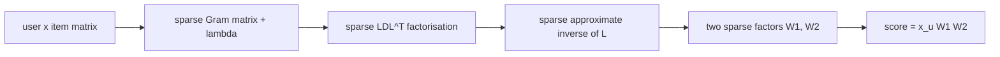

# SANSA

> EASE without the item cap: the same "predict each item from all the others" model, computed approximately
> with sparse matrices so that catalogs of hundreds of thousands of items fit in memory.

--8<-- "generated/methods/sansa.md"

!!! tip "When to use it"
    - When EASE works well but your catalog is too large for its dense item × item matrix. In recbench, EASE
      keeps at most 20,000–60,000 items; SANSA keeps them all.
    - When you want a compact model to serve: SANSA's weights are sparse.

!!! warning "When not to"
    - On small catalogs, where exact EASE is simpler and slightly more accurate.
    - If you cannot install SuiteSparse (SANSA needs it for sparse factorisations).

## 1. Intuition

[EASE](ease.md) finds the best item × item weight matrix in one step: invert the item co-occurrence matrix
(plus λ on the diagonal). With 200,000 items that matrix has 40 billion entries, too big for memory, so EASE
keeps only the most popular items.

Most item pairs never co-occur, and the important structure of the inverse is concentrated in relatively few
entries. SANSA (Scalable Approximate NonSymmetric Autoencoder) computes a sparse approximation of the inverse:

1. a **sparse factorisation** of the co-occurrence matrix, $LDL^\top$, keeping only the largest entries;
2. a sparse **approximate inverse** of $L$.

The result is two sparse matrices whose product behaves like EASE's weights.

## 2. A tiny worked example

On a small catalog the approximation can be made exact by keeping every entry (`sansa_density = 1`). Then
SANSA's scores for unseen items rank exactly like EASE's: `tests/test_new_methods.py` checks this, with a
correlation above 0.99.

The only difference is on items the user already has. EASE sets the diagonal to 0, while SANSA's diagonal is
-1, so seen items differ by exactly the user's own interaction. The evaluator masks those items anyway.

On a large catalog, `sansa_density` controls the trade-off. At 0.001, the weights keep about 0.1% of the
entries a dense matrix would have: a 100,000-item catalog keeps about 10 million weights instead of 10 billion.

## 3. How it works

1. Build the user × item matrix $X$ (binary, or time-decayed weights).
2. Factorise $P(X^\top X + \lambda I)P^\top \approx L D L^\top$ sparsely, with a fill-reducing reordering $P$
   (CHOLMOD, or incomplete Cholesky for very large catalogs).
3. Compute a sparse approximate inverse of $L$.
4. Assemble two sparse factors $W_1, W_2$ with $W_1 W_2 \approx -(X^\top X + \lambda I)^{-1} / \text{diag}$.
5. Score: $x_u W_1 W_2$.

## 4. The math, symbol by symbol

EASE's closed form, which SANSA approximates:

$$
B = I - P \,\mathrm{diagMat}(1 / \mathrm{diag}(P)), \qquad P = (X^\top X + \lambda I)^{-1}
$$

| Symbol | Meaning | Shape |
|---|---|---|
| $X$ | user × item interactions | users × items |
| $\lambda$ | L2 regularisation (`sansa_lambda`) | > 0 |
| $P$ | the inverse SANSA approximates sparsely | items × items |
| $L, D$ | sparse lower-triangular factor and diagonal of the factorisation | items × items |
| density | share of entries kept (`sansa_density`) | about 1e-5–1e-2 |

## 5. Training and inference

- **Training:** a sparse factorisation and a sparse inverse: minutes for very large catalogs, CPU only.
- **Inference:** two sparse matrix products per batch of users.
- **Hardware:** CPU, with SuiteSparse installed (`brew install suite-sparse` or `apt install libsuitesparse-dev`).

## 6. Hyperparameters

| Name in recbench config | What it does | Default | Searched over |
|---|---|---|---|
| `sansa_lambda` | L2 regularisation, as EASE's λ | 500 | 1–20000 (log) |
| `sansa_density` | share of weights kept | 0.001 | 1e-5–0.01 (log) |
| `sansa_factorizer` | `cholmod` (exact sparse) or `icf` (incomplete, for huge catalogs) | cholmod | — |

## 7. In recbench

- Code: `src/recbench/methods/linear.py::SANSA`, which wraps the `sansa` package (installed with the
  `sansa` extra).
- `tests/test_new_methods.py` checks that it ranks unseen items like exact EASE on a small catalog.

!!! info "Fidelity: faithful"
    It uses the authors' package with its default factorisation and inverter settings.

## 8. Results in this benchmark

--8<-- "generated/methods/sansa-results.md"

## 9. Strengths and weaknesses

- **Strengths:** EASE-quality models on catalogs EASE cannot handle; sparse weights; fast scoring.
- **Weaknesses:** an extra system dependency (SuiteSparse); a second setting (density) to tune;
  explanations are less direct than EASE's, because the weights are a product of two factors.

## 10. Common pitfalls

- **A density that is too low:** too few weights survive, and accuracy drops sharply.
- **Comparing SANSA to a capped EASE without saying so.** The difference may come from the extra items, not
  the method.

## 11. Check your understanding

??? question "Why can't EASE simply use all 235,000 RetailRocket items?"
    Its dense item × item matrix would need 235,000² × 4 bytes ≈ 220 GB, several times that while it is being
    inverted.

??? question "What does SANSA give up compared with exact EASE?"
    A little accuracy, from approximating the inverse with a limited number of non-zero entries.

## 12. Further reading

- Spišák, Bartyzal, Hoskovec, Peska, Tůma (2023). *Scalable Approximate NonSymmetric Autoencoder for
  Collaborative Filtering.* RecSys. [Code](https://github.com/glami/sansa)
- [EASE](ease.md), [SLIM](slim.md).
