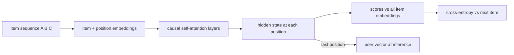

# SASRec

> Self-Attentive Sequential Recommendation: a small causal Transformer reads the user's recent items *in
> order* and predicts the next one, like a language model predicting the next word.

!!! abstract "In plain words"
    SASRec reads a user's history in order, like a sentence, and predicts the next item, the way a phone keyboard
    predicts the next word. Its attention mechanism lets it look back at any earlier item, so a click from long ago can
    still matter if it is relevant to what comes next.

--8<-- "generated/methods/sasrec.md"

!!! tip "When to use it"
    - When the order of actions matters: music sessions, shopping journeys, watching a series.
    - As the standard sequential baseline. With a full cross-entropy loss it is very strong (often stronger
      than BERT4Rec).

!!! warning "When not to"
    - When timestamps are unreliable (for example, MovieLens ratings entered in bulk): there is little real
      order to learn.
    - For very short histories, or users with no history.
    - On a laptop with a huge catalog: the full softmax over all items is memory-hungry.

## 1. Intuition

Your last few actions say a lot about your next one. If you just listened to three jazz albums, a fourth is
likely. If you bought a phone, a phone case is likely next. SASRec reads your history from oldest to newest.
At each position it asks: "given everything up to here, which item comes next?"

**Self-attention** is how it reads. Each position looks back at all earlier positions and decides how much
each one matters ("attention weights"), then mixes their information. **Causal** means a position may look
only *backwards*, never at future items. That is what makes "predict the next item" an honest task during
training.

## 2. A tiny worked example

Item embeddings (2-D): A = (1, 0), B = (0, 1), C = (1, 1). A user's history is A → B → C. To keep the
arithmetic visible, assume the query, key, and value projections are the identity and there is one head
(dimension $d = 2$).

Attention at the **last position** (C) looks at A, B, C:

- Scores $\mathbf{q}_C\cdot\mathbf{k}_j/\sqrt{d}$: A → 0.7071, B → 0.7071, C → 1.4142
- Softmax weights: A 0.2483, B 0.2483, C 0.5035 (C attends most to itself)
- Output (weighted sum of values): $\mathbf{h} = (0.7517, 0.7517)$

At the **first position**, the causal mask lets A see only itself (weight 1.0). At the second, B sees A
and B (weights 0.33, 0.67).

The user vector is the output at the last position, $\mathbf{h}$. Scores are dot products with item
embeddings. For two unseen items, E = (0.8, 0.9) scores $0.7517 \times 1.7 = 1.278$ and D = (−1, 0.5) scores
−0.376, so E is recommended. A real SASRec stacks 2+ such layers, with learned projections, positional
embeddings, feed-forward blocks, residual connections, and layer normalisation.

## 3. How it works

1. Cut **training windows** from each user's pre-test history: inputs $s_1..s_{n-1}$, targets
   $s_2..s_n$ (each position must predict the item that follows it).
2. Embed each item and add a learned **position** embedding.
3. Run $L$ Transformer layers with a **causal mask** (and a mask on padding).
4. At every position, compute scores against all item embeddings (shared with the input embeddings) and
   apply cross-entropy against the true next item.
5. At inference, feed the user's most recent `seq_len` items. The output at the last position is the user
   vector; score all items; remove seen ones.

## 4. The math, symbol by symbol

Attention for one head:

$$
\text{Attn}(Q, K, V) = \operatorname{softmax}\!\left(\frac{QK^\top}{\sqrt{d}} + M\right)V
$$

Prediction and loss at position $t$:

$$
\hat{y}_{t,i} = \mathbf{h}_t^\top \mathbf{e}_i,
\qquad
\mathcal{L} = -\sum_{t}\ln\frac{\exp(\hat{y}_{t,s_{t+1}})}{\sum_{j=1}^{N}\exp(\hat{y}_{t,j})}
$$

| Symbol | Meaning | Shape / range |
|---|---|---|
| $Q, K, V$ | queries, keys, values: linear projections of the layer input | positions × $d$ |
| $\sqrt{d}$ | scaling that keeps dot products in a reasonable range | scalar |
| $M$ | mask: $-\infty$ for future positions and padding keys, 0 elsewhere | positions × positions |
| $\mathbf{h}_t$ | output of the last layer at position $t$ | $d$ numbers |
| $\mathbf{e}_i$ | embedding of item $i$ (shared by input and output) | $d$ numbers |
| $s_{t+1}$ | the true next item after position $t$ | an item index |
| $N$ | number of items in the catalog | e.g. 20,000 |

The loss is the full softmax cross-entropy over the whole catalog. When the catalog is too large for the
memory budget, recbench switches to sampled softmax with 1,024 shared random negatives (see
[negative sampling](../concepts/negative-sampling.md)).

## 5. Training and inference

- **Training:** attention costs $O(L\cdot n^2 \cdot d)$ per window of length $n$; the full softmax costs
  $O(n\cdot N\cdot d)$ per window, usually the bigger part.
- **Inference:** one forward pass per user plus a dot product with all items.
- **Hardware:** fine on a laptop CPU at smoke scale; a GPU for full datasets.

## 6. Hyperparameters

| Name in recbench config | What it does | Default | Searched in the [quick tier](../../results/quick-tier.md) | Tip |
|---|---|---|---|---|
| `dim` | embedding and hidden size | preset (32 / 64 / 128) | 64, 128 | |
| `layers` | Transformer layers | preset (2 / 2 / 3) | fixed (preset) | 2 is a strong default |
| `heads` | attention heads | preset (2 / 2 / 4) | fixed (preset) | must divide `dim` |
| `seq_len` | maximum history length read | preset (50 / 50 / 200) | 50, 100, 200 | longer histories for long sessions (music) |
| `dropout` | dropout rate | 0.2 | 0.1, 0.2, 0.3, 0.5 | higher for sparse data |
| `sasrec_loss` | `auto` (full softmax when it fits in memory, else sampled), `sampled`, or `bce` (the original loss) | auto | all three | full softmax usually wins (Klenitskiy & Vasilev 2023) |
| `n_negatives` | negatives shared by a batch for the sampled softmax | 1,024 | 256, 1,024, 4,096 | more negatives behave more like the full softmax |
| `lr` | Adam learning rate | 1e-3 | 1e-4–1e-2 (log scale) | |
| `max_epochs`, `patience` | early stopping on a validation fold | 30, 3 | fixed: 200, 10 | the final run reuses the best epoch count |
| `batch_size` | windows per step | preset | fixed (preset) | |

One **epoch** is enough random windows for every training event to be a target about once, and at least one
window per user. Sizing epochs by users alone made them tiny when there are few users with long histories
(14 batches on the MovieLens quick tier).

## 7. In recbench

- Code: `src/recbench/methods/sasrec.py::SASRec` (the method) and `src/recbench/methods/sasrec.py::SASRecNet`
  (the network, pre-layer-norm Transformer encoder layers with GELU).
- **Masking:** `src/recbench/methods/sasrec.py::causal_padding_mask` blocks future positions *and* padding
  keys, but always lets a position attend to itself, so no row is fully blocked (that would produce NaN).
- **Training data:** `src/recbench/methods/seq_trainer.py::sequence_windows` cuts right-aligned windows from
  pre-test histories only. The loss is `src/recbench/methods/seq_trainer.py::next_item_loss`.
- **Alignment:** histories are right-aligned (the newest item in the last column), and the user vector is
  read from the last column. The copy-task test in `tests/test_methods.py` checks this.

!!! info "Fidelity"
    Faithful to SASRec's architecture, trained with the full cross-entropy recipe of Klenitskiy & Vasilev
    (2023) instead of the original binary cross-entropy with one negative. That is a deliberate upgrade.

## 8. Results in this benchmark

--8<-- "generated/methods/sasrec-results.md"

## 9. Strengths and weaknesses

- **Strengths:** models order and recency; fast inference; a strong next-item baseline.
- **Weaknesses:** needs enough ordered data; full softmax memory grows with the catalog; explanations are
  post-hoc (history items similar to the recommendation); cannot score brand-new items.

## 10. Common pitfalls

- **Reading the wrong end of a padded sequence.** recbench v0.1 had exactly this bug (see the
  [review log](../../review/2026-10-02-review.md)).
- **Binary cross-entropy with one negative** under-trains SASRec badly. Full or sampled softmax is much stronger.
- **Training on test items.** Windows must come from pre-test history only.

## 11. Check your understanding

??? question "Why can't position 2 attend to position 3 during training?"
    Position 2's job is to predict item 3. Seeing it would be cheating; the causal mask forbids it.

??? question "In the example, why does position 3 give C the highest weight?"
    Its query (1, 1) has the largest dot product with its own key (1, 1): 2/√2 = 1.41, versus 0.71 for A and B.

??? question "Why share the item embeddings between input and output?"
    It halves the parameters and ties "what an item means as input" to "what it means as a prediction".
    That helps rare items, which get gradients from both roles.

## 12. Further reading

- Kang & McAuley (2018), [Self-Attentive Sequential Recommendation](https://arxiv.org/abs/1808.09781) (ICDM 2018).
- Klenitskiy & Vasilev (2023), [Turning Dross Into Gold Loss: is BERT4Rec really better than
  SASRec?](https://arxiv.org/abs/2309.07602) (RecSys 2023).
- [Sequential and session-based recommendation](../concepts/sequential-and-session.md).
