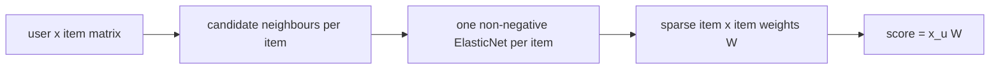

# SLIM (ElasticNet)

> Learns, for every item, a small set of non-negative weights saying which other items predict it, by solving
> one regularised regression per item.

!!! abstract "In plain words"
    For every item, SLIM learns a short list of other items that predict it, like "people who own a tent and a
    sleeping bag usually buy a camping stove too". Every weight is positive, and most are exactly zero. A user's score
    for the stove is the sum of the weights of the items they already own, so every recommendation comes with its
    reasons.

--8<-- "generated/methods/slim.md"

!!! example "Improve it yourself"
    [Lab 4](../../labs/04-slim.md) takes you through SLIM in four levels: reproduce its baseline, understand
    every setting, leave out rare items, and allow negative weights (Steck 2019). The [lab scoreboard](../../labs/scoreboard.md) tracks your results.

!!! tip "When to use it"
    - When you want EASE-like accuracy with a **sparse** item × item matrix (fast to serve, easy to inspect).
    - As a strong classical baseline next to EASE, RP3beta, and ItemKNN.

!!! warning "When not to"
    - With huge catalogs and no time to tune: one regression per item adds up (recbench pre-selects each
      item's candidate neighbours to keep it fast).
    - When order or time matter more than co-occurrence.

## 1. Intuition

For each item $j$, ask: "if I only knew which *other* items a user has, how well could I guess whether they
have item $j$?" That is a regression: the target is item $j$'s column, the features are the other items'
columns. SLIM adds two rules:

- the weights must be **non-negative** (an item can only *add* evidence for another), and
- they must be **sparse** (L1 penalty): only a few items should explain each item.

Item $j$ can never use itself as a feature, otherwise the trivial answer "you have $j$ if you have $j$" would
win.

## 2. A tiny worked example

Users A and B have items 1 and 2; C has items 3 and 4; D has only item 1.

To learn which items predict **item 2**, the target is its column (A, B, C, D) = (1, 1, 0, 0). Take item 1's
column (1, 1, 0, 1) as the only feature. Least squares gives

$$
w_{1\to2} = \frac{x_1 \cdot y}{x_1 \cdot x_1} = \frac{2}{3} \approx 0.67.
$$

Items 3 and 4 never appear with item 2, so their weights stay 0: the non-negativity rule forbids negative
weights, and the L1 penalty prefers exact zeros. The penalties shrink 0.67 a little in practice.

D has item 1, so D's score for item 2 is $1 \times 0.67 = 0.67$, and D's scores for items 3 and 4 are 0.
D gets **item 2**.

## 3. How it works

1. Build the user × item matrix $X$ (binary, or time-decayed weights).
2. For speed, pick each item's `slim_neighbors` most similar items (cosine) as its only candidate features.
   This is "fsSLIM", proposed in the SLIM paper.
3. For every item $j$, fit an ElasticNet regression of column $j$ on its candidates, with non-negative
   weights. The items are fitted in parallel.
4. Store the weights in a sparse matrix $W$; score a user as $x_u W$.

## 4. The math, symbol by symbol

For each item $j$:

$$
\min_{w_j \ge 0,\; w_{jj} = 0} \; \frac{1}{2n}\lVert x_{\cdot j} - X w_j \rVert_2^2 + \alpha \rho \lVert w_j \rVert_1 + \frac{\alpha (1-\rho)}{2} \lVert w_j \rVert_2^2
$$

| Symbol | Meaning | Shape / range |
|---|---|---|
| $x_{\cdot j}$ | item $j$'s column: who interacted with $j$ | users × 1 |
| $X$ | the user × item matrix (features: the candidate neighbours of $j$) | users × items |
| $w_j$ | item $j$'s column of $W$: how much each item predicts $j$ | items × 1, sparse, ≥ 0 |
| $n$ | number of users | — |
| $\alpha$ | overall penalty strength (`slim_alpha`) | about 1e-5–1e-1 |
| $\rho$ | L1 share of the penalty (`slim_l1_ratio`) | 0–1 |

This is scikit-learn's ElasticNet with `positive=True` and no intercept.

## 5. Training and inference

- **Training:** one small coordinate-descent regression per item, parallel over CPU threads. Pre-selecting
  candidates keeps each regression to about 100 features.
- **Inference:** sparse vector × sparse matrix.
- **Hardware:** CPU (many cores help).

## 6. Hyperparameters

| Name in recbench config | What it does | Default | Searched over |
|---|---|---|---|
| `slim_alpha` | penalty strength | 0.001 | 1e-5–0.1 (log) |
| `slim_l1_ratio` | share of L1 (sparsity) in the penalty | 0.1 | 0.01–1 |
| `slim_neighbors` | candidate features per item | 100 | 50, 100, 200 |
| `slim_max_iter` | coordinate-descent iterations per regression | 100 | not searched |
| `decay_half_life_days`, `train_window_days` | time-aware settings | none | as for every method |

## 7. In recbench

- Code: `src/recbench/methods/linear.py::SLIM`.
- `tests/test_new_methods.py` checks that the weights are non-negative with a zero diagonal.
- Explanations cite the history items with the largest weights, like EASE.

!!! info "Fidelity: faithful"
    This is the fsSLIM variant (feature selection by item similarity) from Ning & Karypis (2011), with
    scikit-learn's ElasticNet as the solver.

## 8. Results in this benchmark

--8<-- "generated/methods/slim-results.md"

## 9. Strengths and weaknesses

- **Strengths:** sparse, non-negative, inspectable weights; often close to EASE in accuracy; easy to serve.
- **Weaknesses:** slower to train than EASE or ItemKNN on large catalogs; two penalties to tune; the
  candidate pre-selection can miss a useful predictor.

## 10. Common pitfalls

- **Letting an item predict itself.** Without $w_{jj} = 0$ the model learns the identity and recommends
  nothing new.
- **A too-strong penalty.** All weights become 0 and every score is 0. A job's tuning summary
  (`runs/tuning/quick/<dataset>/slim.json`) shows it: settings with a very large `slim_alpha` score near zero.
- **Silent non-convergence.** ElasticNet's convergence warnings are silenced. With 100 iterations (`slim_max_iter`)
  and a small penalty, the weights may stop short of the optimum without a message ([lab 4](../../labs/04-slim.md),
  Level 2).
- **Running the regressions one after another on a big catalog.** Each item is its own regression, so time grows
  with the number of items. recbench runs them in parallel (joblib) and limits each one to the item's most
  similar items (`slim_neighbors`).

## 11. Check your understanding

??? question "Why must the weights be non-negative?"
    It keeps the model additive and explainable: owning an item can only raise another item's score. It also
    acts as extra regularisation.

??? question "How are SLIM and EASE related?"
    Both learn an item × item matrix that predicts each item from the others, with a zero diagonal. EASE uses
    an L2 penalty and no sign constraint, which gives a closed-form, dense solution. SLIM adds L1 and
    non-negativity, which gives a sparse solution but needs one regression per item.

??? question "SLIM and ItemKNN both produce item-to-item weights. How do they get them differently?"
    ItemKNN computes a similarity with a fixed formula (cosine). SLIM **learns** the weights by regression, so that
    together they rebuild each item's column. Two nearly identical items then share the credit instead of each
    getting a full similarity.

## 12. Further reading

- Ning, Karypis (2011). *SLIM: Sparse Linear Methods for Top-N Recommender Systems.* ICDM.
- [EASE](ease.md), [ItemKNN](itemknn.md), [SANSA](sansa.md).
