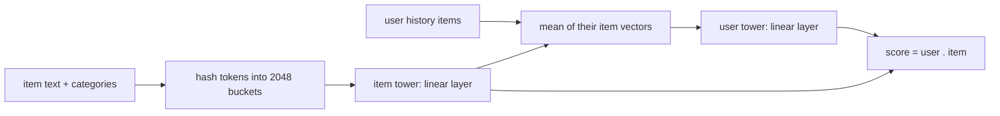

# Text hash tower

> A content-based two-tower model: item vectors are computed from each item's **words** (title,
> description, categories), not from an ID, so it can recommend brand-new items. It is a small, honest
> stand-in for LLM-based text understanding.

--8<-- "generated/methods/text_hash_tower.md"

!!! tip "When to use it"
    - When many items are new or rarely interacted with (news, fashion drops, marketplaces).
    - As a cheap baseline before trying large language-model encoders.

!!! warning "When not to"
    - When items have no useful text (RetailRocket's public dump has none).
    - When collaborative signal dominates and items are stable: ID models usually win there.

## 1. Intuition

Two items whose descriptions share words ("waterproof hiking jacket" and "hiking rain jacket") are probably
related, even if nobody has bought both yet. This model turns each item's text into a fixed-length vector by
**hashing** words into buckets (the "hashing trick"). It then learns:

- an **item tower**: a linear layer that turns the bag of words into an item embedding, and
- a **user tower**: the average of the embeddings of the items in the user's history, followed by a linear layer.

Score = user vector · item vector. A brand-new item gets a vector from its words alone.

How this relates to LLMs: modern systems replace "hashed bag of words + linear layer" with a pretrained
language model (a sentence encoder or an LLM) that understands meaning, not just shared words. The
architecture, two towers and a dot product, stays the same. See
[LLMs and generative recommenders](../concepts/llm-and-generative-recsys.md).

## 2. A tiny worked example: hashing

Item: title "Toy Story 3", categories "Animation|Comedy".

1. Tokens: lower-case words plus prefixed category tokens: `toy`, `story`, `3`, `cat:animation`, `cat:comedy`.
2. Hash each token into one of 2,048 buckets with CRC32 modulo 2,048: buckets 1902, 1080, 1691, 903, 978.
3. Count tokens per bucket (here all 1) and L2-normalise: each of the five buckets gets $1/\sqrt5 = 0.447$.

The result is a sparse 2,048-number vector. A different movie containing "story" also lights up bucket 1080,
so the two items share that feature. Hash collisions (two unrelated words in one bucket) happen occasionally;
with 2,048 buckets and short texts they are rare enough.

## 3. How it works

1. Build the sparse item × 2,048 matrix of hashed, normalised token counts (once).
2. Item tower: $\mathbf{q}_i = W_t\,\mathbf{f}_i + \mathbf{b}$.
3. User tower at every position $t$ of a training window: the mean of $\mathbf{q}$ over the items so far,
   then a linear layer, giving $\mathbf{h}_t$.
4. Next-item cross-entropy at every position, with all item vectors recomputed from text each step.
5. Recommend: $\mathbf{h}$ from the user's recent history · all item vectors. New items included.

## 4. The math, symbol by symbol

$$
\mathbf{q}_i = W_t\,\mathbf{f}_i + \mathbf{b},
\qquad
\mathbf{h}_t = W_u\left(\frac{1}{t}\sum_{k\le t}\mathbf{q}_{s_k}\right),
\qquad
\hat{y}_{t,i} = \mathbf{h}_t^\top\mathbf{q}_i
$$

| Symbol | Meaning | Shape / range |
|---|---|---|
| $\mathbf{f}_i$ | hashed, L2-normalised token counts of item $i$ | 2,048 numbers (sparse) |
| $W_t, \mathbf{b}$ | item-tower weights and bias | 2,048 × dim, dim |
| $\mathbf{q}_i$ | item vector | dim |
| $s_k$ | the $k$-th item of the user's history | item index |
| $W_u$ | user-tower weights | dim × dim |
| $\mathbf{h}_t$ | user vector after $t$ history items | dim |

## 5. Training and inference

- **Training:** a sparse matrix product (items × 2,048 by 2,048 × dim) each step, plus the next-item loss.
- **Inference:** one mean and one linear layer per user, then dot products with all items.
- **Hardware:** laptop CPU.

## 6. Hyperparameters

| Name in recbench config | What it does | Default | Tip |
|---|---|---|---|
| `hash_features` | number of hash buckets | 2048 | more buckets = fewer collisions, more parameters |
| `dim`, `seq_len`, `batch_size`, `lr`, `max_steps` | tower size and training | preset | |

## 7. In recbench

- Code: `src/recbench/methods/content.py::TextHashTower`, with the network
  `src/recbench/methods/content.py::ContentTowerNet` and the features from
  `src/recbench/methods/content.py::hashed_text_features`.
- `scores_cold_items=True`: the evaluator keeps brand-new items in its lists, which is where
  `item_cold_recall_at_10` becomes interesting.
- Refuses to run (`Unsupported`) when items have no text and no categories.
- recbench v0.1 called a similar model `generative_llm`, although it contained no language model. v0.2
  renamed it to describe what it is.

!!! info "Fidelity: simplified"
    A faithful hashed bag-of-words two-tower. It is a *placeholder* for LLM-based recommenders, which are on
    the [roadmap](../../results/roadmap.md).

## 8. Results in this benchmark

--8<-- "generated/methods/text_hash_tower-results.md"

## 9. Strengths and weaknesses

- **Strengths:** handles new items; cheap; useful whenever text is informative.
- **Weaknesses:** a bag of words misses meaning ("not waterproof" ≈ "waterproof"); weak when text is short or
  uninformative; ignores order within the history (a mean).

## 10. Common pitfalls

- **Leaking future text.** Steam reviews written after the cutoff were once used as item text (fixed in
  v0.2). Item content must be known at prediction time.
- **Meaningless text** such as "item 12345" (RetailRocket in v0.1) only adds noise.

## 11. Check your understanding

??? question "Why can this model score an item that appeared only in the test window?"
    Its vector comes from its text, which is known at prediction time, not from a learned ID embedding that
    would need past interactions.

??? question "What happens if two unrelated words hash to the same bucket?"
    They share one feature, a small amount of noise. More buckets reduce collisions.

??? question "How would you turn this into an LLM-based recommender?"
    Replace the hashed bag of words with embeddings from a pretrained text encoder (or LLM), and keep the
    two-tower structure and training loss.

## 12. Further reading

- Weinberger et al. (2009), [Feature Hashing for Large Scale Multitask Learning](https://arxiv.org/abs/0902.2206).
- [Collaborative, content-based, hybrid](../concepts/collaborative-content-hybrid.md) and [cold start](../concepts/cold-start.md).
