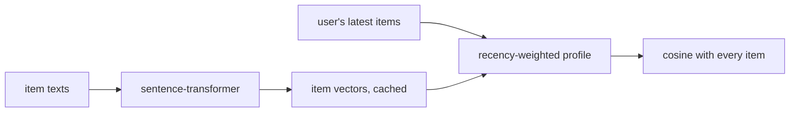

# Text-embedding kNN

> Turns every item's description into a vector with a pretrained language model, then recommends items whose
> descriptions are closest to what the user looked at recently. No interaction data is needed to score an item.

!!! abstract "In plain words"
    Every item gets a vector from its description, made by a pretrained language model that has read a lot of text:
    "two-person dome tent" lands close to "lightweight camping tent". A user's taste is the average vector of their
    latest items. Recommendations are the items whose descriptions point the same way. It needs no interaction data to
    score an item, so it can recommend brand-new items on day one.

--8<-- "generated/methods/text_knn.md"

!!! tip "When to use it"
    - For **new items** with no interactions yet: collaborative methods cannot score them, this can.
    - As a content baseline, and as a feature for re-rankers (the LightGBM re-ranker can use its similarity).

!!! warning "When not to"
    - When item texts are missing or uninformative (RetailRocket has only hashed category ids; Last.fm only
      artist names).
    - As the only recommender for warm users: similar descriptions are not the same as "people like you also
      bought".

## 1. Intuition

A pretrained **sentence encoder** has read a lot of text and maps sentences with similar meaning to nearby
vectors: "two-person dome tent" lands close to "lightweight camping tent", far from "silk evening dress".
recbench encodes each item's title, description and categories once. A user's taste is the average vector of
their latest items, with the newest counting most. Recommendations are the items whose vectors point the same
way.

## 2. A tiny worked example

Use two-dimensional vectors: tent = [1, 0] and sleeping bag = [0.6, 0.8]. The sleeping bag is newest, so it
gets weight 1, and the tent gets 0.9 (decay 0.9 per position):

$$
\text{profile} = 1 \cdot [0.6, 0.8] + 0.9 \cdot [1, 0] = [1.5, 0.8] \;\to\; \text{normalised } [0.882, 0.471]
$$

| Candidate | Vector | Cosine with the profile |
|---|---|---|
| stove | [0.8, 0.6] | 0.882·0.8 + 0.471·0.6 = **0.988** |
| dress | [−0.6, 0.8] | −0.529 + 0.377 = **−0.152** |

The stove wins, even if nobody has bought it yet.

## 3. How it works

1. Item text = title / description + category tokens (for example "Hiking Boots, Footwear, Outdoor").
2. Encode all items with the sentence-transformer (`text_encoder`, default all-MiniLM-L6-v2, 384 numbers per
   item). The vectors are cached per split.
3. Profile = the recency-weighted mean of the user's latest `text_profile_window` item vectors, normalised.
4. Score = cosine(profile, item vector) for every item, including items nobody has interacted with.

## 4. The math, symbol by symbol

$$
p_u = \frac{\sum_{k=0}^{W-1} \delta^{k}\, v_{h_{u,k}}}{\left\lVert \sum_{k} \delta^{k}\, v_{h_{u,k}} \right\rVert},\qquad s(u, i) = p_u \cdot v_i
$$

| Symbol | Meaning |
|---|---|
| $v_i$ | unit-length text vector of item $i$ |
| $h_{u,k}$ | the user's $k$-th most recent item ($k = 0$ is the newest) |
| $W$ | profile window (`text_profile_window`) |
| $\delta$ | position decay (`text_position_decay`; 1 = plain average) |

## 5. Training and inference

- **"Training":** encoding the catalog once: about a minute for 100,000 items on a GPU, longer on a CPU. Cached.
- **Inference:** a weighted average plus a dense product with all item vectors.
- **Hardware:** GPU for encoding large catalogs; scoring is cheap.

## 6. Hyperparameters

| Name in recbench config | What it does | Default | Searched over |
|---|---|---|---|
| `text_profile_window` | how many recent items form the profile | 20 | 5, 20, 50, 100 |
| `text_position_decay` | weight multiplier per older position | 0.9 | 1.0, 0.95, 0.9, 0.7 |
| `text_encoder` | the sentence-transformer model | all-MiniLM-L6-v2 | fixed |

## 7. In recbench

- Code: `src/recbench/methods/text_knn.py::TextKNN`, with encoding in
  `src/recbench/methods/text_knn.py::encode_texts`.
- `scores_cold_items=True`, so it is evaluated on the whole catalog, including new items. Compare its
  cold-item recall with the collaborative methods'.
- Tests use a tiny fake encoder, so they never download a model. One slow test runs the real model.

!!! info "Fidelity: faithful (a content baseline)"
    This is a standard content-based nearest-neighbour recommender with a modern text encoder. It is not an
    LLM-based recommender: the language model only describes items. It does not read users or generate text.

## 8. Results in this benchmark

--8<-- "generated/methods/text_knn-results.md"

## 9. Strengths and weaknesses

- **Strengths:** cold-start items; no training; easy to explain ("similar to the hiking boots you viewed").
- **Weaknesses:** knows nothing about what users actually do together; only as good as the item texts.

## 10. Common pitfalls

- **Judging it only on warm users and popular items.** Its value shows in cold-item recall and on catalogs with
  frequent new arrivals.
- **Encoding text written after the cutoff.** recbench builds item texts from catalog metadata, never from
  reviews (see the [Steam](../datasets/steam.md) adapter).
- **Treating category codes as text.** Some datasets only have hashed ids for categories, not words (RetailRocket).
  The encoder then compares meaningless strings; check `fit.items_with_text` and read its results with that in
  mind.

## 11. Check your understanding

??? question "Why can it recommend an item with zero interactions?"
    The item's vector comes from its text alone, so it exists before anyone interacts with the item.

??? question "How does this differ from the text hash tower?"
    The text hash tower learns its own text representation from interactions, using hashed words. Text kNN uses
    a pretrained encoder and no training at all.

??? question "Text kNN scores well on cold items but poorly overall. How could you still use it?"
    As a feature or a candidate source rather than the whole recommender: the LightGBM re-ranker can add text similarity
    as a feature (`rerank_text`), and a production system can use it only for items too new for collaborative models.

## 12. Further reading

- Reimers, Gurevych (2019). *Sentence-BERT: Sentence Embeddings using Siamese BERT-Networks.* EMNLP.
  [arXiv](https://arxiv.org/abs/1908.10084)
- [Cold start](../concepts/cold-start.md), [collaborative, content, hybrid](../concepts/collaborative-content-hybrid.md),
  [text hash tower](text-hash-tower.md).
