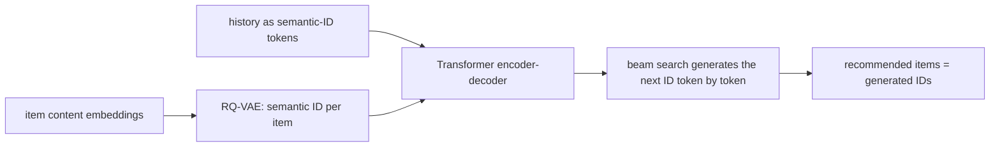

# TIGER-lite

> Experimental and **not ranked**. A GRU next-item model that also learns TIGER-style "semantic IDs"
> (short code tuples per item) and uses them to explain recommendations. It does **not** do TIGER's
> generative retrieval; this page explains both.

--8<-- "generated/methods/tiger_lite.md"

!!! tip "When to use it"
    - To understand semantic IDs, the building block of generative retrieval (TIGER and its successors).
    - As a teaching contrast: the same codes can be used to *explain* (here) or to *generate* (real TIGER).

!!! warning "When not to"
    - As evidence about TIGER's real performance. recbench does not implement generative retrieval, so this
      method is unranked.

## 1. Intuition

**Real TIGER** (Google, 2023) replaces "score every item" with "write the item's name". Each item gets a
short **semantic ID**, a tuple like (3, 17, 42), built so that similar items share prefixes: all sci-fi
movies might start with 3, sci-fi comedies with (3, 17). A Transformer encoder-decoder reads the user's
history (as semantic IDs) and *generates* the next item's ID token by token. Beam search keeps the most
likely few IDs, and those are the recommendations. No embedding table over all items is needed at output
time, and new items with known content get IDs immediately.

**TIGER-lite** keeps only the first half of that idea: learning semantic IDs by **residual quantisation**.
It ranks items like an ordinary sequence model (a GRU), and uses the codes to explain: "this item shares the
code prefix (3, 17) with an item you liked".

## 2. A tiny worked example: residual quantisation

Quantise an item vector $\mathbf{v} = (0.9, 0.3)$ with two levels of 4 codes each.

**Level 1 codebook:** (1, 0), (0, 1), (−1, 0), (0, −1). Distances from $\mathbf{v}$: 0.316, 1.140, 1.924,
1.581. The nearest is code **0**, (1, 0). Residual = (0.9, 0.3) − (1, 0) = (−0.1, 0.3).

**Level 2 codebook:** (0.1, 0.1), (−0.1, 0.3), (0.2, −0.2), (0, 0). Distances from the residual: 0.283,
**0**, 0.583, 0.316. The nearest is code **1**. The remaining residual is (0, 0).

Semantic ID = **(0, 1)**. The reconstruction (1, 0) + (−0.1, 0.3) = (0.9, 0.3) is exact here. Any item whose
vector is near (1, 0) also gets first code 0, so the prefix "0" means "this region of the space".

## 3. How it works

**TIGER-lite in recbench:**

1. A GRU reads right-aligned pre-test windows; next-item cross-entropy at every position (as in [SASRec](sasrec.md)).
2. In parallel, a 3-level residual codebook (64 codes per level) learns to reconstruct the item embeddings
   (an MSE loss, weight 0.1, with the item vectors held fixed for this term).
3. Ranking: last GRU state · item embeddings.
4. Explanations: compare the recommended item's semantic ID with the user's history items; cite those
   sharing the longest prefix.

**Real TIGER (for contrast):**

## 4. The math, symbol by symbol

Residual quantisation with $M$ levels:

$$
\mathbf{r}_0 = \mathbf{v},\qquad
c_m = \arg\min_k \lVert \mathbf{r}_{m-1} - \mathbf{b}_{m,k} \rVert,\qquad
\mathbf{r}_m = \mathbf{r}_{m-1} - \mathbf{b}_{m,c_m},\qquad
\hat{\mathbf{v}} = \sum_{m=1}^{M}\mathbf{b}_{m,c_m}
$$

| Symbol | Meaning | Value in recbench |
|---|---|---|
| $\mathbf{v}$ | an item's embedding | $d$ numbers |
| $\mathbf{b}_{m,k}$ | code $k$ of the level-$m$ codebook | 3 levels × 64 codes × $d$ |
| $c_m$ | the chosen code at level $m$; $(c_1,\dots,c_M)$ is the semantic ID | integers |
| $\mathbf{r}_m$ | what is left to explain after level $m$ | $d$ numbers |
| $\hat{\mathbf{v}}$ | reconstruction from the codes | $d$ numbers |

Training loss: next-item cross-entropy + $0.1 \cdot \lVert \hat{\mathbf{v}} - \text{sg}(\mathbf{v}) \rVert^2$,
where sg (stop-gradient) means the item vectors are not pulled towards the codes by this term.

## 5. Training and inference

- **Training:** like a small SASRec (a GRU instead of attention) plus distance computations to the codebooks.
- **Inference:** last GRU state · item embeddings.
- **Hardware:** laptop CPU.

## 6. Hyperparameters

| Name in recbench config | What it does | Default |
|---|---|---|
| `dim`, `seq_len`, `batch_size`, `lr`, `max_steps` | GRU size and training | preset |
| (fixed) codebook | levels × codes | 3 × 64 |
| (fixed) quantisation loss weight | weight of the codebook loss | 0.1 |

## 7. In recbench

- Code: `src/recbench/methods/tiger.py::TigerLite` and `src/recbench/methods/tiger.py::ResidualQuantizer`.
- `spec.ranked = False`: it appears in reports under "Experimental", never on the leaderboard.
- The copy-task test (`tests/test_methods.py`) checks that it reads histories from the correct end.

!!! info "Fidelity: simplified, deliberately unranked"
    Missing compared with TIGER: an RQ-VAE trained on item *content* (here the codebook quantises ID embeddings),
    the encoder-decoder, generation of IDs, beam search, and collision handling. No official TIGER code
    was released. recbench v0.1 called a similar model "TIGER" and ranked it; v0.2 renamed it to avoid
    misleading results.

## 8. Results in this benchmark

--8<-- "generated/methods/tiger_lite-results.md"

## 9. Strengths and weaknesses

- **Strengths:** a hands-on introduction to semantic IDs; coarse "item family" explanations.
- **Weaknesses:** the codes do not affect ranking; not comparable with published TIGER results.

## 10. Common pitfalls

- **Calling it TIGER.** The defining feature of TIGER is *generating* IDs; without it, it is a different model.
- **Codebook collapse:** if most items land on the same codes, IDs carry no information. Real RQ-VAEs use
  extra tricks (k-means initialisation, commitment losses) to prevent it.

## 11. Check your understanding

??? question "What would the semantic ID of v = (0.1, 0.9) be with the example codebooks?"
    Level 1: the nearest code is (0, 1) (distance 0.141), so code 1, leaving the residual (0.1, −0.1).
    Level 2: codes (0.2, −0.2) and (0, 0) are both at distance 0.141, a tie; `argmin` takes the first, code 2.
    The semantic ID is (1, 2). Near-ties and collisions like this are why real systems add an extra
    code that makes every item's ID unique.

??? question "Why can generative retrieval recommend a brand-new item without retraining the decoder?"
    If the new item's content is encoded into a semantic ID, the decoder can already generate that ID
    sequence, because it has learned the code vocabulary, not a per-item table.

??? question "Why is TIGER-lite unranked?"
    Its ranking does not use the technique it is named after, so ranking it next to real methods would
    suggest a comparison with TIGER that does not exist.

## 12. Further reading

- Rajput et al. (2023), [Recommender Systems with Generative Retrieval](https://arxiv.org/abs/2305.05065)
  (NeurIPS 2023).
- [LLMs and generative recommenders](../concepts/llm-and-generative-recsys.md).
