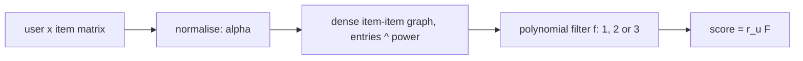

# Turbo-CF

> A training-free graph filter built from a few dense matrix products, so it runs in seconds on a GPU: it shapes
> which patterns of the item-item graph get through with a small polynomial.

--8<-- "generated/methods/turbocf.md"

!!! tip "When to use it"
    - When you have a GPU and want a graph method cheaper than LightGCN and simpler than GF-CF (no SVD).
    - To learn how "graph filtering" works: three settings change the filter's shape in an understandable way.

!!! warning "When not to"
    - On huge catalogs: the item-item matrix is dense, so recbench keeps the most popular items that fit in
      memory, like EASE.
    - When order or time matter more than co-occurrence.

## 1. Intuition

Think of the normalised item-item matrix $\bar P$ as a set of patterns (its eigenvectors), each with a strength
(its eigenvalue, between 0 and 1). Strong patterns are broad tastes shared by many users. Weak patterns are
mostly noise.

A graph filter $f$ re-weights the patterns: it keeps strength $\lambda$ as $f(\lambda)$. Turbo-CF uses small
polynomials, because a polynomial of a matrix is just a few matrix products, with no eigendecomposition needed:

| Filter (`turbocf_filter`) | $f(\lambda)$ | λ = 0.1 | λ = 0.5 | λ = 1 | Effect |
|---|---|---|---|---|---|
| 1, linear | $\lambda$ | 0.10 | 0.50 | 1.00 | keeps every pattern in proportion |
| 2 | $2\lambda - \lambda^2$ | 0.19 | 0.75 | 1.00 | lifts weaker patterns |
| 3, close to an ideal low-pass | $\lambda + 0.01(-\lambda^3 + 10\lambda^2 - 29\lambda)$ | 0.072 | 0.38 | 0.80 | mutes weak patterns relative to the strongest |

Two more settings shape $\bar P$ before filtering: **alpha** decides how degrees normalise users versus items,
and **power** raises every entry of $\bar P$ to a power (below 1, weak links get relatively stronger).

## 2. A tiny worked example

Take the strongest pattern (λ = 1) and a weak one (λ = 0.1). The linear filter keeps them in a 10 : 1 ratio.
Filter 2 changes that to 1.00 : 0.19, about 5 : 1, so weak patterns gain influence. Filter 3 gives
0.80 : 0.072, about 11 : 1, so the strongest pattern dominates a little more. The tuner tries all three and
keeps whichever predicts the validation week best.

## 3. How it works

1. Normalise: $\tilde R = D_U^{-\alpha} R\, D_I^{\alpha - 1}$ (alpha = 1/2 is the symmetric version GF-CF uses).
2. Dense item-item graph: $\bar P = (\tilde R^\top \tilde R)^{\circ s}$, each entry raised to the power $s$.
3. Polynomial filter: $F = f(\bar P)$, which takes one or two dense matrix products.
4. Score: $r_u F$.

## 4. The math, symbol by symbol

$$
\tilde R = D_U^{-\alpha} R D_I^{\alpha-1}, \qquad \bar P = \left(\tilde R^\top \tilde R\right)^{\circ s}, \qquad s_u = r_u\, f(\bar P)
$$

| Symbol | Meaning | Shape / range |
|---|---|---|
| $R$, $r_u$ | interactions, and user $u$'s row | users × items, 1 × items |
| $D_U, D_I$ | user and item degrees (diagonal) | — |
| $\alpha$ | normalisation balance (`turbocf_alpha`) | about 0.3–0.7 |
| $s$ | element-wise power (`turbocf_power`) | about 0.5–1.5 |
| $f$ | the polynomial filter (`turbocf_filter`: 1, 2, or 3) | — |

## 5. Training and inference

- **"Training":** one sparse product, then one to three dense $n \times n$ products, $O(n^3)$ for $n$
  items: seconds on a GPU for tens of thousands of items.
- **Inference:** one dense product per batch of users.
- **Hardware:** GPU recommended; it also runs on a CPU for small catalogs.

## 6. Hyperparameters

| Name in recbench config | What it does | Default | Searched over |
|---|---|---|---|
| `turbocf_alpha` | user versus item normalisation | 0.5 | 0.3–0.7 |
| `turbocf_power` | element-wise power of the graph | 1.0 | 0.5–1.5 |
| `turbocf_filter` | polynomial filter | 1 | 1, 2, 3 |
| `turbocf_max_items` | item cap (lowered automatically to fit GPU memory) | 30,000 | — |
| `decay_half_life_days`, `train_window_days` | time-aware settings | none | as for every method |

## 7. In recbench

- Code: `src/recbench/methods/graph_filters.py::TurboCF`.
- `tests/test_new_methods.py` checks all three filters against the dense formula.
- Items outside the cap are never recommended. MLflow logs `fit.item_cap_coverage`, the share of
  interactions the kept items cover.

!!! info "Fidelity: faithful"
    The normalisation, power, and the three filters follow the authors' code (MIT licence). The item cap is a
    recbench addition, needed for large catalogs.

## 8. Results in this benchmark

--8<-- "generated/methods/turbocf-results.md"

## 9. Strengths and weaknesses

- **Strengths:** no training, no decomposition, very fast on a GPU, three interpretable settings.
- **Weaknesses:** dense memory grows with items squared (hence the cap); no order, time, or content.

## 10. Common pitfalls

- **Comparing it with a different item cap than EASE** without saying so.
- **Expecting filter 3 to always win.** "Closer to ideal" is not automatically better on a time-based test.

## 11. Check your understanding

??? question "Why does a polynomial filter avoid an eigendecomposition?"
    $f(\bar P) = c_1 \bar P + c_2 \bar P^2 + \ldots$ needs only matrix products, and it applies $f$ to every
    eigenvalue automatically, without computing the eigenvalues.

??? question "What do GF-CF and Turbo-CF share?"
    Both filter the normalised item-item graph without training. GF-CF adds an explicit SVD projection;
    Turbo-CF shapes the filter with a polynomial instead.

## 12. Further reading

- Park, Shin, Shin (2024). *Turbo-CF: Matrix Decomposition-Free Graph Filtering for Fast Recommendation.*
  SIGIR. [Code](https://github.com/jindeok/Turbo-CF)
- [GF-CF](gfcf.md), [LightGCN](lightgcn.md), [EASE](ease.md).
