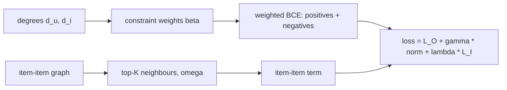

# UltraGCN

> Gets the smoothing of a graph neural network without running one: it works out what infinitely many
> LightGCN layers converge to, and turns that into weights in a plain matrix-factorisation loss.

!!! abstract "In plain words"
    LightGCN learns by repeatedly averaging each user with their items, and each item with its users: slow on a big
    graph. UltraGCN works out where that averaging would end up after infinitely many rounds, and turns the answer into
    weights. Each (user, item) pair is pulled together with a strength that is larger for niche items and lighter users.
    It then trains an ordinary embedding model with those weights: the graph's effect, without the graph rounds.

--8<-- "generated/methods/ultragcn.md"

!!! tip "When to use it"
    - When LightGCN looks promising but too slow. UltraGCN never passes messages over the graph, so each step
      costs about as much as BPR-MF.
    - When you want graph-aware embeddings for retrieval.

!!! warning "When not to"
    - When you cannot afford to tune it: its paper settings (200 negatives weighted by 200) do not transfer to
      every dataset. The tuner searches them.
    - When order matters, or for cold items.

## 1. Intuition

[LightGCN](lightgcn.md) repeatedly averages each user's embedding with their items' embeddings, and each
item's with its users'. Repeat this enough and the embeddings settle into a fixed point. Mao et al. worked out
that fixed point. It says a user and an item should be close, with a strength $\beta_{ui}$ that depends on how
many interactions each has:

$$
\beta_{ui} = \frac{\sqrt{d_u + 1}}{d_u} \cdot \frac{1}{\sqrt{d_i + 1}}
$$

UltraGCN puts this $\beta$ into an ordinary binary cross-entropy loss as a per-pair weight. It also adds an
item-item term: a user should be close to the graph neighbours of the items they like. No message passing
is needed at training time.

## 2. A tiny worked example

A user with 4 interactions ($d_u = 4$) and two of their items:

- a bestseller with 99 users: $\beta = \frac{\sqrt 5}{4} \cdot \frac{1}{\sqrt{100}} = 0.559 \times 0.1 = 0.056$
- a niche item with 3 users: $\beta = 0.559 \times \frac{1}{\sqrt 4} = 0.559 \times 0.5 = 0.280$

The niche item gets 5 times more weight. Infinite smoothing naturally discounts popular items, which only
tell us that "everyone has it", and UltraGCN keeps that effect without running the layers.

## 3. How it works

1. Count degrees: interactions per user ($d_u$) and per item ($d_i$).
2. Precompute each item's top-K neighbours in the item-item co-occurrence graph, with weights $\omega_{ij}$.
3. Each step samples (user, positive) pairs and `ultragcn_negatives` negatives per pair.
4. Loss = weighted BCE on positives and negatives + γ · ‖θ‖²/2 + λ · the item-item term.
5. Train in epochs; stop early on the validation fold; score with a dot product.

## 4. The math, symbol by symbol

$$
\mathcal{L} = \sum_{(u,i)} \Big[(w_1 + w_2\beta_{ui})\,\mathrm{BCE}(e_u^\top e_i, 1)
+ \nu\, \frac{1}{|\mathcal N|}\sum_{j \in \mathcal N}(w_3 + w_4\beta_{uj})\,\mathrm{BCE}(e_u^\top e_j, 0)\Big]
+ \frac{\gamma}{2}\lVert\theta\rVert^2 - \lambda \sum_{(u,i)} \sum_{j \in S(i)} \omega_{ij} \log\sigma(e_u^\top e_j)
$$

| Symbol | Meaning | Default |
|---|---|---|
| $\beta_{ui}$ | constraint weight from degrees (see above) | — |
| $w_1 \ldots w_4$ | how much of $\beta$ to use for positives and negatives | 1e-7, 1, 1e-7, 1 |
| $\nu$ | negative weight (`ultragcn_neg_weight`) | 200 |
| $\mathcal N$ | sampled negatives (`ultragcn_negatives`) | 200 |
| $S(i), \omega_{ij}$ | item $i$'s top-K graph neighbours (`ultragcn_neighbors`) and their weights | K = 10 |
| $\gamma$, $\lambda$ | L2 strength (`ultragcn_gamma`) and item-item weight (`ultragcn_lambda`) | 1e-4, 1e-3 |

## 5. Training and inference

- **Training:** like BPR-MF with many negatives plus K neighbour lookups per positive; no graph propagation.
- **Inference:** a dot product against all item vectors.
- **Hardware:** GPU recommended.

## 6. Hyperparameters

| Name in recbench config | Searched over |
|---|---|
| `ultragcn_negatives`, `ultragcn_neg_weight` | 50–500 and 10–500 (the paper uses equal values) |
| `ultragcn_gamma`, `ultragcn_lambda` | 1e-5–1e-3 and 1e-4–1e-2 (log) |
| `ultragcn_neighbors` | 5, 10, 20 |
| `dim`, `lr` | 64–128, 1e-4–1e-2 |
| `max_epochs`, `patience` (early stopping) | fixed: 100, 5 |

## 7. In recbench

- Code: `src/recbench/methods/ultragcn.py::UltraGCN`, with the neighbour weights in
  `src/recbench/methods/ultragcn.py::item_neighbours`.
- `tests/test_new_methods.py` compares the neighbour weights with the dense definition. It also checks that,
  with the number of negatives scaled to the tiny toy catalog, the model clearly beats Random.

!!! info "Fidelity: faithful"
    It follows the authors' implementation (RecZoo, Apache-2.0): the same constraint weights, losses,
    initialisation, and defaults. One difference: the loss is averaged over the batch instead of summed, which
    only rescales the learning rate.

## 8. Results in this benchmark

--8<-- "generated/methods/ultragcn-results.md"

## 9. Strengths and weaknesses

- **Strengths:** graph-aware at MF cost; no message passing; the item-item term adds neighbourhood knowledge.
- **Weaknesses:** many interacting settings ($w_1$–$w_4$, negatives and their weight, γ, λ); it is sensitive to
  them, as the toy test shows.

## 10. Common pitfalls

- **Copying the paper's negative settings to a small catalog:** 200 negatives from a 40-item catalog are
  mostly repeats of the same items, and training goes wrong.
- **Calling it a GNN:** it uses no layers at all; it is MF with graph-derived weights.
- **Copying the paper's weights without tuning.** The balance of `ultragcn_negatives`, `ultragcn_neg_weight` and
  `ultragcn_lambda` depends on the dataset. With too little negative pressure, every user ends up close to every
  item, which is why the search space varies them.

## 11. Check your understanding

??? question "Why does a popular item get a small beta?"
    $\beta_{ui}$ shrinks with $\sqrt{d_i + 1}$. An item everyone interacts with says little about this
    particular user, and infinite-layer smoothing discounts it accordingly.

??? question "What does the item-item term add?"
    It asks the user to be close to the neighbours of the items they like, which spreads signal to items they
    never touched.

??? question "Why does UltraGCN train faster than LightGCN?"
    It never passes messages over the graph during training. The graph's effect is computed once, as the per-pair
    weights β and the list of item neighbours, and training is plain mini-batch matrix factorisation.

## 12. Further reading

- Mao, Zhu, Xiao, Lu, Wang, He (2021). *UltraGCN: Ultra Simplification of Graph Convolutional Networks for
  Recommendation.* CIKM. [arXiv](https://arxiv.org/abs/2110.15114)
- [LightGCN](lightgcn.md), [GF-CF](gfcf.md), [negative sampling](../concepts/negative-sampling.md).
