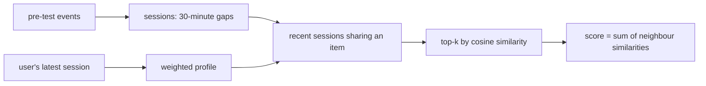

# V-SKNN (session kNN)

> Looks at what you did in your latest session, finds past sessions that looked like it, and recommends what
> those sessions also contained, giving your most recent clicks the most weight.

--8<-- "generated/methods/vsknn.md"

!!! tip "When to use it"
    - For short-term intent: shopping sessions, browsing, playlists. Published comparisons found session kNN
      methods competitive with neural session models such as GRU4Rec.
    - As a cheap, explainable baseline for sequential and next-item tasks.

!!! warning "When not to"
    - When long-term taste matters more than the latest session (for example, films rated over years).
    - When sessions are very short or rarely repeat across users.

## 1. Intuition

You are in a shop and put a tent and a sleeping bag in your basket. A clerk who has seen thousands of
baskets remembers baskets that also held a tent and a sleeping bag, and many of them held a camping stove.
So the clerk suggests a stove.

V-SKNN does the same, with three refinements:

1. **Recent items count more.** Your last click says more about what you want now than your first.
2. **Recent sessions are searched first.** It only considers the `sample_size` most recent past sessions
   that share an item with yours, which is fast and favours current trends.
3. **Only the `k` most similar sessions vote**, each with a weight equal to its similarity.

## 2. A tiny worked example

Your latest session (newest last): **tent → sleeping bag**. With "div" weighting, the newest item has
weight 1 and the one before it 1/2. So your profile is {sleeping bag: 1, tent: 0.5}.

Past sessions:

| Session | Items | Overlap score (sum of your weights) |
|---|---|---|
| S1 | tent, sleeping bag, stove | 1 + 0.5 = 1.5 |
| S2 | sleeping bag, torch | 1 |
| S3 | dress, shoes | 0 (not a neighbour) |

The cosine similarity divides the overlap by the lengths of both vectors:
‖your profile‖ = √(1² + 0.5²) ≈ 1.118, ‖S1‖ = √3 ≈ 1.732, ‖S2‖ = √2 ≈ 1.414.

- sim(S1) = 1.5 / (1.118 × 1.732) ≈ 0.775
- sim(S2) = 1 / (1.118 × 1.414) ≈ 0.632

Each item collects the similarities of the neighbour sessions that contain it. Stove: 0.775 (from S1).
Torch: 0.632 (from S2). Tent and sleeping bag are already yours and get masked. Recommendation: **stove,
then torch**.

## 3. How it works

1. Rebuild sessions from timestamps: a gap of more than 30 minutes starts a new session.
2. The user's profile is their last session (or their last N items) with position weights.
3. Find past sessions that share an item with the profile (excluding the user's own latest session), and keep
   the most recent `sample_size` of them.
4. Compute the cosine similarity of each to the profile, and keep the top `k`.
5. Score each item by the sum of the similarities of the neighbours containing it, optionally times the item's
   IDF (rare items count more).

## 4. The math, symbol by symbol

$$
\text{score}(u, i) = \text{idf}(i)^{[\text{idf on}]} \sum_{n \in N_k(s_u)} \text{sim}(s_u, n)\, \mathbb{1}[i \in n],
\qquad \text{sim}(s_u, n) = \frac{\sum_{j \in s_u \cap n} w_j}{\lVert w \rVert_2 \sqrt{|n|}}
$$

| Symbol | Meaning |
|---|---|
| $s_u$ | user $u$'s profile: the items of their latest session (or last N items) |
| $w_j$ | position weight of item $j$ in the profile: 1 for the newest, then 1/2, 1/3, ... ("div") |
| $N_k(s_u)$ | the $k$ most similar sessions among the `sample_size` most recent ones sharing an item |
| $\lvert n\rvert$ | number of distinct items in session $n$ |
| $\text{idf}(i)$ | $\log(\#\text{sessions} / \#\text{sessions containing } i)$ |

## 5. Training and inference

- **Training:** only rebuilding sessions and indexing them (seconds).
- **Inference:** per user, a sparse lookup of candidate sessions, a top-k, and a sparse sum. The neighbour
  search happens at prediction time, which is why kNN methods are called "lazy".
- **Hardware:** CPU.

## 6. Hyperparameters

| Name in recbench config | What it does | Default | Searched over |
|---|---|---|---|
| `vsknn_k` | neighbour sessions that vote | 100 | 50–500 |
| `vsknn_sample` | recent candidate sessions considered | 1000 | 500, 1000, 5000 |
| `vsknn_weighting` | position weights in the profile | div | div, linear, same |
| `vsknn_last_n` | profile = last N items instead of the last session | null | null, 10, 50 |
| `vsknn_idf` | multiply scores by item IDF | false | true, false |

## 7. In recbench

- Code: `src/recbench/methods/neighbourhood.py::VSKNN`, with sessions rebuilt in
  `src/recbench/methods/neighbourhood.py::sessions_from_events`.
- `tests/test_new_methods.py` builds three tiny sessions by hand and checks the recommendation.

!!! info "Fidelity: simplified"
    It keeps the core of session-rec's VSKNN: position weighting, recent-session sampling, top-k cosine
    neighbours, and optional IDF. It leaves out dwell-time weighting and some of the scoring variants, and it
    adapts the task from "next click in this session" to "what this user does next", using their latest
    session as the profile.

## 8. Results in this benchmark

--8<-- "generated/methods/vsknn-results.md"

## 9. Strengths and weaknesses

- **Strengths:** captures short-term intent cheaply; adapts instantly to new sessions (no retraining);
  explanations are natural ("people with sessions like yours also chose...").
- **Weaknesses:** forgets long-term taste; prediction-time cost grows with the number of sessions; needs
  patterns that repeat across users.

## 10. Common pitfalls

- **Letting your own current session be its own neighbour.** It would "recommend" what you already have.
  recbench excludes it.
- **Session gaps that do not fit the domain.** 30 minutes suits browsing; a music app may need a different
  gap.

## 11. Check your understanding

??? question "Why sample the most recent sessions instead of all of them?"
    Speed, and recency: recent sessions reflect current trends and stock. Ludewig & Jannach found that
    sampling barely hurts accuracy.

??? question "When would `vsknn_last_n = 50` beat using the last session?"
    When sessions are very short (one or two clicks), so the last session alone says too little about intent.

## 12. Further reading

- Ludewig, Jannach (2018). *Evaluation of Session-based Recommendation Algorithms.* User Modeling and
  User-Adapted Interaction. [arXiv](https://arxiv.org/abs/1803.09587)
- [Sequential and session recommendation](../concepts/sequential-and-session.md), [SASRec](sasrec.md).
