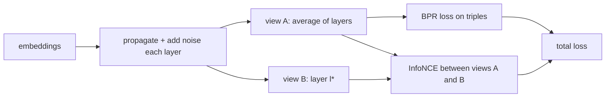

# XSimGCL

> LightGCN plus a contrastive loss: two slightly noisy versions of every embedding must still recognise each
> other, which spreads embeddings more evenly and reduces popularity bias.

--8<-- "generated/methods/xsimgcl.md"

!!! tip "When to use it"
    - When a graph model over-concentrates on popular items and you want more uniform, long-tail-friendly
      embeddings.
    - As a representative of modern self-supervised (contrastive) recommendation.

!!! warning "When not to"
    - With a tiny training budget: the contrastive term needs time to help. Short untuned runs can do worse
      than plain LightGCN.
    - For new users and items, when order matters, or without a GPU on large graphs.

## 1. Intuition

Graph models like LightGCN tend to squeeze many embeddings into a narrow region near popular items. That
hurts recommendations for niche tastes. Contrastive learning pushes back with a game: take a node's
embedding, make two noisy copies, and ask the model to match each copy with its twin among all other nodes'
copies. To win, embeddings must be distinguishable from one another, which spreads them out (more
"uniform").

XSimGCL ("eXtremely Simple Graph Contrastive Learning") makes the noisy copies in the cheapest possible way:
it adds small random noise inside the same propagation it already runs, instead of building separate
augmented graphs as earlier methods did.

## 2. A tiny worked example

Three nodes with 2-D embeddings: (1, 0), (0, 1), (0.7, 0.7). Noise strength ε = 0.2.

**Perturb.** Each copy adds $\text{sign}(\mathbf{e}) \odot \hat{\boldsymbol{\Delta}} \cdot \varepsilon$, where
$\hat{\boldsymbol{\Delta}}$ is a random unit-length vector. With the noise directions used here, the two views are:

| Node | View 1 | View 2 |
|---|---|---|
| 1 | (1.12, 0) | (1.0, 0) |
| 2 | (0, 1.12) | (0, 1.0) |
| 3 | (0.9, 0.7) | (0.82, 0.86) |

**InfoNCE with temperature τ = 0.15.** For node 3, compare view 1 with every node's view 2 (cosine
similarity ÷ τ): node 1 → 5.26, node 2 → 4.09, node 3 (its twin) → 6.59. The loss is
$-\ln\frac{e^{6.59}}{e^{5.26}+e^{4.09}+e^{6.59}} = 0.297$. For nodes 1 and 2, whose twins are much
closer than the others, the losses are 0.120 and 0.148. The average, 0.189, is the contrastive loss for
this tiny batch.

Node 3 has the largest loss because its views are hard to tell apart from the others. Training pushes
such crowded embeddings apart.

## 3. How it works

1. Run LightGCN-style propagation, adding noise to every layer's output (the perturbed pass).
2. View A: the final averaged embeddings. View B: the embeddings after layer $l^*$ (by default layer 1).
3. Loss = BPR on (user, positive, negative) triples
   + λ × [InfoNCE(users in the batch) + InfoNCE(positive items in the batch)]
   + L2 on the batch embeddings.
4. After training, run a clean (noise-free) propagation and recommend with dot products.

## 4. The math, symbol by symbol

Noise:

$$
\mathbf{e}' = \mathbf{e} + \operatorname{sign}(\mathbf{e}) \odot \frac{\boldsymbol{\Delta}}{\lVert\boldsymbol{\Delta}\rVert}\,\varepsilon,
\qquad \boldsymbol{\Delta} \sim \mathcal{U}(0,1)^d
$$

Contrastive loss for a set of nodes $\mathcal{B}$:

$$
\mathcal{L}_{\text{cl}} = \frac{1}{|\mathcal{B}|}\sum_{i\in\mathcal{B}} -\ln \frac{\exp(\cos(\mathbf{z}_i', \mathbf{z}_i'')/\tau)}{\sum_{j\in\mathcal{B}} \exp(\cos(\mathbf{z}_i', \mathbf{z}_j'')/\tau)},
\qquad
\mathcal{L} = \mathcal{L}_{\text{BPR}} + \lambda\,\mathcal{L}_{\text{cl}} + \text{L2}
$$

| Symbol | Meaning | Shape / range |
|---|---|---|
| $\varepsilon$ | noise magnitude | `xsim_eps`, default 0.2 |
| $\operatorname{sign}(\mathbf{e})\odot$ | keeps the noise in the same orthant (sign pattern) as the embedding | element-wise |
| $\mathbf{z}_i', \mathbf{z}_i''$ | node $i$ in view A and view B | $d$ numbers |
| $\cos(\cdot,\cdot)$ | cosine similarity | [−1, 1] |
| $\tau$ | temperature: smaller values sharpen the softmax | `xsim_tau`, default 0.15 |
| $\lambda$ | weight of the contrastive term | `xsim_lambda`, default 0.2 |
| $l^*$ | which layer gives view B | `xsim_layer_cl`, default 1 |

## 5. Training and inference

- **Training:** like LightGCN (one perturbed full-graph propagation per step), plus the InfoNCE terms over
  the unique users and items in the batch. Slightly more expensive per step than LightGCN.
- **Inference:** one clean propagation, then dot products.
- **Hardware:** laptop CPU for smoke graphs; a GPU for full datasets.

## 6. Hyperparameters

| Name in recbench config | What it does | Default | Typical range | Tip |
|---|---|---|---|---|
| `xsim_eps` | noise magnitude ε | 0.2 | 0.05–0.5 | too high destroys the signal |
| `xsim_lambda` | contrastive weight λ | 0.2 | 0.01–1 | the most sensitive knob |
| `xsim_tau` | temperature τ | 0.15 | 0.05–0.5 | |
| `xsim_layer_cl` | layer used for view B | 1 | 1 to `graph_layers` | |
| `graph_layers`, `graph_reg`, `graph_batch_size`, `dim`, `lr`, `max_steps` | as in [LightGCN](lightgcn.md) | | | |

## 7. In recbench

- Code: `src/recbench/methods/graph.py::XSimGCL`, using SELFRec's `XSimGCL_Encoder` and its `InfoNCE`,
  `bpr_loss`, and `l2_reg_loss` (pinned commit `5b022942`). The loss mirrors SELFRec's training loop.
- Device handling, graph construction, and negative sampling are shared with LightGCN.
- The defaults are SELFRec's published settings (ε 0.2, λ 0.2, τ 0.15, $l^*$ = 1, 2 layers).

!!! info "Fidelity"
    Faithful (the original authors' encoder and losses). The step budget is far shorter than the paper's
    training, which matters more for contrastive methods than for plain LightGCN.

## 8. Results in this benchmark

--8<-- "generated/methods/xsimgcl-results.md"

## 9. Strengths and weaknesses

- **Strengths:** more uniform embeddings, often better long-tail coverage than LightGCN, and cheap
  augmentation compared with graph-dropping methods.
- **Weaknesses:** four extra hyperparameters, sensitive to the training budget, and the same scaling and
  cold-start limits as LightGCN.

## 10. Common pitfalls

- **Judging it on a tiny budget.** The contrastive term first spreads embeddings out, which can lower
  accuracy until the BPR term catches up. A diagnostic run on the Last.fm smoke split showed exactly this:
  with SELFRec's defaults and the laptop budget of 400 steps, XSimGCL found almost no relevant new artists.
  With 2,000 steps and a smaller contrastive weight (`xsim_lambda: 0.05`), it reached LightGCN's level. The
  defaults stay faithful to the paper; tune `xsim_lambda` and `max_steps` before drawing conclusions.
- **Reading one run as the truth.** Small smoke runs also move noticeably with the random seed: the
  confidence intervals reflect which users were sampled, not training randomness.
- **Temperature too low:** the loss focuses on a few hard negatives and becomes unstable.
- **Forgetting to evaluate with clean embeddings:** the noise is for training only.

## 11. Check your understanding

??? question "Why multiply the noise by sign(e)?"
    So each noisy view stays in the same sign region as the original embedding. The noise rotates the vector
    slightly instead of flipping it to a different region of space.

??? question "In the example, why does node 3 have the largest contrastive loss?"
    Its view-A vector is fairly similar to the view-B vectors of nodes 1 and 2, so its twin is harder to
    single out. Minimising the loss pushes it away from the others.

??? question "What does InfoNCE encourage at the level of the whole embedding space?"
    Alignment (each node close to its own twin) and uniformity (different nodes spread apart). Uniformity is
    what reduces the crowding around popular items.

## 12. Further reading

- Yu et al. (2023), [XSimGCL: Towards Extremely Simple Graph Contrastive Learning for
  Recommendation](https://arxiv.org/abs/2209.02544) (IEEE TKDE).
- [Loss functions: InfoNCE](../concepts/loss-functions.md#infonce) and [popularity bias](../concepts/popularity-bias.md).
- SELFRec: <https://github.com/Coder-Yu/SELFRec>.
