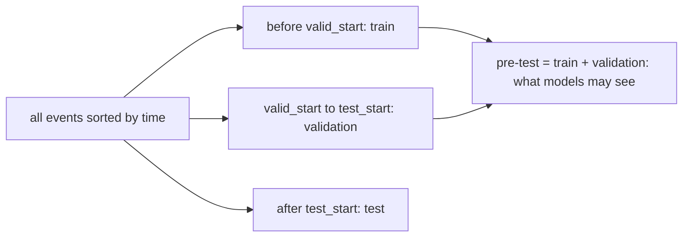

# Data leakage and time splits

## Why it matters

**Data leakage** means the model, during training, sees information it would not have when making a real
prediction. It makes offline numbers look better than reality, sometimes dramatically. It is the most common
reason a recommender that "won" offline disappoints in production. recbench itself had two leakage bugs
before its first review; both are described below as cautionary tales.

## Intuition

You can only use the past to predict the future. Any split of data into "train" and "test" must respect
that arrow of time *globally*: no training example may come from after the moment you pretend to predict.

## Ways to split, from leakiest to most realistic

| Split | How | Problem |
|---|---|---|
| Random | random 80% of interactions for training, 20% for testing | trains on the future of other users and of the same user |
| Leave-last-out | each user's last item is test, everything else train | users' timelines differ, so one user's test item may be older than another user's training items: the model learns "future" trends |
| **Global temporal** (recbench) | one cutoff time $t_0$ for everybody: before = train, after = test | realistic: at $t_0$, nothing after $t_0$ exists |

## A small example of leakage

A song goes viral on day 100. Under a random split, some day-101 plays of that song land in training, so the
model "knows" it is a hit and recommends it for day-95 test events, which would have been impossible on day 95.
Under a global temporal split with $t_0$ = day 95, the model has never heard of the song.

## Two real bugs in recbench v0.1

1. **Training on the evaluation answers.** Two sequence models were trained on a file whose target column
   was each user's first test item, the very item they were then evaluated on. After only 200 training steps
   they reached recall of 0.71–0.81 while every honest model stayed at or below 0.34. *Lesson:* if one model
   is suspiciously far ahead, look for leakage before celebrating.
2. **A time-zone shift.** The cutoff was converted with a database function that applied the computer's local
   time zone, moving it 7 hours on a laptop in Vietnam but not on a cloud server. Splits differed by machine,
   and one dataset ended up with no test users at all. *Lesson:* compute cutoffs in UTC integers, never through
   time-zone-aware conversions.

Details: [review log](../../review/2026-10-02-review.md).

## How recbench prevents leakage now

- **A structural barrier:** models receive a `TrainView` (`src/recbench/data.py::TrainView`), which can read only
  pre-test events and has no path to test files. A test checks this (`tests/test_leakage.py`).
- **UTC integer cutoffs** computed on the full dataset (`src/recbench/pipeline/materialize.py::cutoffs`), with a
  test that requires identical cutoffs under three time zones (`tests/test_split.py`).
- **Deterministic ties:** equal timestamps are ordered by row number in the source file.
- **Content leakage:** item text must be known at prediction time. Steam reviews (which can postdate the
  cutoff) are no longer used as item text.

## Pitfalls

- **Global statistics computed on all data** (popularity, normalisation, vocabularies) leak too: compute them
  from training data only.
- **Validation data:** if you tune on the test window, your test results are optimistic. recbench reserves a
  validation window (`valid_start` to `test_start`) for future tuning.
- **Features from the future**, such as "total number of reviews" taken from a later snapshot.

## Check your understanding

??? question "Why is leave-last-out leaky even though each user's test item is their latest?"
    Different users' latest items happen at different times. User A's test item (from 2015) can be older than
    user B's training items (from 2019), so the model sees the "future" relative to A.

??? question "Is it leakage that MostPopular knows the cutoff date?"
    No. The cutoff stands for "now", which a production system always knows. Leakage is using *events*
    after the cutoff.

## Further reading

- Ji et al. (2023), [A Critical Study on Data Leakage in Recommender System Offline
  Evaluation](https://arxiv.org/abs/2010.11060) (ACM TOIS).
- [Evaluation protocols](evaluation-protocols.md).
