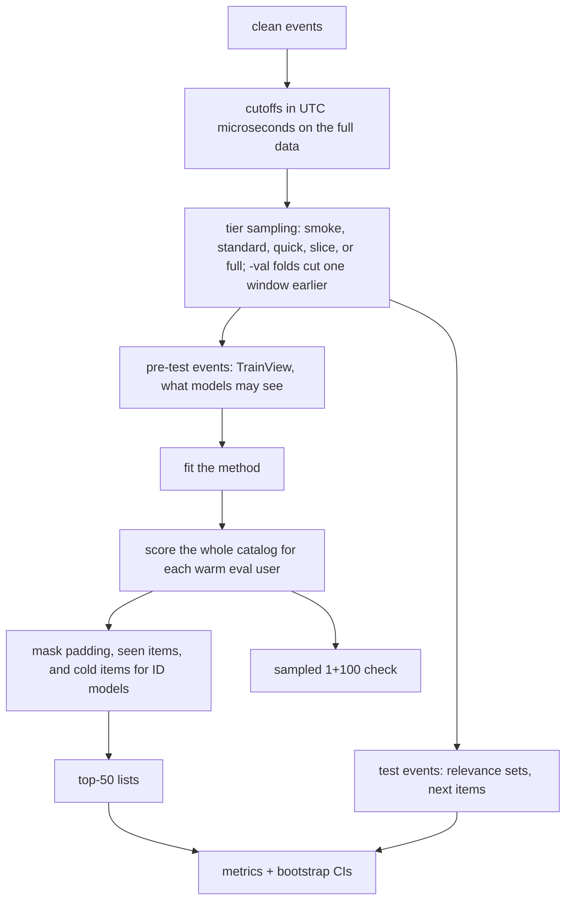

# Evaluation protocols

## Why it matters

The same models can be ranked differently by different evaluation procedures. A **protocol** fixes every
choice: what is held out, who is evaluated, which items compete, what counts as a hit. recbench's protocol is
versioned (currently **v2**) so results are comparable and reproducible.

## The choices, and recbench's answers

| Choice | Options | recbench v2 |
|---|---|---|
| Split | random, leave-last-out, global temporal | global temporal cutoff, UTC ([leakage](data-leakage-and-splits.md)) |
| Who is evaluated | everyone, warm users, cold users | **warm users** primary; cold users as a separate slice |
| Candidate items | all items (full ranking), or 1 positive + N random (sampled) | **full ranking** primary; 1 + 100 sampled as a secondary check |
| Already-seen items | allowed, or removed | removed by default (`exclude_seen`); Last.fm also reports `allow_repeats` |
| Relevant items | all test-window items, or the next one only | both: top-N metrics use all relevant test items; next-item metrics use the first |
| List length K | 10, 20, 50 | all three; headline metric NDCG@10 |
| Uncertainty | none, bootstrap, multiple seeds | bootstrap 95% confidence intervals over users; 3 seeds for the full-data confirmations of random methods |

## Full ranking vs sampled metrics

**Sampled:** rank the true item against 100 random items. It is cheap. But random items are mostly obscure,
so the task is easy, and Krichene & Rendle (2020) showed the shortcut can **change which model wins**. recbench
reports both, and every [leaderboard](../../results/leaderboards.md) has a "Full ranking vs. sampled" table
where you can see methods move up or down. Details and a simulation:
[full ranking vs sampled](../metrics/sampled-vs-full.md).

## Warm and cold users

A *warm* user has history before the cutoff and at least one relevant item after it. A *cold* user has no history.
Mixing them hides failures: ID models cannot personalise for cold users at all. recbench evaluates warm users
for every method and reports a cold-user slice for methods that can serve them (popularity-style).

## Repeat consumption

On Last.fm, 37% of test interactions in the smoke split are repeats (artists the user already played). Two
valid questions follow:

- **"Discover something new"** (`exclude_seen`, the default): remove known items from the ranking, and count
  only new items as relevant.
- **"Predict the next play, repeats included"** (`allow_repeats`): keep known items. Some models are much better
  at this than at discovery.

Last.fm reports both; the `allow_repeats/*` columns hold the second version.

## The recbench v2 protocol step by step

## In recbench

- Split and eval-user construction: `src/recbench/pipeline/materialize.py::materialize`.
- Ranking, masks, metrics, and CIs: `src/recbench/evaluation.py::Evaluator`.
- The protocol version is stored with every run (`PROTOCOL_VERSION` in `src/recbench/protocol.py`), so v1 and v2
  results are never mixed.

## Pitfalls

- **Comparing numbers across datasets or protocols.** NDCG@10 on RetailRocket and on MovieLens are not
  comparable; neither are sampled and full-ranking numbers.
- **Ignoring confidence intervals.** On smoke splits, many methods are statistically tied.
- **Evaluating on users the model has never seen** with an ID model, which only measures noise.

## Check your understanding

??? question "Why is sampled evaluation 'easier' than full ranking?"
    The true item competes with 100 mostly obscure items instead of the entire catalog, including the strong
    popular competitors.

??? question "Under exclude_seen, which test items count as relevant?"
    Only items the user had not interacted with before the cutoff.

## Further reading

- Krichene & Rendle (2020), [On Sampled Metrics for Item Recommendation](https://arxiv.org/abs/2005.06338) (KDD 2020).
- [Ranking accuracy metrics](../metrics/ranking-accuracy.md) and [confidence intervals](../metrics/confidence-intervals.md).
