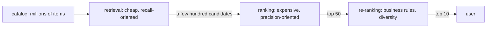

# Retrieval and ranking

## Why it matters

Production recommenders rarely run one model over the whole catalog. They use a **funnel**: a cheap model
narrows millions of items to a few hundred candidates, and an expensive model ranks those carefully.
Knowing where each method belongs explains why some are slow in a full-catalog benchmark.

## Intuition

Hiring for a job: first, a quick filter on keywords cuts 10,000 applications to 200. Then interviews (expensive,
careful) rank the 200. Interviewing all 10,000 would be better in theory and impossible in practice.

## Stages and typical models

| Stage | Goal | Typical models | recbench examples |
|---|---|---|---|
| Retrieval (candidate generation) | do not miss good items (high recall@100+) | embedding dot products with approximate nearest-neighbour search, co-occurrence, popularity | [EASE](../algorithms/ease.md), [iALS](../algorithms/ials.md), [SASRec](../algorithms/sasrec.md), [ItemKNN](../algorithms/itemknn.md) |
| Ranking | order candidates precisely | feature-rich pointwise models | [DIN](../algorithms/din.md), [DCN-V2](../algorithms/dcnv2.md) |
| Re-ranking | apply rules: diversity, freshness, business constraints | rules, small models | (not implemented) |

## A small example: why pointwise rankers are expensive

Scoring every item for every user with a pointwise model costs users × items model evaluations. For 2,000
users and 23,773 items that is 47.5 million evaluations. With [DIN](../algorithms/din.md) each one also
attends over a 50-item history. In recbench this took over 90 minutes on a laptop CPU for one dataset.
As a ranker over 200 retrieved candidates, the same model would need 400,000 evaluations, about 120 times fewer.

## In recbench

- recbench evaluates every method on **full-catalog ranking**, so retrieval and ranking models face the same
  task. This is the fairest single comparison, but it is unusually hard for pointwise rankers.
- A method declares how it scores: `output="scores"` (whole catalog at once, embedding models),
  `output="pairs"` (one pair at a time, DIN and DCN-V2), or `output="list"` (a remote service returns a list).
  See `src/recbench/protocol.py::Recommender.full_scores`.
- A two-stage pipeline (for example "EASE top-200 → DIN") is on the [roadmap](../../results/roadmap.md).

## Pitfalls

- **Judging a ranker only by full-catalog accuracy.** It may be excellent within a good candidate set.
- **Judging a retriever by NDCG@10.** Its job is recall at large K (recall@50 or more), not the order of the top 10.
- **The retrieval ceiling.** A ranker can never recover an item the retriever missed.

## Check your understanding

??? question "Which metric fits a retrieval stage better, NDCG@10 or Recall@50?"
    Recall@50 (or recall at an even larger K): retrieval must not lose relevant items; the ranker orders them later.

??? question "Why does DCN-V2 cost less to score than DIN?"
    DCN-V2 processes a pair through small dense layers. DIN additionally attends over the whole history for
    every pair.

## Further reading

- Covington, Adams and Sargin (2016), [Deep Neural Networks for YouTube Recommendations](https://dl.acm.org/doi/10.1145/2959100.2959190) (RecSys 2016): the classic two-stage design.
- [Serving and latency](serving-and-latency.md).
