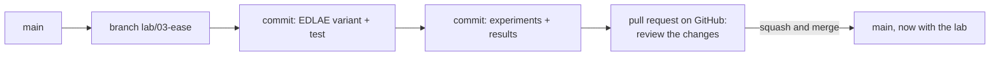

# Git workflow

!!! abstract "In plain words"
    Git records every change to the project as a **commit**. You work on each lab in its own **branch**, a
    parallel line of commits, so `main` always stays working. When the lab is done, you **push** the branch to GitHub
    and open a **pull request** (PR): a page that shows your changes, where you check them once more before merging
    them into `main`.



## Once per lab

### 1. Start from an up-to-date main

```bash
git switch main
git pull
git switch -c lab/03-ease        # create the branch and move onto it
```

### 2. Work, and commit small steps

```bash
git status                        # what changed
git diff                          # how it changed, line by line
git add src/recbench/methods/baselines.py tests/test_ease_variant.py
git commit -m "EASE: EDLAE variant (Steck 2020), off by default"
```

Commit whenever one thing works: the variant and its test, then the experiment and its results, then the docs. A
good message says *what* and, if not obvious, *why*, in one line.

What to commit, and what never to commit:

| Commit | Never commit (Git ignores them already) |
|---|---|
| code in `src/`, tests in `tests/` | `data/`, `runs/`, `reports/` (results and downloads) |
| `labs/<nn>-<method>/experiments.yaml` and the notebook, **saved without outputs** | `.env` and any key or token |
| docs, including the regenerated `docs/generated/lab/*.md` | |

To save a notebook without outputs in VS Code, open the **…** menu at the top of the notebook, choose **Clear All
Outputs**, then save. `./scripts/check.sh` refuses notebooks with outputs, because they make changes hard to review.

### 3. Check, then push

```bash
./scripts/check.sh
git push -u origin lab/03-ease
```

`-u` links your branch to its copy on GitHub; later pushes are just `git push`.

### 4. Open the pull request on GitHub

The push prints a link (`https://github.com/<you>/recbench/pull/new/lab/03-ease`). Open it, or on the repository's
GitHub page click **Compare & pull request**. The description starts from the project's template
(`.github/pull_request_template.md`): what the change does, the `compare` output, and a checklist. Fill it in and
click **Create pull request**.

### 5. Review your own changes

On the PR page, **Files changed** shows every line you changed. Read it as if someone else wrote it: leftover
`print`s, unclear names, a forgotten file. Fix things locally, commit, `git push`; the PR updates itself.

### 6. Merge and tidy up

Click **Squash and merge**. It turns all the branch's commits into one commit on `main`, with the PR's title. Then:

```bash
git switch main
git pull                          # main now contains your work
git branch -d lab/03-ease         # delete the finished branch locally
```

## Small rescues

| Problem | Command |
|---|---|
| undo changes to a file you have not committed | `git restore path/to/file` |
| unstage a file you added by mistake | `git restore --staged path/to/file` |
| fix the last commit's message, or add a forgotten file to it | `git add file`, then `git commit --amend` |
| undo the last commit but keep its changes | `git reset --soft HEAD~1` |
| see the history | `git log --oneline -10` |

!!! tip "Optional: the GitHub command line"
    `brew install gh`, then `gh auth login` once. After that, `gh pr create --fill` opens the PR from the terminal
    and `gh pr view --web` opens it in the browser. Everything above also works without it.
