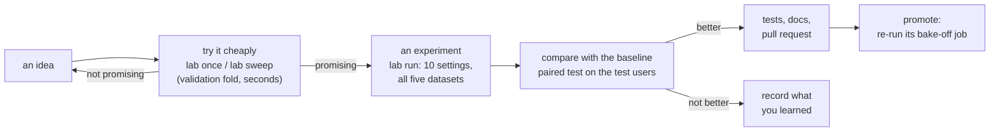

# Developer handbook

!!! abstract "In plain words"
    This section is the "how we work here" guide. It shows how to set up, run one method, run a fair
    experiment, decide whether a change really helped, test it, debug it, and get it merged through a pull request.
    The pages are short and practical. The [labs](../labs/index.md) then use these steps to improve the 11 light
    methods, one per week.

## The daily loop

1. **An idea.** It comes from reading the code, a paper, or the [error analysis](compare-results.md#where-did-it-get-better).
2. **Try it cheaply** on MovieLens' validation fold, where one setting takes seconds:
   [`lab once`](run-one-method.md), or [`lab sweep`](run-one-method.md#vary-one-setting-sweep) to try one setting at
   several values. Nothing here touches a test split.
3. **Run an experiment.** Define it in the method's experiment file and run it on all five datasets with
   [`lab run`](run-experiments.md). It gets the same budget as the baseline: 10 settings tried on the validation
   fold, then the best one tested once.
4. **Compare** it with the baseline using [`python -m recbench.compare`](compare-results.md), a paired test over the
   same test users.
5. **Ship or learn.** If it is better, [test](test.md) it, [update the docs](update-docs.md), open a
   [pull request](git-workflow.md) and [promote](promote.md) it. If not, write down what you learned: a negative
   result is a result.

## Three rules that keep results honest

| Rule | Why | How recbench enforces it |
|---|---|---|
| Choose settings on the **validation fold**, never on the test split | a setting picked by its test score looks better than it is: you have fitted the test users' noise | `lab once` and `lab sweep` only use `quick-val`; tuning searches on `quick-val`; the scoreboard picks experiments by validation score |
| **Test** each configuration **once** | every extra look at the test split is another chance to pick by luck | a job's final run is its only run on `quick` |
| Give every idea the **same budget** | an idea that needs more settings tried, or more time, is not free | experiments get the baseline's 10 settings unless you say otherwise, and `compare` prints both budgets and both training times |

## Where things live

| What | Where | In Git? |
|---|---|---|
| method code | `src/recbench/methods/` (one module per family) | yes |
| the lab tools | `src/recbench/lab/`, `src/recbench/compare.py` | yes |
| search spaces (what tuning may try) | `configs/tuning/quick.yaml` | yes |
| the lab's settings | `configs/benchmarks/lab.yaml` | yes |
| your experiments and notebooks | `labs/<nn>-<method>/` | yes |
| the test template | `labs/templates/test_variant_template.py` | yes |
| data splits | `data/splits/<dataset>/<tier>/` | no (re-created by `prepare`) |
| the bake-off's results | `runs/mlflow`, `runs/tuning`, `reports/` | no |
| the lab's results | `runs/lab/`, `reports/lab/` | no |
| docs | `docs/` (generated parts in `docs/generated/`) | yes |

The lab's results live in their own **workspace**, `runs/lab/` and `reports/lab/`. Your experiments therefore never
mix with the bake-off's results, and fetching the bake-off's results from a rented box never overwrites yours.

## The pages

1. [Set up](setup.md): the lab extra, VS Code and its notebooks, a first check.
2. [Run one method](run-one-method.md): one setting, or one setting at several values, on the validation fold.
3. [Run experiments](run-experiments.md): the baseline, experiment files, and running in the background.
4. [Compare results](compare-results.md): the paired test, the verdict, error analysis, the scoreboard.
5. [Test](test.md): the template for your variants, the default-behaviour pins, the pre-PR check.
6. [Debug](debug.md): what usually goes wrong and how to find out why.
7. [Git workflow](git-workflow.md): a branch per method, commits, a pull request on GitHub.
8. [Update the docs](update-docs.md): what to write where, and how to check it.
9. [Promote a winner](promote.md): make it a setting or the default, and re-run its bake-off job.
