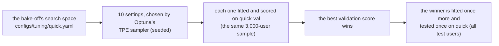

# Run experiments

!!! abstract "In plain words"
    An **experiment** is a named change to how a method is tuned: settings added, removed or fixed, or a code change
    switched on by a new setting. It gets exactly the baseline's budget: 10 settings tried on each dataset's
    validation fold, then the best one tested once. Every experiment and every baseline is run this same way, so the
    comparison is fair. You define experiments in a small YAML file next to the lab's notebook and run them with one
    command.

## The baseline: what you compare against

For each lab method and each dataset, the baseline is one **tuning job**:



- **TPE** (Tree-structured Parzen Estimator) is a search method: after a few random settings it proposes new ones
  near those that scored well.
- Methods whose training is random (iALS, BPR-MF, the LightGBM re-ranker) are tested three times, with seeds 42, 43
  and 44, and averaged. That keeps a lucky seed from deciding a comparison.
- Each job may use at most 3 hours. A job that needs more ends `over_budget`: a result about cost, not a crash.

The job's summary is `runs/lab/tuning/quick/<dataset>/<method>.json`: the settings tried, their validation scores and
times, the winner (`best_params`, `best_val`) and its test result. In a notebook, `lab.baseline("ease")` shows it per
dataset and `lab.trials("ease", "movielens-25m")` lists the 10 settings tried.

## Define an experiment

Each lab folder has an `experiments.yaml`. For ItemKNN, `labs/01-itemknn/experiments.yaml` starts like this:

```yaml
experiments:
  baseline: {}   # the bake-off's search space, unchanged

  no-time-knobs:
    note: Without recency weighting or a training window, is ItemKNN worse?
    remove: [decay_half_life_days, train_window_days]
```

An experiment starts from the baseline's search space and changes it with these keys:

| Key | Meaning | Example |
|---|---|---|
| `params` | settings added to the search, or searched differently (same format as `configs/tuning/quick.yaml`) | `knn_shrink: {type: choice, values: [0, 1000]}` |
| `remove` | settings no longer searched; the method's default applies | `remove: [train_window_days]` |
| `fixed` | settings held at one value | `fixed: {rp3_beta: 0.0}` |
| `trials` | settings to try; default 10, the baseline's budget. Change it only on purpose, because then the comparison is no longer fair | `trials: 10` |
| `note` | what you tried and why (shown on the scoreboard) | |
| `promoted` | `true` once you [promote](promote.md) it | |

The label (`no-time-knobs`) uses lower-case letters, digits and dashes. `baseline` is reserved and stays empty. The
search-space formats are `choice` (a list of values), `float` and `int` (uniform in a range), and `log` and `logint`
(uniform on a log scale, for settings like λ that span powers of ten).

## Run it

```bash
python -m recbench.lab run --method itemknn --experiment no-time-knobs --datasets movielens-25m
```

!!! success "You should see"
    ```text
    itemknn:no-time-knobs on movielens-25m (1 at a time; each job: 10 settings on quick-val, then the best once on quick)
    movielens-25m: finished, test NDCG@10 0.1453 (validation 0.1645)

    Next: python -m recbench.compare itemknn itemknn:no-time-knobs
    ```

Without `--datasets` it runs all five, two at a time (`--workers 2`). When it finishes, it prints the comparison
command to run next. (This experiment lost: ItemKNN without its recency settings scores 0.145 against the baseline's
0.159 on MovieLens.)

**How long?** Roughly as long as the method's baseline job on each dataset. `lab.baseline("itemknn")` shows those
times in its `minutes` column. On MovieLens most lab methods take one to five minutes; the large datasets take longer.

### Run it on a rented box

Training belongs on a rented box, where many cores run several jobs at once. Push your branch, then on the box:

```bash
git fetch && git switch lab/01-itemknn            # your code and your experiments.yaml
./scripts/run_lab_box.sh itemknn:no-time-knobs itemknn:asymmetric
```

`run_lab_box.sh` first makes sure the baseline is complete (a done job is skipped), then runs each `method:experiment`
on all five datasets. Back on the laptop, `./scripts/fetch_lab_results.sh vast-gpu` imports the results, and
`python -m recbench.compare ...` and the notebooks work on them as if they had run locally. The lab's machine
profile is the same everywhere, so a laptop run and a box run of the same setting give the same numbers; only the times
differ.

### Run it in the background

On the laptop, big datasets take a while. Start the run in the background, close the terminal if you like, and check
on it later:

```bash
mkdir -p runs/lab/logs
nohup caffeinate -i python -m recbench.lab run --method itemknn --experiment no-time-knobs > runs/lab/logs/itemknn-no-time-knobs.log 2>&1 &
tail -f runs/lab/logs/itemknn-no-time-knobs.log     # follow it; Ctrl-C stops following, not the run
```

| Part | Meaning |
|---|---|
| `nohup` | keep running after the terminal closes |
| `caffeinate -i` | keep the Mac awake while it runs |
| `> …log 2>&1` | write everything it prints to the log file |
| `&` | start it in the background and give the prompt back |

`python -m recbench.lab status` shows every experiment's progress, or `lab.results("itemknn")` in a notebook.

### When does an experiment run again?

| Situation | What `lab run` does |
|---|---|
| it already finished, nothing changed | skips it: `already done` |
| you changed its definition in `experiments.yaml` | runs it again on its own (the old summary moves to `archive/`) |
| you changed the method's code | runs it again on its own: its fingerprint includes a hash of the code |
| it failed | starts a fresh attempt |
| you want it again anyway | `--rerun` |

## Experiments that need code: variants

Some ideas need new code, for example a new similarity or a different penalty. Write them as a **variant**: a new
setting of the existing method whose default keeps today's behaviour.

```python
# in ItemKNN.fit (src/recbench/methods/baselines.py)
similarity = str(cfg.get("knn_similarity", "cosine"))   # the default keeps today's behaviour
if similarity == "asymmetric":
    ...                                                   # your new code
```

Then search the new setting in an experiment:

```yaml
  asymmetric:
    params:
      knn_similarity: {type: choice, values: [asymmetric]}
      knn_alpha: {type: float, low: 0.1, high: 0.9}
```

If you run an experiment whose settings no code reads, for example because the variant is not written yet or a name is
misspelled, `lab run` stops at once: `itemknn's code never reads knn_similarity`. Without that check, the experiment
would quietly re-run the baseline. Each lab's Level 4 walks through one variant with hints, a test, and a folded
solution.

## Fair-play checklist

- Keep `trials` at 10, the baseline's budget, and keep the search ranges similar in width.
- Compare on all five datasets before concluding (MovieLens first is fine for iterating).
- Choose among your experiments by **validation** score; the [scoreboard](../labs/scoreboard.md) does this for you.
- Write a `note` for every experiment, including the ones that did not work.
