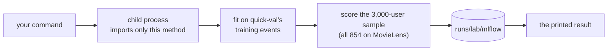

# Run one method

!!! abstract "In plain words"
    Before a full experiment, try your idea on one setting: fit the method once on MovieLens' validation fold and
    score it. That takes seconds. `python -m recbench.lab once` does it from a terminal, and `lab.fit` plus
    `lab.evaluate` do it in a notebook, where you can also look inside the fitted model. `lab sweep` repeats it for
    one setting at several values. None of these ever touches a test split, so you can try as much as you like.

!!! note "Where to run these"
    `lab once`, `lab sweep` and `lab.fit` fit models: seconds to a few minutes on MovieLens, longer on the big
    datasets. Run them wherever you train: on a rented box over SSH, or on the laptop if you allow training there.
    `python -m recbench.compare`, the scoreboard and reading results only read stored runs, so they are always fine
    on the laptop.

## One setting: `lab once`

```bash
python -m recbench.lab once --method itemknn --dataset movielens-25m --set knn_neighbors=200
```

!!! success "You should see"
    ```text
    itemknn on movielens-25m, validation fold (854 users), knn_neighbors=200
      NDCG@10   0.1401  [0.1261, 0.1526]
      Recall@10 0.1349   coverage@10 0.009   train 3.6 s   scoring 0.19 s per 1,000 users
    ```

Line by line:

| Part | Meaning |
|---|---|
| `validation fold (854 users)` | the users scored: a fixed, seeded sample of at most 3,000 of the fold's users (MovieLens has only 854), the same sample tuning uses |
| `knn_neighbors=200` | your settings; every other setting is the method's default |
| `NDCG@10 0.1401 [0.1261, 0.1526]` | ranking quality of the top 10, averaged over users, with a 95% bootstrap interval ([NDCG](../dictionary/metrics/ranking-accuracy.md#ndcg), [intervals](../dictionary/metrics/confidence-intervals.md)) |
| `Recall@10` | the share of each user's validation items found in their top 10 |
| `coverage@10` | the share of the catalog that appears in anyone's top 10: 0.009 means a narrow, popular set |
| `train`, `scoring` | seconds to fit; seconds to score 1,000 users |

`--set` takes `name=value` and can be repeated. Values are read as YAML: `200` is a number, `null` means "none" (for
example `--set decay_half_life_days=null`), and `bm25` is text.

### Start from the baseline's best setting: `--best`

```bash
python -m recbench.lab once --method itemknn --dataset movielens-25m --best
```

!!! success "You should see"
    ```text
    itemknn on movielens-25m, validation fold (854 users), decay_half_life_days=365, knn_neighbors=15, knn_shrink=100, knn_weighting=tfidf, train_window_days=365
      NDCG@10   0.1982  [0.1830, 0.2129]
      Recall@10 0.1875   coverage@10 0.023   train 1.1 s   scoring 0.02 s per 1,000 users
      (the baseline's best trial scored 0.1982 on the same users)
    ```

This reproduces the baseline's best trial exactly: same settings, same users, same score. Add `--set` to change one
thing from there. That is the usual way to test an idea: everything else stays at its best value.

!!! warning "Validation scores and test scores are not comparable"
    The baseline's *test* NDCG@10 for ItemKNN on MovieLens is 0.159, not 0.198. The test split covers a later time
    window with other users, and some periods are simply harder. Compare two settings on the same split, never a
    validation number with a test number.

### What happens behind the command



The run is stored in the lab's MLflow store. Asking for exactly the same settings again returns the stored result
instantly, marked `(stored result of an identical run)`; `--fresh` computes it again. After you edit the method's
code, the identity of its runs changes, so they compute again by themselves (the lab's `track_code` setting).

## Vary one setting: `sweep`

```bash
python -m recbench.lab sweep --method itemknn --dataset movielens-25m --param knn_neighbors --values 5,15,50,200,1000
```

!!! success "You should see"
    ```text
    itemknn on movielens-25m (validation fold): knn_neighbors = [5, 15, 50, 200, 1000]
      knn_neighbors=         5  NDCG@10=0.1959 [0.1813, 0.2101]  train 1.1 s  (finished)
      knn_neighbors=        15  NDCG@10=0.1982 [0.1830, 0.2129]  train 1.1 s  (cached)
      knn_neighbors=        50  NDCG@10=0.1913 [0.1765, 0.2065]  train 1.0 s  (finished)
      knn_neighbors=       200  NDCG@10=0.1819 [0.1660, 0.1972]  train 1.2 s  (finished)
      knn_neighbors=      1000  NDCG@10=0.1891 [0.1728, 0.2050]  train 1.4 s  (finished)
    ```

Every other setting stays at the baseline's best on this dataset; `--from-defaults` starts from the method's defaults
instead. The table is also saved as `reports/lab/sweeps/itemknn/movielens-25m-knn_neighbors.csv`.

**How to read it:** the intervals overlap a lot. On 854 users, differences of about 0.01 are within the noise, so
this sweep says "the number of neighbours matters little here, anything from 5 to 1,000 is close". That is useful to
know too. The labs ask you to *predict* each sweep's shape before you run it, then explain what you see.

## In a notebook: look inside the model

```python
from recbench import lab

lab.setup()                                        # always first
data, split = lab.load("movielens-25m")            # the validation fold
best = lab.baseline("itemknn", "movielens-25m")["best_settings"]
model = lab.fit("itemknn", data, **best)           # fitted in the notebook
lab.evaluate(model, data, split)                   # NDCG@10 0.1982 [...]: the same number as `once --best`
lab.neighbours(model, data, "Toy Story (1995)")    # the items most similar to Toy Story
model.sim                                          # the item x item similarity matrix itself (scipy sparse)
```

`lab.fit` and `lab.evaluate` reproduce the command's numbers exactly. The notebook's advantage is that the model stays
in memory, so you can open it up: its similarity matrix, its weights, the scores for one user. The
[lab pages](../labs/index.md) use this in every Level 1.

`lab.sweep`, `lab.once` and `lab.run` call the same functions as the commands; `lab.plot_sweep(table)` draws a
sweep with its intervals.

## See every run: the MLflow UI

```bash
mlflow ui --backend-store-uri "file://$PWD/runs/lab/mlflow" --port 5002
```

Open <http://127.0.0.1:5002>. Each `once`, `sweep` value and tuning trial is a run with its settings (Parameters),
results (Metrics) and files (Artifacts: `per_user_metrics.npz` holds every user's score). Filter with
`tags.stage = "once"` or `tags.method = "itemknn"`. [MLflow](../cloud/mlflow.md) explains the UI.
