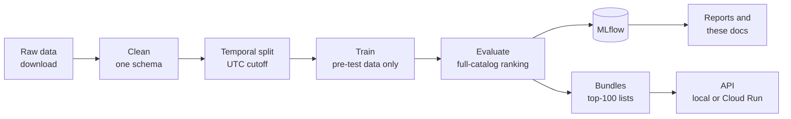

# recbench

**A recommender-systems benchmark that doubles as a dictionary.** It runs 18 recommendation methods, from a
random baseline to Meta's HSTU and a managed service, on 5 public datasets under one honest protocol. It serves
the results behind an API, and it explains every algorithm, metric, and design choice from scratch.

## Who it is for

- **You are learning recommender systems.** Follow the [learning path](start/learning-path.md): six weeks from
  "what is a recommendation" to deploying one, with a checkpoint each week.
- **You need to choose a method for a product.** Read the [decision guide](results/decision-guide.md), then the
  [leaderboards](results/leaderboards.md) for the dataset most like yours.
- **You want to look something up.** The [dictionary](dictionary/index.md) has a page for every concept,
  algorithm, metric, and dataset.
- **You want to extend it.** Add a [method](how-to/add-a-method.md), a [metric](how-to/add-a-metric.md), or a
  [dataset](how-to/add-a-dataset.md); the [codebase walkthrough](codebase/architecture.md) shows how the parts fit.

## What happens, end to end



Every step is one command; the [first smoke run](start/first-smoke-run.md) runs them all on your laptop.

## What is inside

| | |
|---|---|
| **Methods** | a ladder from simplest to most complex: Random, MostPopular · ItemKNN, EASE · BPR-MF, iALS · LightGCN, XSimGCL · SASRec, BERT4Rec, S3-Rec, HSTU, TIGER-lite · DIN, DCN-V2 · text and multimodal towers · Recombee. See the [algorithms](dictionary/algorithms/index.md). |
| **Datasets** | MovieLens-25M (movies), RetailRocket and H&M (e-commerce), Last.fm-1K (music), Steam (games). See the [datasets](dictionary/datasets/index.md). |
| **Metrics** | 33: ranking accuracy, next-item accuracy, coverage and popularity, novelty and diversity, calibration and fairness, cold start, efficiency, explanations, plus a qualitative rubric and time to market. See the [metrics](dictionary/metrics/index.md). |
| **Protocol** | one global time cutoff; models see only events before it; every item in the catalog is ranked; 95% confidence intervals. See [evaluation protocols](dictionary/concepts/evaluation-protocols.md). |
| **Serving** | precomputed recommendation lists behind a small API, deployable to Cloud Run with cost guardrails. See [Cloud & MLOps](cloud/gcp-basics.md). |

## How these docs are organised

| Section | Kind | Use it to |
|---|---|---|
| [Start here](start/learning-path.md) | tutorials | learn by doing, in order |
| [How-to](how-to/add-a-method.md) | recipes | complete a specific task |
| [Dictionary](dictionary/index.md) | explanations and reference | understand a concept, algorithm, metric, or dataset |
| [Codebase](codebase/architecture.md) | reference | find where and how something is implemented |
| [Cloud & MLOps](cloud/gcp-basics.md) | explanations | understand deployment, tracking, cost, and security |
| [Results](results/leaderboards.md) | generated tables and guidance | read results and make decisions |
| [Review log](review/2026-10-02-review.md) | history | see what was wrong in v0.1 and how it was fixed |

Every algorithm page follows the same structure: intuition, a tiny worked example, how it works, the math
symbol by symbol, training and inference, hyperparameters, this repository's implementation, results, strengths
and weaknesses, pitfalls, questions to check your understanding, and further reading.

## Quick start

```bash
uv venv .venv --python 3.12 && source .venv/bin/activate
uv pip install -e ".[dev]"
./scripts/run_smoke_cpu.sh --datasets movielens-25m --methods most_popular,ease,sasrec
mkdocs serve        # this site, at http://127.0.0.1:8000
```

The [install guide](start/install.md) explains each line.

## Status

- **Protocol v2.** A review of v0.1 found test leakage and other bugs that made its numbers invalid. They are
  fixed and guarded by tests; see the [review log](review/2026-10-02-review.md).
- **Smoke-tier results** (laptop) are on the [smoke-tier page](results/leaderboards-smoke.md). They check the pipeline;
  they do not pick winners.
- **Full-tier results** (untuned v0.2 defaults) are on the [leaderboards](results/leaderboards.md).
- **The quick-tier bake-off** tunes 23 low-budget methods with equal budgets, dataset by dataset; its results
  appear on the [quick-tier page](results/quick-tier.md) ([how to run it](start/quick-tier-box.md)).
- What is simplified or missing: [known limitations](results/known-limitations.md) and the [roadmap](results/roadmap.md).

## Licence

The code is MIT-licensed. The datasets have their own licences, several of them non-commercial; recbench
downloads them from their sources and never redistributes them. See the [datasets](dictionary/datasets/index.md)
pages.
