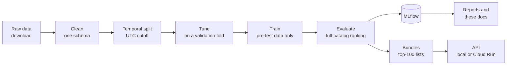

# recbench

**A recommender-systems benchmark that doubles as a dictionary.** It runs 34 recommendation methods, from a
random baseline to Meta's HSTU and a managed service, on 5 public datasets under one honest protocol, and tunes the
23 low-budget ones with the same budget in a bake-off. It serves the results behind a monitored API, and it explains
every algorithm, metric, and design choice from scratch.

## Who it is for

- **You are learning recommender systems.** Follow the [learning path](start/learning-path.md): seven weeks from
  "what is a recommendation" to deploying one, with a checkpoint each week.
- **You need to choose a method for a product.** Read the [decision guide](results/decision-guide.md), then the
  [overall comparison](results/overall-comparison.md) and the [quick-tier results](results/quick-tier.md) for the
  dataset most like yours.
- **You want to look something up.** The [dictionary](dictionary/index.md) has a page for every concept,
  algorithm, metric, and dataset.
- **You want to extend it.** Add a [method](how-to/add-a-method.md), a [metric](how-to/add-a-metric.md), or a
  [dataset](how-to/add-a-dataset.md); the [codebase walkthrough](codebase/architecture.md) shows how the parts fit.

## What happens, end to end



Every step is one command; the [first smoke run](start/first-smoke-run.md) runs them all on your laptop.

## What is inside

| | |
|---|---|
| **Methods** | a ladder from simplest to most complex, from Random and MostPopular through neighbourhood, linear, matrix-factorisation, graph and sequential models to re-rankers, content-based methods and a managed service. See the [algorithms](dictionary/algorithms/index.md). |
| **Datasets** | MovieLens-25M (movies), RetailRocket and H&M (e-commerce), Last.fm-1K (music), Steam (games). See the [datasets](dictionary/datasets/index.md). |
| **Metrics** | 33: ranking accuracy, next-item accuracy, coverage and popularity, novelty and diversity, calibration and fairness, cold start, efficiency, explanations, plus a qualitative rubric and time to market. See the [metrics](dictionary/metrics/index.md). |
| **Protocol** | one global time cutoff; models see only events before it; every item in the catalog is ranked; 95% confidence intervals. See [evaluation protocols](dictionary/concepts/evaluation-protocols.md). |
| **Tuning** | the quick-tier bake-off: the same tuning budget for every low-budget method, a 3-hour cap per job, each dataset's top 3 confirmed on full data. See the [quick tier](results/quick-tier.md). |
| **Serving** | precomputed recommendation lists behind a small API, deployable to Cloud Run with cost guardrails and monitoring. See [Cloud & MLOps](cloud/gcp-basics.md) and [monitoring](cloud/monitoring.md). |
| **Labs** | improve the 11 light methods yourself, one per week: reproduce, understand every setting, try data tricks, implement an idea from a paper, and judge it with a paired test. See the [labs](labs/index.md) and the [developer handbook](handbook/index.md). |

## How these docs are organised

| Section | Kind | Use it to |
|---|---|---|
| [Start here](start/learning-path.md) | tutorials | learn by doing, in order |
| [Developer handbook](handbook/index.md) | how we work | set up, run, experiment, compare, test, debug, Git, docs |
| [Labs](labs/index.md) | guided projects | improve one method per week, with hints and folded solutions |
| [How-to](how-to/add-a-method.md) | recipes | complete a specific task |
| [Dictionary](dictionary/index.md) | explanations and reference | understand a concept, algorithm, metric, or dataset |
| [Codebase](codebase/architecture.md) | reference | find where and how something is implemented |
| [Cloud & MLOps](cloud/gcp-basics.md) | explanations | understand deployment, tracking, cost, and security |
| [Results](results/leaderboards.md) | generated tables and guidance | read results and make decisions |
| [Review log](review/2026-10-02-review.md) | history | see what was wrong in v0.1 and how it was fixed |

Every algorithm page follows the same structure: intuition, a tiny worked example, how it works, the math
symbol by symbol, training and inference, hyperparameters, this repository's implementation, results, strengths
and weaknesses, pitfalls, questions to check your understanding, and further reading.

## Quick start

```bash
uv venv .venv --python 3.12 && source .venv/bin/activate
uv pip install -e ".[dev]"
./scripts/run_smoke_cpu.sh --datasets movielens-25m --methods most_popular,ease,sasrec
mkdocs serve        # this site, at http://127.0.0.1:8000
```

The [install guide](start/install.md) explains each line.

## Status

- **Protocol v2.** A review of v0.1 found test leakage and other bugs that made its numbers invalid. They are
  fixed and guarded by tests; see the [review log](review/2026-10-02-review.md).
- **Smoke-tier results** (laptop) are on the [smoke-tier page](results/leaderboards-smoke.md). They check the pipeline;
  they do not pick winners.
- **Full-tier results** (untuned v0.2 defaults) are on the [leaderboards](results/leaderboards.md).
- **The quick-tier bake-off** (first run 2026-10-04) tuned 23 low-budget methods with equal budgets on all five
  datasets and confirmed each dataset's top 3 on full data.
    - EASE has the best mean rank.
    - The LightGBM re-ranker is the only method that clearly beats it, on H&M.
    - No neural model placed higher than 8th on any dataset.

  See the [quick-tier page](results/quick-tier.md) and the [overall comparison](results/overall-comparison.md)
  ([how to run it](start/quick-tier-box.md)). A short [follow-up session](start/box-5-follow-up.md) closes what
  the first run left open.
- What is simplified or missing: [known limitations](results/known-limitations.md) and the [roadmap](results/roadmap.md).

## Licence

The code is MIT-licensed. The datasets have their own licences, several of them non-commercial; recbench
downloads them from their sources and never redistributes them. See the [datasets](dictionary/datasets/index.md)
pages.
