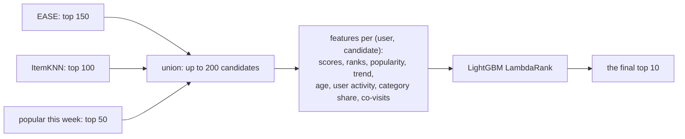

# Primer: trees and learning to rank

!!! abstract "In plain words"
    The LightGBM re-ranker (lab 11) works in two stages. First, cheap methods propose about 200 candidate items per
    user. Then a model of **boosted decision trees** reorders the candidates using many clues (features): each
    generator's score, the item's recent popularity, how long the user has been away, and more. It is trained with
    **LambdaRank**, a loss that cares most about getting the top of the list right, exactly what NDCG@10 rewards.

## Decision trees and boosting

A **decision tree** asks yes/no questions about the features ("is the item's 7-day popularity above 40?") and ends in
a leaf with a number. One tree is a crude model.

**Gradient boosting** builds many small trees one after another. Each new tree learns to correct the errors left by
the trees before it, and its prediction is added with a small weight (the learning rate). With targets 3, 5 and 8,
the first "tree" predicts their mean, 5.33, leaving errors −2.33, −0.33 and +2.67. The next tree learns to predict
those errors from the features, and so on. Hundreds of small corrections add up to an accurate model. LightGBM is a
fast implementation of this.

| LightGBM setting | In recbench | Effect |
|---|---|---|
| learning rate | `lgbm_lr` | smaller: each tree corrects less, so more trees are needed, but the model usually generalises better |
| leaves per tree | `lgbm_leaves` | more leaves: each tree can describe finer patterns, and overfits more easily |
| minimum examples per leaf | `lgbm_min_child` | larger: leaves must be backed by more examples, so the model is smoother |
| number of trees | `lgbm_trees` (500), with early stopping | training stops when 50 more trees do not improve NDCG@10 on held-out users |

## Learning to rank

What should the trees predict? Three families of losses:

| Kind | Learns from | Example |
|---|---|---|
| pointwise | each (user, item) on its own: "chosen or not?" | logistic regression on clicks |
| pairwise | pairs: "chosen item above a non-chosen one" | BPR (lab 9) |
| listwise | the whole list's quality, such as NDCG | LambdaRank |

**LambdaRank** is pairwise with a twist: each pair is weighted by how much swapping the two items would change NDCG.
A user has one relevant item:

| Relevant item moves | Gain in its discount $1/\log_2(\text{rank} + 1)$ | Weight of this pair |
|---|---|---|
| rank 3 → rank 1 | 0.500 → 1.000: **+0.500** | large |
| rank 10 → rank 9 | 0.289 → 0.301: **+0.012** | small |

Mistakes near the top cost most, so the model spends its effort there.

## The two stages in recbench

Two things set the re-ranker's ceiling:

- **Candidate recall:** the share of a user's test items that are among the candidates at all. The ranker can only
  reorder what it is given. recbench reports it as `candidate_recall`. Improving the candidate generators raises
  this ceiling; that is lab 11's Level 4.
- **Training without leakage:** the ranker learns from the most recent period before the test split. The generators
  are fitted on the events before the validation cutoff, the features are computed as of that cutoff, and the labels
  are what users chose between the validation cutoff and the test cutoff. Nothing from after a cutoff may be used to
  predict it.

## Exercises

**1.** Why is a smaller learning rate usually paired with more trees?

??? success "Solution"
    Each tree's correction is multiplied by the learning rate. Halving it halves each step, so about twice as many
    trees are needed to make the same total correction. The smaller steps average out noise and usually generalise
    better; early stopping decides how many trees are enough.

**2.** A user's only test item is not among their 200 candidates. What is the best NDCG@10 the re-ranker can reach
for this user?

??? success "Solution"
    0. The item is never scored, so it can never reach the top 10, whatever the ranker learns. This is why candidate
    recall is the ceiling.

**3.** Why may the ranker not be trained on labels from the test period, even though the test users' answers would
be the most relevant examples?

??? success "Solution"
    Then the test would measure what the model memorised, not what it can predict. Every number on the scoreboard
    would be too optimistic. Labels must come from before the test cutoff, as they would in production, where the
    future is unknown.
