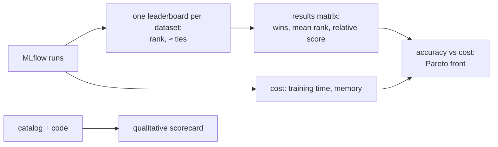

# Overall comparison

!!! abstract "In plain words"
    Each leaderboard compares methods on **one** dataset. This page asks the bigger questions: which methods are
    good **everywhere**, what they cost, what else they do well (variety, new items, explanations), and how much
    effort they take to build and tune. It is generated from the benchmark's results, so it fills in by itself as
    new results arrive. Five datasets are not many, though: read the "critical difference" before declaring a
    winner.

--8<-- "generated/overall/headline.md"

## How to read this page



The page uses five ideas:

- **Rank, not raw NDCG.** NDCG@10 is 0.2 on MovieLens and 0.01 on H&M, because some datasets are much harder than
  others. Averaging raw NDCG would let the easiest dataset decide everything. Ranks (1st, 2nd, …) put every
  dataset on the same footing.
- **≈ (tied with the best).** The method's 95% confidence interval overlaps the best method's, so the data cannot
  tell them apart.
- **Mean rank.** The average rank over the methods that ran on **every** dataset; lower is better. Methods that
  missed a dataset are listed without one, because comparing them on fewer datasets would not be fair.
- **Relative score.** A method's NDCG@10 divided by the best NDCG@10 on that dataset, averaged. 1.0 means "the best
  on every dataset it ran on"; 0.5 means "half as good as the best, on average".
- **Critical difference (CD).** With few datasets, small differences in mean rank are luck. The Nemenyi test
  (Demšar 2006) gives the gap two mean ranks must exceed to count as a real difference. With 9 methods on 5
  datasets it is about 5.4 ranks, so only very large gaps are significant.

!!! example "A worked example"
    Three methods on two datasets:

    | Method | Dataset X | Dataset Y | Mean rank | Relative score |
    |---|---|---|---|---|
    | A | 0.20 (1st) | 0.010 (2nd) | (1 + 2) / 2 = **1.5** | (0.20/0.20 + 0.010/0.012) / 2 = **0.92** |
    | B | 0.15 (2nd) | 0.012 (1st) | (2 + 1) / 2 = **1.5** | (0.15/0.20 + 0.012/0.012) / 2 = **0.88** |
    | C | 0.05 (3rd) | 0.004 (3rd) | **3.0** | (0.25 + 0.33) / 2 = **0.29** |

    A plain average of NDCG would rank A first by a lot (0.105 vs 0.081), only because dataset X has bigger
    numbers. The mean rank says A and B are equal, and the relative score says A is a little ahead. C is clearly
    behind on both.

The page shows each **source** of results separately and never mixes them. A source is one tier, run either with
default settings or after tuning:

| Tab | Source | Use it for |
|---|---|---|
| Quick tier, tuned | the [bake-off](quick-tier.md): every method tuned with the same budget | the fairest comparison of the low-budget methods |
| Full, confirmed | each dataset's top 3, re-checked on the full data | whether the quick-tier winners hold at full size |
| Full, untuned v0.2 | the first GPU run, default settings | a before/after view: what tuning changed |
| Smoke | small laptop runs | checking the pipeline only, never for choosing |

## 1. Results matrix

=== "Quick tier, tuned"

    --8<-- "generated/overall/matrix-quick.md"

=== "Full, confirmed"

    --8<-- "generated/overall/matrix-full-tuned.md"

=== "Full, untuned v0.2"

    --8<-- "generated/overall/matrix-full-untuned.md"

=== "Smoke"

    --8<-- "generated/overall/matrix-smoke.md"

## 2. Accuracy against cost

A cheap method that is almost as accurate is often the better choice. The chart puts accuracy (relative score, up)
against training time (right, log scale). The ringed methods are on the **Pareto front**: no other method is both
more accurate and faster. Pick from the front, at the time budget you can afford.

=== "Quick tier, tuned"

    --8<-- "generated/overall/cost-quick.md"

=== "Full, confirmed"

    --8<-- "generated/overall/cost-full-tuned.md"

=== "Full, untuned v0.2"

    --8<-- "generated/overall/cost-full-untuned.md"

=== "Smoke"

    --8<-- "generated/overall/cost-smoke.md"

## 3. Beyond accuracy

Two methods with the same NDCG can behave very differently. One may recommend the same few bestsellers to everyone
(low coverage, high popularity percentile), while the other spreads attention across the catalogue. These metrics
are explained in [coverage and popularity](../dictionary/metrics/coverage-and-popularity.md),
[novelty](../dictionary/metrics/novelty-diversity-serendipity.md) and
[cold-start slices](../dictionary/metrics/cold-start-slices.md).

=== "Quick tier, tuned"

    --8<-- "generated/overall/beyond-quick.md"

=== "Full, confirmed"

    --8<-- "generated/overall/beyond-full-tuned.md"

=== "Full, untuned v0.2"

    --8<-- "generated/overall/beyond-full-untuned.md"

=== "Smoke"

    --8<-- "generated/overall/beyond-smoke.md"

## 4. Qualitative scorecard

The things a leaderboard cannot measure: how much work a method is to build and tune, how much data it needs, how
easy it is to steer, and how well it can explain itself. The scores come from `dictionary/catalog.yaml`, and the
flags from each method's code. All registered methods are listed, including those held back from the bake-off.

--8<-- "generated/overall/scorecard.md"

## 5. What ran, and what did not

A method missing from a matrix either failed, ran out of time, could not run on that data, or was never tried.
The reason matters: "over budget" is a result about cost; "failed" is a problem to fix.

=== "Quick tier, tuned"

    --8<-- "generated/overall/status-quick.md"

=== "Full, confirmed"

    --8<-- "generated/overall/status-full-tuned.md"

=== "Full, untuned v0.2"

    --8<-- "generated/overall/status-full-untuned.md"

=== "Smoke"

    --8<-- "generated/overall/status-smoke.md"

## Commentary

!!! note "2026-10-04: untuned full results only"
    Only the untuned v0.2 run covers the full data so far.

    - **EASE** wins four of five datasets and has the best mean rank (1.6), with MostPopular winning Steam.
    - **The critical difference is about 5.4**, so the only gap that is clearly significant is EASE against
      Random.
    - **On cost**, EASE, ItemKNN and MostPopular form the Pareto front (with Random, trivially, as the fastest).
      The neural models took about 5–50 times longer to train than EASE, without being more accurate.

    Untuned neural models are understated, though, which is why the [quick-tier bake-off](quick-tier.md) tunes
    every method with the same budget. This commentary is revised when its results arrive.

## What this page cannot tell you

- **Online behaviour.** These are offline scores on past data; users react to what they are shown
  ([offline vs online](../dictionary/concepts/offline-vs-online.md)).
- **Your data.** Five public datasets are not your product. Use the dataset whose regime is closest to yours
  (see the [decision guide](decision-guide.md)).
- **Cost on other hardware.** Times compare methods on one machine; another machine changes all of them.

## Rebuild it

```bash
python -m recbench.report.overall --docs
```

`./scripts/fetch_results.sh` runs it for you after every fetch from the rented box.
