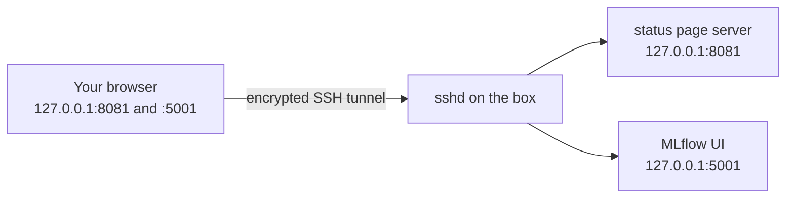
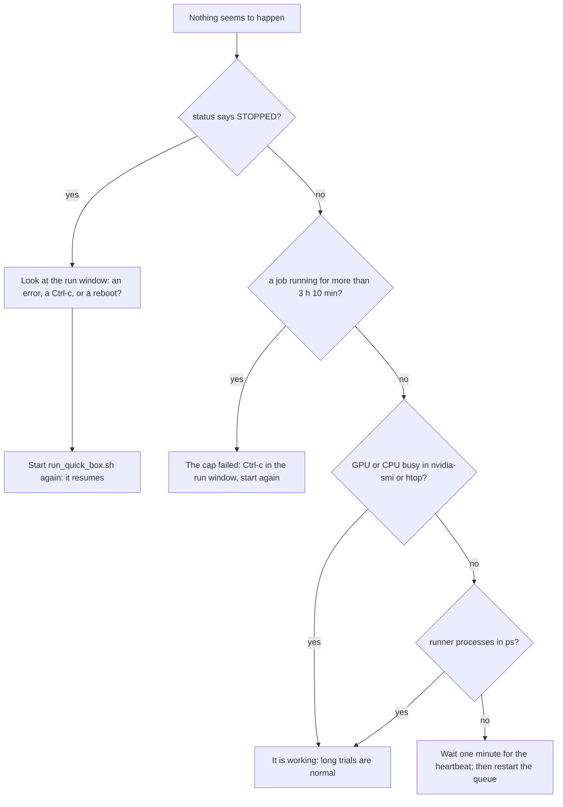

# 5c. Run and monitor

!!! abstract "In plain words"
    You copy the prepared data to the box, start the queue inside tmux, and let it work. While it runs, you can
    check on it at three levels: one status command, a few standard Linux tools, or two web pages (a status page
    and MLflow) opened in your laptop's browser through an encrypted SSH tunnel. Nothing you do while watching
    can disturb the run.

**Time:** 1.5–2.5 hours per dataset. **Cost:** about $1–2 per dataset.

## Step 1: copy the splits (on the laptop)

```bash
./scripts/upload_splits.sh vast-gpu                     # repository at ~/recbench on the box
./scripts/upload_splits.sh vast-gpu /workspace/recbench # if you cloned into /workspace
```

It sends every dataset's small quick tiers first (about 0.5 GB), then the full tiers dataset by dataset (about
8 GB). Re-running it only sends what changed.

!!! success "You should see"
    ```text
    10:02:11 uploaded movielens-25m/quick (37M)
    10:02:14 uploaded movielens-25m/quick-val (32M)
    ...
    10:03:40 uploaded lastfm/quick-val (28M)
    10:05:58 uploaded movielens-25m/full (818M)
    ...
    All splits are on vast-gpu:recbench/data/splits.
    ```

    At 50 Mbit/s upload, the quick tiers take about 2 minutes and the full tiers about 25. You can start step 2
    as soon as `lastfm/quick-val` appears. A dataset's full splits are needed only for its confirmation, an hour
    or more later.

## Step 2: start the run (on the box, inside tmux)

On the box, in the tmux window vast.ai opened for you (rename it "run" with **Ctrl-b** then **,**):

```bash
cd ~/recbench          # or /workspace/recbench
./scripts/run_quick_box.sh --stop-after-dataset --price-per-hour 0.60
```

- `--stop-after-dataset` finishes the first unfinished dataset, including its confirmations, then stops. That is
  a clean moment to look at the results or to end the rental. The same command later runs the next dataset.
  Leave it out to run all five datasets in one go.
- `--price-per-hour` is the offer's price. It only feeds the cost shown by the status views.
- `--deadline-hours 4` would start no new job after 4 hours. Jobs already running still finish, each within its
  3 hours.

!!! success "You should see"
    ```text
    Logging to runs/logs/quick-queue-20261005T100700Z.log. Status page: reports/queue/quick.html ...
    [queue] 115 jobs over ['movielens-25m', 'retailrocket', 'steam', 'hm', 'lastfm']; 4 CPU workers x 16 threads, 3 GPU slots on 1 GPU(s)
    [queue] start tune:movielens-25m:random on cpu0
    [queue] start tune:movielens-25m:ease on gpu0
    [queue] start tune:movielens-25m:most_popular on cpu1
    [queue] end tune:movielens-25m:random: finished ndcg@10=0.0037
    ```

    Each job prints a `start` line and an `end` line. Jobs take from seconds (Random) to the 3-hour cap.

## Step 3: tmux in two minutes

tmux keeps the run alive when your laptop sleeps or the Wi-Fi drops. All keys start with **Ctrl-b**, released, then one key:

| Keys | Does |
|---|---|
| Ctrl-b c | opens a new window (use it for watching) |
| Ctrl-b n / Ctrl-b p | next / previous window |
| Ctrl-b , | renames the current window |
| Ctrl-b [ | scrolls back in the output (arrow keys, **q** to stop) |
| Ctrl-b d | detaches: leaves everything running and returns to the plain shell |
| `tmux ls`, then `tmux attach` | lists sessions and reattaches, for example after reconnecting with `ssh vast-gpu` |

Do not press **Ctrl-c** in the run window unless you mean to stop the queue (step 7).

## Step 4: watch it, level 1 — the status command

Open a second tmux window (**Ctrl-b c**):

```bash
cd ~/recbench && source .venv/bin/activate
python -m recbench.queue status --config configs/benchmarks/quick.yaml
```

!!! success "You should see (the numbers here are made up)"
    ```text
    queue: running; state written 0 min ago on C.12345
    session: 1.20 h, about $0.72 at $0.6/h; roughly 0.9 h of work left for 9 jobs

    == movielens-25m: 14/23 jobs done
      ease             finished     test NDCG@10=0.2011  val=0.1830
      rp3beta          finished     test NDCG@10=0.1974  val=0.1801
      sasrec           running      test NDCG@10=   -    val=-  gpu0 for 24 min
      sansa            unsupported  test NDCG@10=   -    val=-  the `sansa` package is not installed ...
    ```

How to read it:

| Part | Meaning | Worry when |
|---|---|---|
| `queue: running` | the queue process wrote its heartbeat less than 3 minutes ago | it says `STOPPED?`: the queue ended or crashed; look at the run window |
| `session …` | time since the queue started, the cost at your price, and a **rough** estimate of the work left (median job time × jobs left ÷ parallel slots) | — |
| `14/23 jobs done` | tuning jobs of this dataset that have ended, whatever their status | — |
| `finished` | tuned and tested. `val` is the validation score that chose the settings; `test` is the reported result | — |
| `running … gpu0 for 24 min` | which worker runs it, and for how long | over 3 hours: the cap should have ended it |
| `interrupted` | started in an earlier session; it continues the next time the queue runs | — |
| `over_budget` | no setting finished within the 3-hour cap. That is a result ("too slow for this budget"), not a bug | — |
| `unsupported` | the method cannot run here: a missing optional package, or data it cannot use. The reason is printed | an unexpected reason |
| `failed` | an error; the reason is printed | always: see step 6 |
| `confirm …` | the full-data confirmation of a top method, with its full test NDCG@10 | — |

## Step 5: watch it, level 2 — the machine itself

Run these in the second window. Each one shows something different, and **Ctrl-c** quits the tool, not the run.

| Command | Shows | Normal | Worry when |
|---|---|---|---|
| `watch -n 5 nvidia-smi` | GPU use and memory, one line per process | 1–3 `python` processes; use often 30–100%; memory up to ~40 GB of 48 | memory stays near 100% (out-of-memory risk); 0% use for more than 10 minutes while GPU jobs run |
| `nvtop` | the same as a live chart | | |
| `htop` (q quits) | load per CPU core, memory | many cores busy while CPU jobs run; memory under 80% | memory near 100%: Linux then kills a process, and the trial fails with exit code -9 |
| `free -h` | memory summary | "available" above 10 GB | |
| `df -h .` | free disk space | more than 20 GB free | under 10 GB |
| `tail -f runs/logs/quick-queue-*.log` | the queue's start and end lines | a new line every few minutes | no new line for more than 3 hours |
| the `ps` command below | one line per running trial: its age, CPU % and memory | ages up to about an hour | a trial older than 3 hours |

```bash
ps -eo pid,etime,pcpu,rss,args | grep "[r]ecbench.runner --single"
```

## Step 6: watch it, level 3 — two pages in your browser

On the box, in a spare tmux window, start the two pages:

```bash
./scripts/monitor_box.sh
```

On the **laptop**, open a tunnel and keep that terminal open:

```bash
./scripts/open_tunnel.sh vast-gpu
```



Then open:

- **<http://127.0.0.1:8081/queue/quick.html>**, the status page. It shows the same information as the status
  command, with progress bars, every job's time and trials, and the confirmations with their bundles. It
  refreshes itself every 30 seconds, and the badge at the top turns red ("stopped?") if the queue stops writing
  its heartbeat.
- **<http://127.0.0.1:5001>**, MLflow. Each trial and each test run is one "run" in the `recbench` experiment.
  Useful searches:
  - `tags.stage = "final"`: the one test run of each job;
  - `tags.status = "failed"`: problems. Click one, then **Artifacts → error.txt** for the full error message;
  - `tags.method = "sasrec"`: every trial of one method, with its settings and validation score.

Both pages listen only on the box's own address (127.0.0.1), so they are not open to the internet. The tunnel is
the only way in. **Ctrl-c** in the tunnel terminal closes the tunnel and leaves the run untouched.

## Step 7: is it stuck?



## Step 8: when something goes wrong

| Symptom | Likely cause | What to do |
|---|---|---|
| a GPU job's reason says `CUDA out of memory` | three GPU jobs at once did not fit | set `queue.jobs_per_gpu: 2` in `configs/benchmarks/quick.yaml`, then rerun with `--retry-failed` |
| a trial failed with exit code -9 | memory full: Linux killed it | use fewer CPU workers (`--cpu-workers 2`) and rerun with `--retry-failed` |
| `No space left on device` | disk full | `du -sh runs/* data/*`; delete old logs or the smoke splits; restart |
| SSH dropped | network | `ssh vast-gpu`; the run is still going inside tmux (`tmux attach`) |
| the box disappeared | the host failed or took the machine back | rent a new one (5b), upload (step 1), start (step 2). Results you had not fetched are lost, so fetch often: [5d step 1](box-4-finish.md) works at any time |
| a confirmation shows `interrupted` | the session ended during it | start the queue again; it runs first, also with `--stop-after-dataset` |
| a job still `failed` after you fixed the cause | its failed trials used up its budget | rerun with `--retry-failed --methods <name>`: a new attempt starts from scratch |
| `missing_split` | that dataset's splits were not uploaded | finish step 1 and start the queue again |
| you need the exact error | — | MLflow → the failed run → `error.txt`, or the `reason` in `runs/tuning/quick/<dataset>/<method>.json` |

## Step 9: pause or stop

- **Ctrl-c** in the run window stops the queue. Running trials are killed and lose only their own progress.
  Finished trials (in the Optuna journal) and finished runs (in MLflow) are kept.
- Running `./scripts/run_quick_box.sh` again resumes where it stopped.
- To stop paying, bring the results home first, then destroy the box (5d).

**Next:** [5d. Finish](box-4-finish.md).
