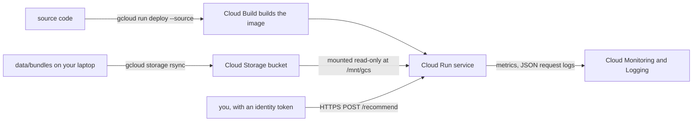

# 7. Deploy to Cloud Run

!!! abstract "In plain words"
    You put your recommendations on the internet as a small private web service: you send it a user id, and it
    answers with that user's top items. The lists were computed in advance (a "bundle" per method), so the service
    only looks them up, which makes it fast and cheap. Google Cloud Run runs it, starts it when a request arrives,
    and stops it when nobody calls, so an idle service costs nothing. You practise first with the small smoke
    bundles, then serve the bake-off's winners, set up monitoring, and finally remove everything.

**Time:** about an hour the first time. **Cost:** with the defaults (scale to zero, at most one instance), a demo
stays within or near Cloud Run's free tier. Check <https://cloud.google.com/run/pricing>, and set up the budget
alert in step 3 first anyway.



New to projects, billing accounts or IAM? Read [GCP basics](../cloud/gcp-basics.md) first.

## Step 1: a Google Cloud project

1. Create a project at <https://console.cloud.google.com/projectcreate> and note its **project id** (for example
   `recbench-4821`). Every command below uses `YOUR_PROJECT_ID`; replace it.
2. Link a **billing account** to it. That is required even for free-tier use.

## Step 2: install the command-line tool and log in

```bash
brew install --cask google-cloud-sdk        # on Linux, see https://cloud.google.com/sdk/docs/install
gcloud auth login                           # opens a browser
gcloud config set project YOUR_PROJECT_ID
gcloud services enable billingbudgets.googleapis.com
```

!!! success "You should see"
    `gcloud config get-value project` prints your project id, and `gcloud --version` prints a recent version.
    The deploy uses Cloud Storage volume mounts, so update an old installation with `gcloud components update`.

## Step 3: a budget alert, before anything else

```bash
gcloud billing accounts list                                     # copy the ACCOUNT_ID
GCP_BILLING_ACCOUNT=XXXXXX-XXXXXX-XXXXXX GCP_PROJECT=YOUR_PROJECT_ID ./deploy/budget_alert.sh 40
```

!!! success "You should see"
    `Created budget [...]`. You will get e-mails at 50%, 90% and 100% of $40 a month of this project's costs.

Alerts **notify**; they do not stop spending. Step 10 (teardown) does that.

## Step 4: a practice deploy with the smoke bundles

The laptop's smoke runs exported bundles for every method (`data/bundles/<dataset>/smoke/<method>/`):

```bash
ls data/bundles/*/smoke/ | head
```

Choose a bucket name that is unique worldwide (your project id plus `-recbench` usually is), then deploy:

```bash
GCP_PROJECT=YOUR_PROJECT_ID RECBENCH_GCS_BUCKET=YOUR_PROJECT_ID-recbench ./deploy/cloud_run.sh
```

The script (explained line by line in [Cloud Run](../cloud/cloud-run.md)):

1. enables Cloud Run, Artifact Registry, Cloud Build and Cloud Storage;
2. creates the bucket if needed and uploads `data/bundles/` to it;
3. builds the image from the source code and deploys service `recbench`. The service is **private** (only
   authenticated callers), with 1 vCPU and 1 GiB, scales to zero, runs at most 1 instance, and serves tier
   `smoke`;
4. adds a startup probe on `/health`, so a revision without bundles never goes live;
5. mounts the bucket read-only and prints the URL.

The first deploy asks to create an Artifact Registry repository: answer **Y**. It takes 3–6 minutes.

!!! success "You should see"
    `Deployed: https://recbench-abc123-uc.a.run.app (tier smoke)` and a reminder of how to call it.

!!! warning "If the build fails with a permission error"
    Projects created since mid-2024 build with the Compute Engine default service account, which may lack the
    Cloud Build role. Grant it, then deploy again:

    ```bash
    NUMBER=$(gcloud projects describe YOUR_PROJECT_ID --format='value(projectNumber)')
    gcloud projects add-iam-policy-binding YOUR_PROJECT_ID \
      --member="serviceAccount:${NUMBER}-compute@developer.gserviceaccount.com" --role=roles/cloudbuild.builds.builder
    ```

## Step 5: call it

```bash
URL=$(gcloud run services describe recbench --region us-central1 --format 'value(status.url)')
TOKEN=$(gcloud auth print-identity-token)          # valid for about an hour
curl -H "Authorization: Bearer $TOKEN" "$URL/health"
curl -H "Authorization: Bearer $TOKEN" -H "content-type: application/json" \
     -d '{"dataset": "movielens-25m", "method": "ease", "user_id": "123", "k": 5}' "$URL/recommend"
curl -H "Authorization: Bearer $TOKEN" "$URL/stats" | python -m json.tool | head -40
```

!!! success "You should see"
    - `/health`: `{"ok": true, "version": "…", "tier": "smoke", "bundles": 70}`.
    - `/recommend`: five items with titles and scores, and `"fallback": false` for a known user. A user id
      that is not in the bundle gets the popularity list with `"fallback": true`.
    - `/stats`: each bundle's export time, data cutoff, coverage and popularity bias, plus this instance's traffic.

    The first call after a quiet period takes a few seconds: Cloud Run starts an instance (a "cold start").
    Later calls are fast. A `403` means a missing or expired token: run the `TOKEN=` line again.

## Step 6: measure latency

```bash
python -m recbench.serving.latency --base-url "$URL" --token "$TOKEN" --tier smoke --dataset movielens-25m --method ease
```

It sends 300 requests, about 10% of them for unknown users, with 8 at a time, after a short warm-up. The user ids
come from your **local** bundle, so `--tier` must be the tier the service serves.

!!! success "You should see"
    JSON with `served_p50_ms`, `served_p95_ms`, `served_p99_ms`, `served_rps` and `served_error_rate`. From a
    laptop, tens of milliseconds at p50 are typical; the network round trip is most of it. The error rate should
    be 0. The numbers are also logged to the MLflow run that made the bundle.

How to read the percentiles: [serving and latency](../dictionary/concepts/serving-and-latency.md).

## Step 7: set up monitoring

```bash
GCP_PROJECT=YOUR_PROJECT_ID ./deploy/monitoring.sh
python -m recbench.serving.monitor --base-url "$URL" --token "$TOKEN"
```

The first command creates an uptime check (it calls `/health` every 15 minutes) and two log-based counters.
The second prints PASS, WARN or FAIL for health, errors, unknown users, latency, and each bundle's freshness,
coverage and popularity bias. [Monitoring](../cloud/monitoring.md) explains every signal and how to set up e-mail
alerts in the console (its step 3).

## Step 8: serve the bake-off's winners

After [5d](box-4-finish.md), `data/bundles/<dataset>/full/<method>/` holds a bundle for each confirmed method. Pick
the ones you want to serve from the [quick-tier results](../results/quick-tier.md), then deploy them:

```bash
ls data/bundles/*/full/
RECBENCH_TIER=full RECBENCH_SERVE_METHODS=ease,rp3beta \
  GCP_PROJECT=YOUR_PROJECT_ID RECBENCH_GCS_BUCKET=YOUR_PROJECT_ID-recbench ./deploy/cloud_run.sh
```

`RECBENCH_SERVE_METHODS` is optional; without it, every method that has a `full` bundle is served. Run the calls in
step 5 again, with a dataset and method you deployed, and `python -m recbench.serving.monitor` once more.

!!! warning "Full bundles are bigger"
    Full-data bundles hold more items. If the logs show "Memory limit exceeded", serve fewer methods, or raise
    `--memory` to `2Gi` in `deploy/cloud_run.sh`. That costs more per second of use, but nothing while idle.

!!! info "Licences"
    Several datasets forbid commercial use or redistribution. Keep the service private; see the
    [datasets index](../dictionary/datasets/index.md).

## Step 9: roll back a bad deploy

Every deploy creates a new **revision**, and the old ones are kept. To send all traffic back to an earlier one:

```bash
gcloud run revisions list --service recbench --region us-central1
gcloud run services update-traffic recbench --region us-central1 --to-revisions REVISION_NAME=100
```

## Step 10: tear down

```bash
GCP_PROJECT=YOUR_PROJECT_ID ./deploy/teardown.sh
GCP_PROJECT=YOUR_PROJECT_ID RECBENCH_GCS_BUCKET=YOUR_PROJECT_ID-recbench ./deploy/teardown.sh --bucket   # bundles too
```

This deletes the service, its images, the uptime check and the log counters (and, with `--bucket`, the bucket). If
you created alert policies, delete them under **Monitoring → Alerting**.

!!! success "You should see"
    `gcloud run services list` shows no `recbench`, and the billing report a day later shows no new charges.

## Want it public?

`./deploy/cloud_run.sh --public` lets anyone with the URL call it. Read [security](../cloud/security.md) first.
With `max-instances 1`, a flood of requests cannot scale costs up, but it can make the service slow for you.

**You have completed the tutorials.** Continue with the [how-to guides](../how-to/add-a-method.md), the
[overall comparison](../results/overall-comparison.md) or the [dictionary](../dictionary/index.md).
