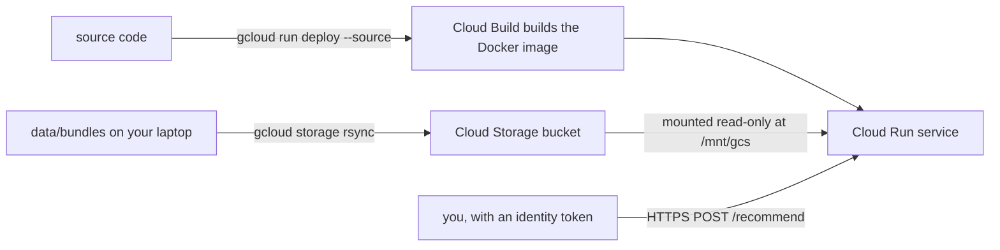

# 6. Deploy to Cloud Run

**Goal:** serve your benchmark's recommendations from a private HTTPS API on Google Cloud, measure its latency,
and remove everything afterwards.
**Time:** about an hour the first time.
**Cost:** with the defaults (scale to zero, at most one instance), a demo should stay within or near Cloud Run's
free tier. Check <https://cloud.google.com/run/pricing>. Set up the budget alert in step 2 first anyway.



## Step 1: a Google Cloud project

1. Create a project at <https://console.cloud.google.com/projectcreate> and note its **project id**.
2. Link a **billing account** (required even for free-tier usage).
3. Install the CLI: `brew install --cask google-cloud-sdk`, then log in:

```bash
gcloud auth login
gcloud config set project YOUR_PROJECT_ID
```

New to these terms? Read [GCP basics](../cloud/gcp-basics.md).

## Step 2: a budget alert (do this first)

```bash
gcloud billing accounts list                       # copy the ACCOUNT_ID
GCP_BILLING_ACCOUNT=XXXXXX-XXXXXX-XXXXXX ./deploy/budget_alert.sh 40
```

You will get e-mails at 50%, 90%, and 100% of $40 a month. Alerts **notify**; they do not stop spending.
Step 6 does that.

## Step 3: have bundles to serve

Bundles are written when you run the benchmark (`data/bundles/<dataset>/<tier>/<method>/`). Check:

```bash
ls data/bundles/*/smoke/
```

## Step 4: deploy

Choose a globally unique bucket name, then:

```bash
GCP_PROJECT=YOUR_PROJECT_ID RECBENCH_GCS_BUCKET=YOUR_PROJECT_ID-recbench ./deploy/cloud_run.sh
```

The script (explained line by line in [Cloud Run](../cloud/cloud-run.md)):

1. enables the needed APIs (Cloud Run, Artifact Registry, Cloud Build, Cloud Storage);
2. creates the bucket if needed and uploads `data/bundles/` to it;
3. builds the Docker image from source with Cloud Build and deploys it as service `recbench`: 1 vCPU, 1 GiB,
   scale to zero, at most 1 instance, **private** (only authenticated callers);
4. mounts the bucket read-only and prints the service URL.

## Step 5: call it and load-test it

```bash
URL=$(gcloud run services describe recbench --region us-central1 --format 'value(status.url)')
TOKEN=$(gcloud auth print-identity-token)
curl -H "Authorization: Bearer $TOKEN" "$URL/health"
curl -H "Authorization: Bearer $TOKEN" -H "content-type: application/json" \
     -d '{"dataset": "movielens-25m", "method": "ease", "user_id": "123", "k": 5}' "$URL/recommend"
```

The first call after idle takes a second or two (a cold start); later calls are fast. A user id not in the
bundle returns the popularity list with `"fallback": true`.

Measure latency from your laptop, and attach it to the method's MLflow run:

```bash
python -m recbench.serving.latency --base-url "$URL" --token "$TOKEN" --dataset movielens-25m --method ease
```

Read the percentiles as explained in [serving and latency](../dictionary/concepts/serving-and-latency.md). They
include the network round trip from your location.

## Step 6: tear down

```bash
GCP_PROJECT=YOUR_PROJECT_ID ./deploy/teardown.sh
# and to delete the bundles too:
GCP_PROJECT=YOUR_PROJECT_ID RECBENCH_GCS_BUCKET=YOUR_PROJECT_ID-recbench ./deploy/teardown.sh --bucket
```

This deletes the service and its source images (and, with `--bucket`, the bucket). Check the billing page a day
later.

## Want it public?

`./deploy/cloud_run.sh --public` allows anyone with the URL to call it. Read [security](../cloud/security.md)
first. With `max-instances 1`, a flood of requests cannot scale costs up, but it can make the service slow for you.

**You have completed the tutorials.** Continue with the [how-to guides](../how-to/add-a-method.md) or the
[dictionary](../dictionary/index.md).
